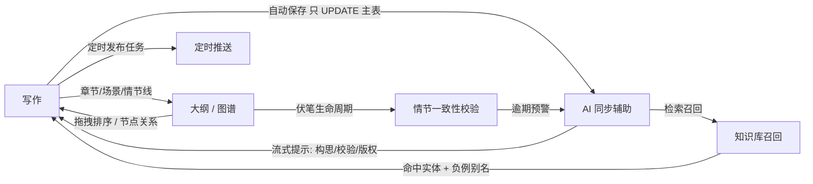
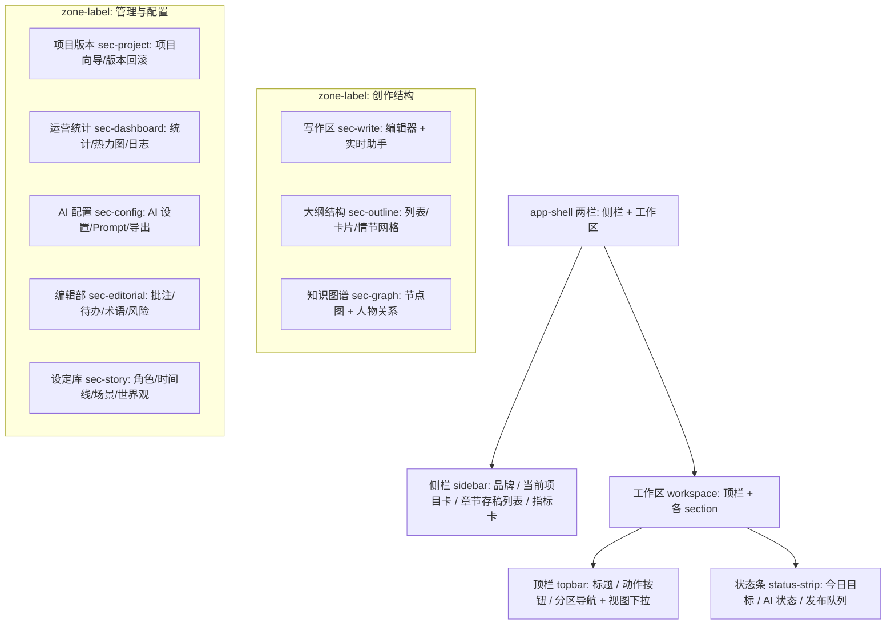

# Novel AI · 产品原型设计

> 本文档描述小说 AI 创作工作台的**产品原型**——界面形态、信息架构、交互流与设计原则。它是 `novel-ai.html` / `novel-ai.css` 的「设计意图」说明，落地细节以代码为准（代码与文档冲突时以代码为准）。
>
> ⚠️ **状态（2026-09-19）**：本文与 `novel-ai.html/css` 均属 **pre-rebuild（已废弃）版本**，新设计方向见 `doc/design/redesign-concept.md` 与可交互原型 `concept/index.html`。
> 现状基线：M6 已收口（2026-09-09），F093 本地模型已合入，schema v7，三栏布局已演进为「吸顶分区导航 + 折叠」。

---

## 1. 产品定位与目标用户

**定位**：一个跑在本机的、零依赖的小说创作智能工作台。作者写，AI 在旁同步辅助；把「写作 / 知识召回 / 大纲 / 图谱 / 定时发布」收进同一张页面，避免在不同工具间反复切换。

**目标用户**：**单机写作的作者**（网文 / 类型小说创作者）。
- 在意数据私密与离线可用——所有内容存本机 SQLite，AI 密钥服务端托管加密，不联网也能写。
- 长篇连载，需要结构化管理（章节、情节线、伏笔、人物关系、时间线）。
- 有稳定更新节奏，需要定时推送与写作统计。
- 不是团队协作工具，不是云端 SaaS，不是给编辑部多人审校用的平台。

**设计目标排序**：写作流畅度 > 结构清晰 > AI 辅助可用性 > 配置/管理可读性。编辑器是一等公民，其余都是「在你需要时才出现」的辅助层。

---

## 2. 核心交互流

作者的一天大致沿以下链路推进；箭头表示数据/状态流动，不是强制顺序。



**关键链路说明**
- **写作 → AI 同步辅助**：编辑器输入即触发自动保存（F076 防抖，仅 UPDATE `chapters` 主表，不生成版本）；AI 助手页签（构思 / 校验 / 版权）给出实时提示（F082 流式卡）。
- **知识库召回**：章节正文经 `entity_mentions` 扫描命中知识/角色/时间线等实体（F080）；命中以 chips 呈现，可点 ✗ 登记负例别名，避免「黑潮生」误召。
- **大纲 / 图谱**：大纲三视图（列表 / 卡片 / 情节网格，F083）+ 力导向知识节点图（F091）。两者是写作结构的「俯瞰图」。
- **定时发布**：在管理与配置区建发布任务，由调度器（F085）到点推送，状态在发布面板顶部展示。
- **情节一致性校验**：伏笔生命周期（F084）逾期 → 仪表盘预警 → 回流到 AI 校验提示。

---

## 3. 信息架构（IA）

整页是单页应用（一个 `novel-ai.html`），分区靠锚点 + 吸顶导航切换。层级如下：



**分区锚点**（`scroll-margin-top: 172px` 避免被吸顶导航遮挡）：`#sec-write` `#sec-outline` `#sec-graph` `#sec-project` `#sec-dashboard` `#sec-config` `#sec-editorial` `#sec-story`。

**分区导航行为**（`js/nav.js`，零依赖事件委托）：
- 平滑滚动 + `IntersectionObserver` 滚动高亮（scrollspy）。
- 「视图 ▾」下拉收纳两个低频开关：**展开录入**（默认收起 `body.forms-collapsed`）、**整理视图**（折叠辅助模块，只留写作区）。
- 跳转到管理与配置区时自动展开录入表单，避免「只看到标题和按钮」。

---

## 4. UI 设计原则

### 4.1 编辑器为唯一焦点
写作区（`#chapterEditor`）是页面核心，正文用衬线体（Noto Serif SC）18px/1.9，独立于 UI 无衬线体（Inter），制造「写作场」与「操作场」的视觉分离。专注模式（F090，`body.focus-mode`）隐藏侧栏/顶栏/面板/状态条，只留编辑器并拉满视口；Esc 退出。

### 4.2 渐进式披露（Progressive Disclosure）
信息密度高，但首屏只暴露「最常用」。三个折叠层级：
1. **录入表单默认收起**：`body.forms-collapsed` 隐藏各管理面板的 `.form-grid` / `.config-textarea` / `.goal-box`，动作按钮与结果列表保持可见（改 CSS 没生效？先看是不是被这条规则收掉了）。
2. **编辑器「更多写作工具 ▾」**：20+ 写作按钮拆成「主行 + 可折叠 `<details>` 次行」，消除一条长龙。
3. **顶栏「更多 ▾」下拉**：低频入口（AI 历史 / 审计日志）收进原生下拉，首屏减负。

### 4.3 移动优先 / 响应式
断点（来自 `novel-ai.css`）：

| 断点 | 行为 |
|---|---|
| ≤ 1480px | 图谱/管理两栏区收为单栏，避免「挤一块」 |
| ≤ 1366px | 编辑器两栏（左文 + 右助手）收为单栏，工具栏独占整行 |
| ≤ 1180px | `.app-shell` 两栏收为单栏，侧栏变静态 |
| ≤ 680px | 全面单栏，编辑字号降到 16px，网格塌为 1 列 |

### 4.4 零依赖下的视觉系统（设计 Token）
全部 token 来自 `:root` 与关键类，无构建、无设计系统框架，直接写 CSS 变量。

**配色（暗色主题，`color-scheme: dark`）**

| Token | 值 | 用途 |
|---|---|---|
| `--bg` | `#090a12` | 页面基底（叠加径向+线性渐变：紫 `#8b5cf6` 左上、青 `#22d3ee` 右上、深蓝渐变底） |
| `--surface` | `rgba(18,20,35,0.84)` | 玻璃面板（配 `backdrop-filter: blur(18px)`） |
| `--surface-strong` | `#16192a` | 强表面（弹窗、下拉） |
| `--card` | `rgba(255,255,255,0.07)` | 卡片内底色 |
| `--border` | `rgba(255,255,255,0.12)` | 1px 描边（全局统一，营造轻盈分隔） |
| `--text` | `#f6f7fb` | 主文字 |
| `--muted` | `#9ca6bd` | 次级文字（说明、标签、eyebrow） |
| `--primary` / `--primary-strong` | `#8b5cf6` / `#a78bfa` | 主色（紫）：主按钮、激活态、品牌 |
| `--accent` | `#22d3ee` | 强调（青）：进度、计时、知识类节点 |
| `--warning` / `--danger` / `--success` | `#f59e0b` / `#fb7185` / `#34d399` | 警示 / 危险 / 成功态（如逾期伏笔红框、保存五态） |

**节点图配色语义**（图谱区分实体类型，颜色即类型）：
- 核心节点 `core`：青边 `rgba(34,211,238,0.72)`；知识 `node-knowledge`：青；角色 `node-character`：绿 `rgba(52,211,153,0.62)`；时间线 `node-timeline`：琥珀 `rgba(245,158,11,0.65)`；场景 `node-scene`：粉 `rgba(244,114,182,0.62)`；世界观 `node-world`：紫 `rgba(167,139,250,0.72)`。边 `rgba(167,139,250,0.42)` 宽 2。

**字体**
- UI：Inter（via Google Fonts）→ `system-ui`/无衬线回退栈。
- 编辑器正文：`"Noto Serif SC", serif`（衬线，营造阅读感）。

**间距 / 圆角 / 阴影**
- 圆角：面板/卡片 `24px`、按钮/标签 `999px`（胶囊）、小卡 `14–22px`。
- 间距：侧栏 `padding: 22px`、工作区 `padding: 34px`、区与区 `gap: 38px`、网格卡内 `padding: 14–24px`。
- 阴影：面板 `0 24px 80px rgba(0,0,0,0.24)`、主按钮 `0 12px 24px rgba(139,92,246,0.26)`。
- 分区小标题 `.zone-label`：12px 大写 800 字重、`letter-spacing: 0.16em`，右侧延伸分隔线，制造「创作结构 / 管理与配置」层级。

> 设计约束：所有视觉都靠原生 CSS 变量 + 渐变实现，不引入图标字体/UI 库；图标用 emoji（如 📌 图钉、★ 快照）或纯 CSS，维持零依赖。

---

## 5. 从「三栏平铺」到「分区导航 + 折叠」的演进

**Why**。M4 时期工作台是「侧栏 + 工作区」，工作区内所有功能区块从上到下平铺：写作 → 大纲 → 图谱 → 项目/版本 → 统计 → 配置 → 编辑部 → 设定库。随 M5/M6 能力膨胀（新增伏笔、Plot Grid、热力图、本地模型预设等），平铺导致：
1. 首屏被管理/配置表单填满，作者进来先看到一堆输入框，而非编辑器；
2. 20+ 写作按钮挤成一条长龙，窄屏换行堆叠过高；
3. 同一屏信息密度过大，认知负荷陡增。

**How（2026-09-16~17 三轮简化）**：
- **吸顶分区导航**：把 8 个区块抽成顶部 `.workspace-nav` 锚点导航 + scrollspy 高亮，作者按需跳转到分区，不必滚动整页找模块。
- **工具栏分组**：编辑器工具栏拆「主行 + 更多写作工具（可折叠 `<details>`）」，次行默认收起。
- **录入表单默认收起**（`forms-collapsed`）：管理区把输入框/长文本藏起来，只留动作按钮与结果，点击「展开录入」再填。
- **轻量化**：hero/feature 大卡 → 轻量 `status-strip`；更多/视图按钮收进原生下拉；加 `zone-label` 分区小标题形成清晰层级。

**效果**：测试仍 75 passed，首屏聚焦写作，管理与配置按需展开，窄屏不再堆叠。这是「渐进式披露」原则在 IA 层的具体落地，而非彻底重做。

---

## 6. 关键界面线框

> 线框为语义示意，具体样式以 `novel-ai.css` 为准。写作主界面用 mermaid，其余用 ASCII 块。

### 6.1 写作主界面（sec-write）

```mermaid
flowchart TB
    subgraph Top[顶栏 topbar 吸顶]
        Title[雾港星火 · 创作工作台]
        Acts[知识库 ▾ 伏笔线索 ▾ 发布计划 ▾ 系统日志 ▾ 更多 ▾ 同步辅助]
        Nav[写作 大纲结构 知识图谱 项目版本 运营统计 AI配置 编辑部 设定库 | 视图▾]
    end
    Status[状态条: 今日目标 / AI 状态 / 发布队列]

    subgraph Editor[编辑器区 editor-layout]
        Left[编辑器面板<br/>章节标题 + 保存状态★打快照<br/>工具栏主行 + 更多写作工具▾<br/>#chapterEditor 衬线正文<br/>自动保存 / 上下文窗口]
        Right[实时助手面板<br/>状态点 / 构思·校验·版权 页签<br/>assist-feed 流式提示卡]
    end
```

### 6.2 大纲视图（sec-outline）
三视图切换：**列表 / 卡片 / 情节网格**，可拖拽排序。

```
┌─ 大纲与结构视图 ───────────────────────────────┐
│ [列表] [卡片] [情节网格]            [刷新结构]   │
├────────────────────────────────────────────────┤
│ 列表视图（大纲树）：                              │
│   ▸ 第12章 钟楼下的背叛                          │
│       ├ 场景卡: POV 罗文 · 心情…                 │
│       └ 伏笔: ⚑黑潮钟声 ⚠逾期红                │
│   ▸ 未分配                                      │
│                                                  │
│ 情节网格（Plot Grid）：行=情节线 列=章节           │
│       章10  章11  章12  章13                      │
│ 黑潮  ◉     ◉     ◉                              │
│ 罗文         ◉     ▣                              │
│ （◉=已推进  ▣=计划中）                            │
└────────────────────────────────────────────────┘
```

### 6.3 图谱视图（sec-graph）
力导向节点图（F091）+ 人物关系 AI 设计。

```
┌─ 知识库节点图 ─────────────┐ ┌─ 人物关系 AI 设计 ─┐
│ [综合][知识][人物][时间线][世界观]│ │ 关系卡1              │
│ ┌─── 力导向画布 ─────────┐  │ │ 关系卡2              │
│ │      (核心)            │  │ │ ...                 │
│ │  角色●   知识◆  场景●   │  │ └────────────────────┘
│ │     时间线◆  世界●      │  │
│ │  边: 紫半透明 可拖拽/钉住│  │
│ └────────────────────────┘  │
│ 统计: 节点数/边数/类型分布    │
│ 点击节点 → 详情卡            │
└────────────────────────────┘
```

### 6.4 管理面板：折叠态 vs 展开态（sec-project / sec-config 等）

管理区受 `body.forms-collapsed` 控制。默认折叠：

```
折叠态（默认，首屏）                  展开态（点「展开录入」后）
┌─ 项目创建与知识导入 ──────┐         ┌─ 项目创建与知识导入 ──────┐
│ [创建项目][新建章节]       │         │ 项目名▢ 题材▢ 章标题▢ ...   │
│ [导入知识][关系设计]       │   →     │ [创建项目][新建章节]       │
│ [保存平台][定时发布]...    │         │ [导入知识][关系设计]...    │
└──────────────────────────┘         └──────────────────────────┘
（只留动作按钮 + 结果列表）            （显式输入框可见）
```

> 折叠边界（避坑）：`forms-collapsed` 仅隐藏 `.ops-layout` 内的 `.form-grid`/`.config-textarea`/`.goal-box`。**写作区的编辑器、状态条、图谱、大纲不在 ops-layout 内，不受影响**；若把新录入元素放在 ops-layout 之外，会绕过折叠逻辑而一直显示。

---

## 7. 演示内容（示例小说）

工作台以示例小说 **「雾港星火」**（题材：玄幻/蒸汽都市、秘仪学院、失忆调查员）填充演示数据：章节（如「第 12 章 · 钟楼下的背叛」）、角色、伏笔「黑潮钟声」（逾期预警示例）、知识「黑潮节奏」等。新人第一次启动即可看到完整形态，便于理解各分区。
