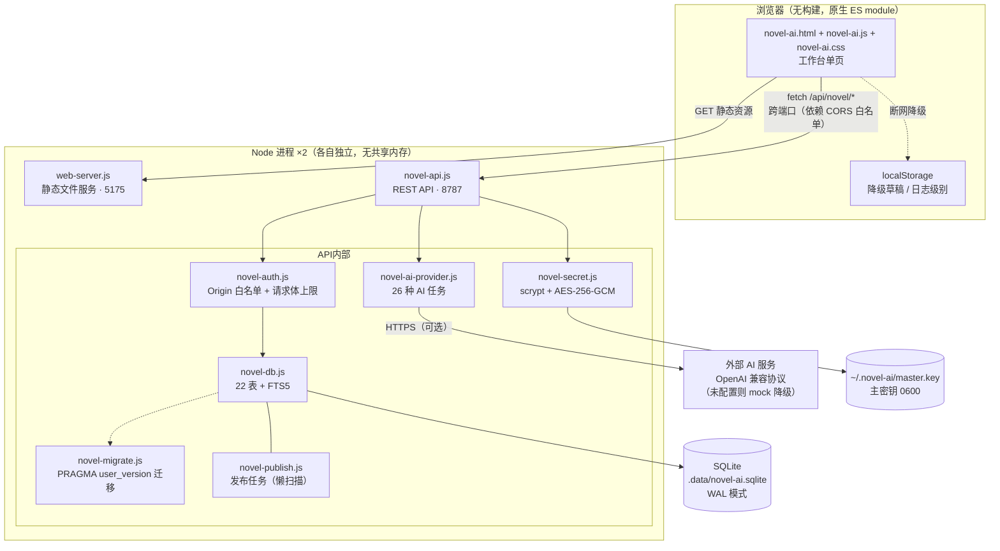
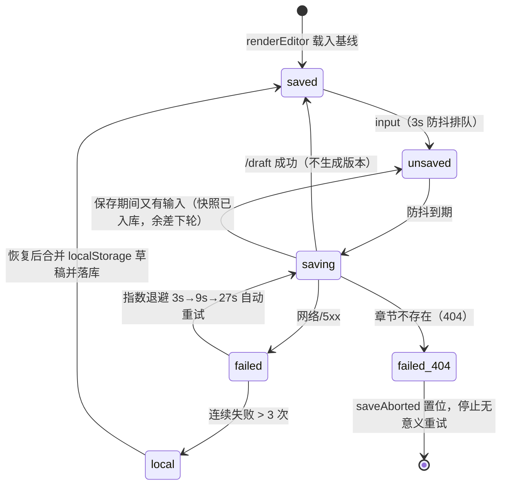

# Novel AI 系统架构（As-Built）

| 项目 | 内容 |
|---|---|
| 文档日期 | 2026-09-05 |
| 文档性质 | **现状架构**（描述代码实际形态）。方案推演与实测依据见 `doc/design/incremental-design-2026-09-02.md` |
| 代码基线 | main @ a1b0946（2026-09-05），M4 已交付 |
| 读者 | 接手本项目的开发者、做架构评审的工程师 |

> **零依赖红线**：整个系统运行时只依赖 Node 内置模块（`node:http` / `node:sqlite` / `node:crypto` / `node:fs` 等）与浏览器原生能力。
> 唯一的第三方包是开发依赖 `@playwright/test`。任何新功能先回答「Node 内置能不能做」，再考虑加依赖。

---

## 一、系统定位与总体拓扑

**单机单用户的本地写作工具**，不是多用户服务端系统。安全模型（F074）围绕「只信任本机」设计，
一切「对外开放 / 多人协作」的需求都会推翻该模型，属于路线图上的显式非目标（见 `doc/roadmap/roadmap.md`）。



### 进程与端口

| 进程 | 入口 | 默认地址 | 职责 | 可覆盖环境变量 |
|---|---|---|---|---|
| API 服务 | `server/novel-api.js` | `127.0.0.1:8787` | 全部业务接口、鉴权、AI 调用、发布扫描 | `NOVEL_API_PORT` / `NOVEL_API_HOST` |
| 静态服务 | `server/web-server.js` | `127.0.0.1:5175` | 只读地吐 `novel-ai.html/js/css`，`/` 映射到 `novel-ai.html` | `NOVEL_WEB_PORT` / `NOVEL_WEB_HOST` |

- 两个进程**无共享状态**，唯一交汇点是 SQLite 文件（WAL 模式 + `busy_timeout=5000` 保证多进程并发安全）。
- `npm run dev`（`scripts/novel-dev.sh`）同时拉起两者并统一回收；`npm run api` / `npm run web` 可单独启动。
- 前端通过 `window.NOVEL_API_PORT`（`novel-ai.html` 注入，默认 8787）拼 API 地址，**跨端口请求依赖 API 侧的 Origin 白名单**。

---

## 二、代码地图

| 文件 | 行数 | 职责 | 关键点 |
|---|---|---|---|
| `novel-ai.html` | 494 | 工作台页面结构 | 注入 `window.NOVEL_API_PORT`；69 个 `data-action` 触发点 |
| `novel-ai.js` | 1805 | 前端全部逻辑（单文件 ES module） | 事件委托路由、F076 防丢稿状态机、日志系统、`escapeHtml` 统一转义、F078 导入交互 |
| `novel-ai.css` | 839 | 样式与主题 | CSS 变量、明暗主题、响应式侧栏 |
| `server/novel-api.js` | 451 | REST 路由（50+ 个分支）+ 中间件编排 | `send()` 按 Origin 回显 CORS；`readJson` 2MB 上限；413/500 统一兜底 |
| `server/novel-db.js` | 1335 | 数据访问层（全部 SQL 集中于此） | 22 表 + FTS5 建表、种子数据、密钥脱敏/加解密接入、审计日志、F078 导出/导入回灌 |
| `server/novel-auth.js` | 72 | 鉴权中间件 | Origin 白名单、写方法集合、`MAX_BODY_BYTES = 2MB` |
| `server/novel-secret.js` | 179 | 密钥加密 | 主密钥管理、scrypt 派生缓存、AES-256-GCM、掩码 |
| `server/novel-migrate.js` | 87 | schema 迁移框架 | `MIGRATIONS` 数组（当前 v1）、单事务、失败即启动失败 |
| `server/novel-ai-provider.js` | 234 | AI 能力适配 | 26 种任务模板、OpenAI 兼容调用（60s 超时）、mock 降级 |
| `server/novel-publish.js` | 43 | 发布任务 | 创建/重试/模拟发布；**懒扫描**（无后台调度器，T018 待做） |
| `server/web-server.js` | 185 | 静态文件服务 | 目录穿越三层防护、MIME 表（`.js` 必须 `text/javascript`） |
| `scripts/novel-dev.sh` | 22 | 双进程启动脚本 | 把 `NOVEL_WEB_PORT` 同步传给 API（否则自定义端口被 403） |
| `tests/` | — | Playwright 用例 + 测试环境 | 见 `doc/testing-docs/test-automation.md` |

---

## 三、一次请求的生命周期

以「自动保存草稿」为例（`POST /api/novel/chapters/:id/draft`）：

```
编辑器 input 事件
  → scheduleAutoSave()：3s 防抖
  → autoSave()：isDirty() 且无在飞请求
  → apiFetch(`/chapters/:id/draft`)          // 前端
  → novel-api.js handle()
      1. OPTIONS 预检分流（非法 Origin 直接 403）
      2. authMiddleware(req)：Origin 白名单，非法 → 403
      3. 路由匹配 → readJson(req)：累计字节数，超 2MB 抛 PAYLOAD_TOO_LARGE
      4. saveDraft(chapterId, content)       // novel-db.js：只 UPDATE chapters，不写版本表
  → send(res, 200, { chapter })              // res.locals.corsOrigin 决定是否回显 ACAO
  ← 前端：lastSavedContent = snapshot，setSaveState('saved')
```

任何一步抛异常统一落到 `handle()` 的 catch：`PAYLOAD_TOO_LARGE` → 413（并 `req.destroy()`），
其余 → 500（`{ error: message }`）。**没有任何静默吞错**。

---

## 四、前端架构（novel-ai.js）

单文件 ES module，无构建、无框架。按行号分区：

| 行段 | 分区 | 内容 |
|---|---|---|
| 1–14 | 基础设施 | `apiBase`（`window.NOVEL_API_PORT || 8787`）、`escapeHtml`（**所有 innerHTML 拼接必须经过它**） |
| 15–118 | 日志系统 | 前端运行日志（DEBUG/INFO/WARN/ERROR，上限 500 条），localStorage 记忆级别，面板筛选/压缩/清除 |
| 120–215 | 常量 | `fallbackState`（API 离线时的演示数据）、`taskLabels`（26 种 AI 任务的中文名）、`nodePositions`（图谱坐标，M6 T023 改造点） |
| 217–306 | 状态与渲染 | `state` / `activeChapter` / `apiOnline`；`loadBootstrap()` 失败 → 降级 fallbackState 并显示「本地演示」；render* 系列 |
| 309–580 | **F076 防丢稿** | 见下节状态机 |
| 582–630 | 模态框 | Promise 风格 `showModal()`，切章 dirty 确认即用它实现 |
| 900+ | `runAi()` | 调 `POST /ai`，渲染结果卡片（区分 provider 来源徽章） |
| 1498+ | `importProjectFile()` | F078 导入交互：文件选择 → 格式预检 → 双模式确认 → `POST /import` → replace 时重载 bootstrap |
| 1631–1805 | **事件委托** | 唯一的全局 click 监听，按优先级匹配 `data-graph-type` → `data-node-id` → `data-chapter-id` → `data-tab` → `data-open-panel` → `data-publish-id` → `data-version` → … → `data-action`（taskMap 26 项路由到 `runAi`，其余 ~30 个 action 各自分发） |

### 4.1 防丢稿状态机（F076）



关键实现约束：

- **草稿与版本分离**：自动保存走 `/draft`（只 UPDATE 正文）；只有手动存稿 `/save`（`kind='manual'`）、
  回滚（`kind='manual'`）才进版本表。这是 X4 实测（自动保存进版本表 → 100 章 318MB）的对策。
- **并发防抖**：`autoSaving` 标志保证不并发写；保存期间的新输入在成功后排队下一轮，不丢失。
- **404 特判**：`apiFetch` 带 `error.status`，章节不存在时停止重试而不是永远闪「保存失败」。
- **切换章节/关闭页面**：`switchChapter()` 经 dirty 确认模态框；`beforeunload` 兜底。

### 4.2 XSS 防线

所有 `innerHTML` 拼接的用户数据（章节标题、AI 输出、知识条目、日志……）必须经 `escapeHtml()`。
新增渲染代码时默认遵守；code review 以此为一票否决项（历史提交 96e1c92 专项清理过一轮）。

---

## 五、API 层（novel-api.js）

### 5.1 中间件链（固定顺序，不可调换）

```
OPTIONS 分流（预检：白名单 204 / 非法 403）
  → authMiddleware          # Origin 白名单；无 Origin（curl/测试）放行
  → res.locals.corsOrigin   # 之后所有 send() 按它回显 ACAO + Vary: Origin，绝不返回 *
  → 路由分支（50 个 if）
  → catch：PAYLOAD_TOO_LARGE → 413；其余 → 500
```

### 5.2 端点清单（按域分组）

前缀统一为 `/api/novel`；「幂等写」指重复调用产生相同结果。

| 域 | 端点 | 方法 | 说明 |
|---|---|---|---|
| 引导 | `/bootstrap` | GET | 一次拉全量：user、project（脱敏+密钥元数据）、chapters、knowledge（global/project）、relations、publishTasks、graph |
| 仪表盘 | `/dashboard` | GET | 统计 + 平台 + 近 14 天进度 |
| 目标/进度 | `/goals`、`/progress` | POST | 写作目标 upsert、进度记录 |
| **AI 配置** | `/settings/ai` | POST | apiKey 三态：非空→加密覆盖；空→保持；`__CLEAR__`→清空（F075） |
| | `/settings/ai/master-key` | GET | 主密钥备份引导（见 §7.3 安全边界） |
| **章节** | `/chapters` | POST | 新建（带 `auto` 初始版本） |
| | `/chapters/:id/save` | POST | 手动存稿，**version+1 且写版本表**（kind='manual'） |
| | `/chapters/:id/draft` | POST | 自动保存，**只更新正文，不写版本表** |
| | `/chapters/:id/versions` | GET | 版本列表（含 kind/name） |
| | `/chapters/:id/rollback` | POST | 回滚到指定版本（本身也产生一个 manual 版本） |
| | `/chapters/:id/archive` | POST | 归档 |
| 批注 | `/chapters/:id/annotations` | GET/POST | 章节批注 |
| 待办 | `/todos`、`/todos/:id/toggle` | GET/POST/POST | 创作待办 |
| 术语 | `/glossary` | GET/POST | 设定术语表 |
| 敏感词 | `/sensitive/check` | POST | 规则匹配（本地词典，非 AI） |
| **知识库** | `/knowledge`、`/knowledge/bulk`、`/knowledge/:id/delete` | POST | 单条/按行批量/删除（同步维护 FTS 索引） |
| 关系 | `/relations` | POST | 人物关系 |
| 实体列表 | `/characters`、`/timeline`、`/scenes`、`/world` | GET/POST | 四类创作实体 |
| **AI 任务** | `/ai` | POST | 统一入口：taskType + chapterId + selectedText → runAiTask → 落 ai_tasks |
| | `/ai/history`、`/ai/tasks/:id/feedback` | GET/POST | 历史与评价 |
| 检索/图谱 | `/search`、`/graph` | GET | LIKE 检索（F088 待升级 FTS5）、知识图谱构建（按 type 过滤） |
| 导出/导入 | `/export/project`（支持 `?projectId=`）、`/export/chapters/:id` | GET | 项目 JSON（F078：19 个集合 + formatVersion/schemaVersion，密钥材料剔除）、单章 |
| | `/import` | POST | 导入回灌：`new`（重映射 ID）默认 / `replace`（覆盖目标项目）；前置 `VACUUM INTO` 整库备份；单事务；载荷非法 → 400 |
| **发布** | `/publish` | GET/POST | GET 时**顺带执行懒扫描**（到期任务 → 模拟发布）；POST 创建任务 |
| | `/publish/:id/simulate`、`/publish/:id/retry` | POST | 手动模拟/重置重试 |
| 提示词 | `/prompts` | GET/POST | 自定义 Prompt 模板（按 taskType 生效） |
| 平台 | `/platforms` | GET/POST | 发布平台配置 |
| 审计 | `/audit` | GET | 操作审计日志 |
| 项目 | `/projects` | POST | 新建项目（当前 bootstrap 仍固定返回 id 最小的项目，F079 待做切换） |

### 5.3 错误约定

| 状态码 | 触发 |
|---|---|
| 400 | 静态服务层非法 URL（API 层目前无显式 400） |
| 403 | Origin 不在白名单（读写一律拒绝）；项目/资源不存在暂以 404 表达 |
| 404 | 端点或资源不存在 |
| 413 | 请求体 > 2MB（`readJson` 触发，响应后 `req.destroy()`） |
| 500 | 未捕获异常，`{ error: message }` |

---

## 六、数据层（novel-db.js）

### 6.1 表清单（22 业务表 + 1 FTS5 虚拟表）

| 域 | 表 |
|---|---|
| 用户/项目 | `users`（单用户 local-author）、`projects`（含 `ai_base_url`/`ai_model`/`api_key_cipher`/`api_key_salt`） |
| 章节 | `chapters`、`chapter_versions`（v1 迁移后含 `kind`：auto/manual，与 `name`） |
| 人物 | `characters`、`character_relations` |
| 知识 | `knowledge_entries`（scope: global/project）、`knowledge_fts`（FTS5，content 表外挂） |
| AI | `ai_tasks`（输入/输出/provider 全留痕）、`ai_feedback`、`prompt_templates` |
| 发布 | `publish_tasks`（waiting/checking/published/failed + retry_count）、`platform_configs` |
| 创作 | `timeline_events`、`scene_locations`（世界观地点，≠ M5 的场景卡 `scenes`）、`world_settings`、`glossary_terms` |
| 运营 | `writing_goals`、`writing_progress`、`creative_todos`、`chapter_annotations`、`audit_logs`、`sensitive_rules` |

全部 SQL 收敛在 `novel-db.js`，上层（API/provider/publish）不写裸 SQL。首次启动 `initDb()` 建表 + `seedDb()`
写入演示项目「雾港星火」；此后 `migrate()` 接管 schema 演进。

### 6.2 连接参数（都有实测依据，勿随手改）

| PRAGMA / 配置 | 值 | 依据 |
|---|---|---|
| `journal_mode` | WAL | 多进程读写的基础 |
| `busy_timeout` | 5000ms | X3 实测：无它则 4 进程并发写失败率 88%，有它为 0。也是 Playwright `workers: 4` 的前提 |
| `foreign_keys` | ON | 导入/删除的引用完整性；导入顺序错误会显式报错（好事） |
| DB 路径 | `NOVEL_DB_PATH` 优先，默认 `.data/novel-ai.sqlite` | 测试/开发库隔离的基础（T003） |

### 6.3 迁移机制（novel-migrate.js）

- `MIGRATIONS` 数组，version 严格递增，**永不修改已发布的迁移**；新需求一律追加新条目。
- 每个迁移单事务：`up()` 成功 → `PRAGMA user_version = N` → COMMIT；失败 → ROLLBACK 并**抛异常终止启动**。
- `safeExec` 容错「duplicate column / already exists」保证幂等；其余错误原样上抛。
- 当前已应用：**v1**（F075 密钥列 `api_key_cipher/salt` + F086 版本语义列 `kind/name`）。
- 契约测试 13 用例覆盖「重复启动 user_version 稳定不变」。

### 6.4 版本语义（F076 × F086 合并设计的落地）

| 操作 | 端点 | UPDATE chapters | INSERT chapter_versions | kind |
|---|---|---|---|---|
| 自动保存（3s 防抖） | `/chapters/:id/draft` | ✅ | ❌ | — |
| 手动存稿 | `/chapters/:id/save` | ✅（version+1） | ✅ | `manual` |
| 新建章节 | `/chapters` | ✅ | ✅ | `auto` |
| 回滚 | `/chapters/:id/rollback` | ✅（version+1） | ✅ | `manual`（name=「回滚自 vN」） |

自动保存**刻意不写版本表也不写审计日志**——高频路径写审计同样会撑表。

---

## 七、安全模型（F074 / F075）

### 7.1 分层防护（自外向内）

1. **网络层**：两个服务都显式 `listen(port, '127.0.0.1')`（X1 修复——曾实际绑定 `::` 暴露局域网）。
2. **来源层**：`authMiddleware` 校验 Origin 白名单（默认 `http://127.0.0.1:5175`、`http://localhost:5175`，
   自定义 `NOVEL_WEB_PORT` 时自动追加）；无 Origin 视为本机调用放行；白名单外**读写一律 403**。
3. **输入层**：请求体 2MB 上限（X5：曾可 50MB 打满内存）；SQL 全部参数绑定，无拼接。
4. **静态服务层**：目录穿越三层防护（解码校验 → 逐段走查 → resolve+startsWith 兜底），NUL 字节拒绝。
5. **输出层**：`escapeHtml` 统一转义；项目对象经 `sanitizeProject` 白名单输出，**密文/盐/明文永不进响应体**。
6. **凭据层**：密钥加密落库（下节）；接口只出掩码 `sk-****1234`。
7. **审计层**：写操作落 `audit_logs`（action + payload），密钥操作只记掩码。

### 7.2 密钥加密链路（F075）

```
明文 apiKey
  → salt = randomBytes(16)，dataKey = scrypt(masterKey, salt, N=16384)   [派生结果缓存，命中≈0ms]
  → AES-256-GCM(iv 12B) 加密
  → 存储：projects.api_key_cipher = base64(iv‖authTag‖ciphertext)，projects.api_key_salt = base64(salt)
主密钥：~/.novel-ai/master.key（32B，0600，目录 0700；显式 chmod 防 umask 放宽）
```

- 主密钥**丢失/被替换 = 已存密钥永久不可解密**（GCM 认证失败，跨进程实测）。这是产品级约束：
  UI 提供「导出主密钥备份」，`getProjectKeyMeta()` 以 `decryptable: false` 区分「没配」与「配了但解不开」。
- scrypt 单次约 30ms，`deriveKey` 带 `Map<salt, key>` 缓存，保证 AI 热路径不每次派生。
- API Key 解析优先级：**项目库解密密钥 → 环境变量 `NOVEL_AI_API_KEY` → 无（mock）**。
  解密失败**不会**静默降级成 mock，而是返回 `provider: 'secret-error'` 的可读错误——避免用户以为 AI 正常工作。

### 7.3 主密钥备份端点的安全边界（`GET /settings/ai/master-key`）

该端点会把主密钥原文返回给调用方，等价于「用户在本机 `cat ~/.novel-ai/master.key`」。
它依赖两道前提：**127.0.0.1 绑定 + Origin 白名单**。若将来放开 `NOVEL_ALLOWED_ORIGINS` 或改绑 `0.0.0.0`，
**必须先摘掉这个端点**（代码注释中已同步标注）。

---

## 八、AI Provider 层（novel-ai-provider.js）

- **26 种任务类型**：前端 `taskMap` → `POST /ai { taskType, chapterId, selectedText }` → `runAiTask()`。
  服务端内置 26 组中文 mock 模板（`taskTemplates`），保证零配置可演示。
- **调用外部模型**：OpenAI 兼容 `/chat/completions`，Bearer 认证，60s `AbortController` 超时。
  baseUrl/model 取值优先级：环境变量 → 项目库字段。
- **provider 四态**（落库到 `ai_tasks.provider`，前端据此显示徽章）：

| provider | 含义 |
|---|---|
| `openai-compatible` | 真实模型调用成功 |
| `mock` | 未配置任何密钥，返回内置模板 + 顶部「本地演示模式」警示卡 |
| `mock-fallback` | 配了密钥但调用失败，已降级 mock（错误信息保留在卡片里） |
| `secret-error` | 库中密钥解密失败（主密钥丢失），直接返回可读修复指引，**不降级** |

- **buildPrompt 现状**：项目设定 + 全文正文 + JSON.stringify(context) 全量注入。
  这是 M5 T014（分层 prompt + Top-K 召回 + 截断标注）的改造点，引用条目、token 预估、引用清单回传均已设计待实现。

---

## 九、发布子系统（novel-publish.js）

- 数据模型：`publish_tasks`（waiting → checking → published / failed，带 `retry_count`/`last_error`）。
- **当前没有后台调度器**：到期扫描 `scanDuePublishTasks()` 挂在 `GET /publish` 上**懒执行**——
  只有作者打开发布面板才会触发；平台名含「失败」即模拟失败走重试链路。
- 这是刻意保留的现状（T018「真实调度器 + 重启补跑」是 M5 任务）。UI 已明确标注「仅服务运行时生效」。
- 对接真实平台 API 属于外部依赖，当前一律 `simulatePublish`（模拟结果），设计上预留 provider 位置。

---

## 十、静态资源服务（web-server.js）

- 零依赖替代 Vite dev server；`GET/HEAD` 之外一律 405。
- `/` → `/novel-ai.html`；`.js` 必须 `text/javascript`（否则 ES module 被浏览器拒载，白屏）。
- 目录穿越防护见 §7.1 第 4 条；开发期 `cache-control: no-cache`。
- 与 API 同样默认绑定 `127.0.0.1`。

---

## 十一、已知限制与待改造点

| # | 现状 | 影响 | 去向 |
|---|---|---|---|
| 1 | `searchAll` 走 LIKE + 固定一条 mock「网络文献」 | 中文召回不稳定；FTS5 索引已建但检索未接入 | T012（FTS5 bigram + 字面后过滤） |
| 2 | 单项目硬编码：`getBootstrapData()` 固定取 id 最小的项目 | 建了多个项目也无法切换（导入的新项目暂只能在 API 层访问） | T011（`?projectId=` 中间件，实测改动极小；导出端点已先行支持该参数） |
| 3 | AI 无流式输出，长任务干等最多 60s | 体验差；SSE 方案已实测可行 | T015（SSE + 可中断 + 三态标识） |
| 4 | 发布仅模拟、无后台调度器 | 进程不在前台打开面板就不触发 | T018 |
| 5 | 前端单文件持续增长 | 改动冲突面大 | T021（模块化，建议 M5 后立即做，见 R15） |
| 6 | `node:sqlite` 在部分 Node 版本仍是 experimental | 启动可能打印 `ExperimentalWarning`（正常现象）；Node 大版本升级可能破 API | engines 锁 `>=22.5.0`；数据访问集中单文件，变更面可控 |
| 7 | 密钥解密依赖主密钥文件 | 主密钥丢失 = 已存密钥不可恢复（可修复的配置故障，有 UI 引导） | 备份引导已交付（F075 A4）；云备份属远期想法 |
| 8 | 页面 `<head>` 引用 Google Fonts 外链 | 离线/网络受限时字体回退系统字体（快速失败无碍）；网络被静默黑洞的环境会拖慢首屏加载 | 远期可评估自托管字体子集 |

---

## 附：架构决策记录（ADR 摘要）

| 决策 | 选择 | 关键理由（详见 design 文档实测节） |
|---|---|---|
| 运行时依赖 | Node 内置模块，零第三方 | 单机工具的可移植性；`node:sqlite` + FTS5 + `node:crypto` 实测覆盖全部需求 |
| 中文检索分词 | FTS5 + bigram 手工切分 + 字面后过滤 | 默认 unicode61 中文召回 3/10；bigram 10/10；trigram 更差（6/10）勿用 |
| 版本存储 | 草稿态不进版本表 | X4：否则 100 章 318MB；草稿/版本分离压缩 45x |
| 实体识别 | 词典最长匹配 + 首字符索引 + 负例词典 | 无分词库可用；索引版 2.5ms/10 万字；CJK 邻居边界校验被实测否定 |
| RAG/召回 | 四维加权（提及/关键词/TF-IDF/邻近），无向量 | 零依赖可落地，无需外部 embedding API（Q3 已关闭） |
| 鉴权 | 本机绑定 + Origin 白名单，无账号体系 | 单机单用户定位；引入账号即推翻整个模型（F095 不排期的根因） |
| 多项目定位 | 查询参数 `?projectId=`，中间件一次接入 | X2：50 个路由分支仅 2 行真依赖 bootstrap.project，无需逐端点改造 |
