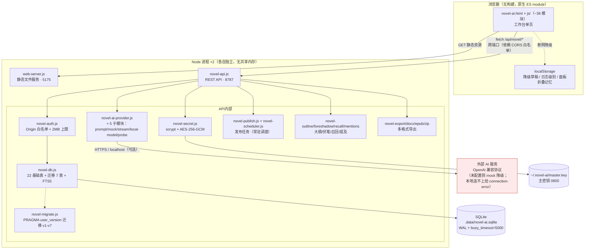
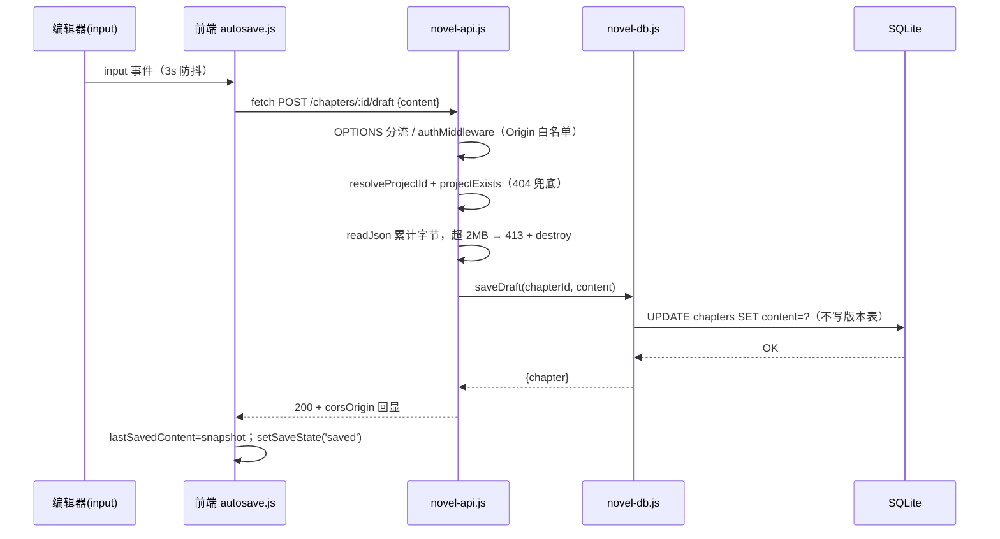
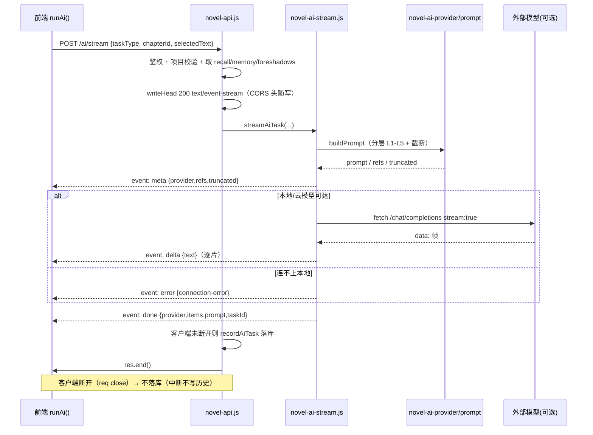
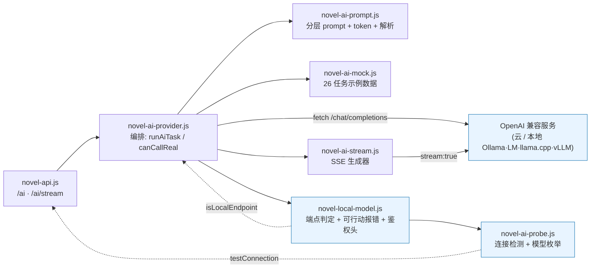

# Novel AI 系统架构（As-Built）

| 项目 | 内容 |
|---|---|
| 文档日期 | 2026-09-17（全新重写） |
| 文档性质 | **现状架构（As-Built）**——描述代码实际形态。方案推演与历史实测见 `doc/design/design.md` |
| 代码基线 | `e0290ca`（2026-09-09，M6 收口），schema `user_version = 7` |
| 读者 | 接手本项目的开发者、做架构评审的工程师 |
| 零依赖红线 | 运行时只依赖 Node 内置模块（`node:http` / `node:sqlite` / `node:crypto` / `node:fs` / `node:os` / `node:path` / `node:url`）；唯一第三方包是 devDependency `@playwright/test`。任何新功能先问「Node 内置能不能做」 |

---

## 一、系统定位与总体拓扑

**单机单用户的本地写作工具**，不是多用户服务端系统。安全模型（F074）围绕「只信任本机」设计；一切「对外开放 / 多人协作」需求都推翻该模型，属显式非目标（F095 不排期）。



**两个进程无共享状态**，唯一交汇点是 SQLite 文件（WAL 模式 + `busy_timeout=5000` 保证多进程并发安全）。前端通过固定 `127.0.0.1` 的 `apiBase` 拼 API 地址，跨端口请求依赖 API 侧 Origin 白名单。

---

## 二、进程与端口

| 进程 | 入口 | 默认地址 | 可覆盖环境变量 | 职责 |
|---|---|---|---|---|
| API 服务 | `server/novel-api.js` | `127.0.0.1:8787` | `NOVEL_API_PORT` / `NOVEL_API_HOST` | 全部业务接口、鉴权、AI 调用、发布调度 |
| 静态服务 | `server/web-server.js` | `127.0.0.1:5175` | `NOVEL_WEB_PORT` / `NOVEL_WEB_HOST` | 只读吐 `novel-ai.html` + `js/` + `css`；`/`→`novel-ai.html` |

- 测试专用：API `127.0.0.1:8788`、Web `127.0.0.1:5176`、库 `.data/novel-test.sqlite`（`tests/test-env.js` 唯一真源），与开发库彻底隔离。
- `npm run dev`（`scripts/novel-dev.sh`）同时拉起两进程并统一回收；`npm run api` / `npm run web` 可单独启动；`npm test` 由 Playwright 自动拉起测试双进程。
- 前端 `apiBase` 写死 `127.0.0.1`（非 `location.hostname`），避免 `localhost` 解析成 IPv6 `::1` 连不上（见 `tests/test-env.js`）。
- 公网部署支持：设 `NOVEL_PUBLIC_API_RELATIVE=1` 后，web-server 注入 `window.NOVEL_API_RELATIVE='1'`，前端走同源相对路径 `/api/novel`，由反代转发到 API 端口（见 §十二）。

---

## 三、代码地图

### 3.1 `server/`（25 个文件）

| 文件 | 职责 | 关键点 |
|---|---|---|
| `web-server.js` | 静态文件服务 | 零依赖替代 Vite；目录穿越三层防护；`.js` → `text/javascript`；可注入 `NOVEL_API_RELATIVE` |
| `novel-api.js` | REST 路由 + SSE + 中间件编排 | `send()` 按白名单回显 CORS；bootstrap 惰性化；F079 项目上下文；`readJson` 2MB 上限；413/400/500 兜底；优雅关闭 |
| `novel-auth.js` | 鉴权中间件 | Origin 白名单、`MAX_BODY_BYTES=2MB`、写方法集合 |
| `novel-project.js` | 项目上下文解析（F079） | 纯函数：`?projectId=` → `X-Project-Id` → 默认；存在性校验在 db 层 |
| `novel-db.js` | 数据访问层（全部 SQL 集中） | 22 基础表 + FTS5 建表、种子「雾港星火」、密钥脱敏/加解密接入、审计、导出/导入、多项目取数、召回取数、提及/别名 |
| `novel-migrate.js` | schema 迁移框架 | `MIGRATIONS` v1–v7；单事务 + 幂等 `safeExec` + 失败即启动失败 |
| `novel-secret.js` | 密钥加密 | 主密钥管理（0600）、scrypt 派生缓存、AES-256-GCM、掩码、指纹 |
| `novel-mentions.js` | 提及扫描器（F080） | 纯函数：首字符索引最长匹配、负例优先遮蔽 |
| `novel-recall.js` | 按需召回打分（F081） | 纯函数：四维加权（提及 0.40/关键词 0.25/TF-IDF 0.20/邻近 0.15） |
| `novel-date.js` | 本地日期工具 | 打卡日期按本地时区换算（v5 迁移用） |
| `novel-ai-provider.js` | AI 编排（OpenAI 兼容） | `runAiTask` / `canCallReal` / `resolveEndpoint`；60s 超时；provider 四态 |
| `novel-ai-prompt.js` | 分层 prompt / 解析 / token | L1–L5 拼装、三段截断、引用清单、token 估算 |
| `novel-ai-mock.js` | 示例数据 | 26 种任务的 mock 输出与降级 |
| `novel-ai-stream.js` | SSE 流式通道 | `streamAiTask` 生成器；`?mock=1` 确定性假流；meta→delta→done/error |
| `novel-local-model.js` | 本地端点判定 / 报错 / 鉴权头 | `isLocalEndpoint`、`describeEndpointError`(可行动)、`LOCAL_PRESETS` |
| `novel-ai-probe.js` | 连接检测 / 模型枚举 | 只探测不落库；`/models` → Ollama `/api/tags` 兜底 |
| `novel-outline.js` | 大纲 / 场景 / 情节线 | `getOutlineData`、章节排序、场景分配、plot beat |
| `novel-foreshadow.js` | 伏笔生命周期 | `planted→resolved/abandoned` 状态机、词面提示 |
| `novel-publish.js` | 发布任务 | 创建/重试/模拟；`simulatePublish` |
| `novel-scheduler.js` | 发布调度器（F085） | 随 API 启动；周期扫描 + 重启补跑；测试库禁用 |
| `novel-export.js` | 导出编排 | 显式列名导出（密钥剔除）、Markdown |
| `novel-docx.js` | DOCX 导出 | 手写 OOXML（`node:zlib`） |
| `novel-epub.js` | EPUB 导出 | 手写 OPF/NCX |
| `novel-zip.js` | ZIP 辅助 | 多文件打包（导出附件用） |
| `load-env.js` | 环境预载 | 必须在其他 import 前载入 `process.env`（F073 配套） |

### 3.2 `js/`（约 36 个原生 ES module，按模块分组）

| 分组 | 文件 | 职责 |
|---|---|---|
| 基础设施 | `api.js` `constants.js` `store.js` `utils.js` `dom.js` `ui.js` `modal.js` `app.js` | API 基址/请求封装、常量、状态存储、工具、DOM 辅助、UI 原语、模态、入口 |
| 编排 | `events.js` `nav.js` `log.js` `autosave.js` `session.js` `render-core.js` | 全局事件委托、吸顶导航、运行日志、防丢稿状态机、写作会话、渲染核心 |
| 写作 | `editor.js` `draft.js` `chapters.js` `versions.js` `focus-mode.js` `editorial.js` | 编辑器、草稿、章节 CRUD、版本、专注模式、编辑工具 |
| AI | `ai.js` `ai-settings.js` `local-model.js` | AI 调用、设置面板、本地模型预设/测试 |
| 知识/图谱 | `knowledge.js` `mentions.js` `graph.js` `graph-view.js` `graph-layout.js` | 知识库、提及/反链、图谱数据/视图/力导向布局 |
| 结构 | `outline.js` `plot-grid.js` `foreshadow.js` `story-bible.js` `projects.js` | 大纲树、Plot Grid、伏笔、设定圣经、项目管理 |
| 视图 | `dashboard.js` `publish.js` `export-menu.js` `fallback-data.js` | 仪表盘、发布、导出菜单、断网降级数据 |

> 前端保持「无构建、无框架」：`<script type="module">` 直接 import，浏览器原生加载。

---

## 四、一次请求的生命周期

### 4.1 自动保存草稿（POST `/api/novel/chapters/:id/draft`）



任何一步抛异常统一落 `handle()` 的 catch：`PAYLOAD_TOO_LARGE`→413（并 `req.destroy()`），`ImportPayloadError`→400，其余→500（`{error:message}`）。**无任何静默吞错**。

### 4.2 AI 流式（POST `/api/novel/ai/stream`，SSE）



---

## 五、前端架构（`js/`）

单文件 `novel-ai.js` 已拆分为约 36 个原生 ES module（T021，保持无构建），按 §3.2 分组。核心机制：

- **防丢稿状态机（F076）**：`saved → unsaved（3s 防抖）→ saving → saved`（草稿只 UPDATE 正文，不生成版本）；失败指数退避 3s→9s→27s 重试；连续 >3 次降级 localStorage 合并；404 特判停止无意义重试；`beforeunload` 兜底。
- **渐进式披露 UI（2026-09 三轮）**：吸顶分区导航、工具栏主行 + 可折叠「更多写作工具」、`forms-collapsed`（只藏输入框不藏按钮）、`status-strip`、`原生 <details>`、`zone-label`。
- **XSS 防线**：所有 `innerHTML` 拼接用户数据必须经转义（历史提交专项清理过）。
- **断网降级**：`fallback-data.js` 提供演示数据，API 离线显示「本地演示」。

---

## 六、API 层（`novel-api.js`）

### 6.1 中间件链（固定顺序，不可调换）

```
OPTIONS 分流（预检：白名单 204 / 非法 403）
  → authMiddleware          # Origin 白名单；无 Origin（curl/测试）放行
  → res.locals.corsOrigin   # 之后所有 send() 按它回显 ACAO + Vary: Origin，绝不返回 *
  → resolveProjectId        # F079：?projectId= → X-Project-Id → 默认项目
  → projectExists           # 不存在显式 404，绝不静默回落
  → 路由分支（60+ if，按域分组）
  → catch：PAYLOAD_TOO_LARGE → 413；ImportPayloadError → 400；其余 → 500
```

**性能约束**：`getBootstrapData()`（全量章节正文 + 图谱）只在 `/bootstrap` 执行；其余分支只取所需数据（轻量端点约 0.3ms，造数 200 章 731ms→211ms）。

### 6.2 端点清单（按域分组，前缀 `/api/novel`）

| 域 | 端点 | 方法 | 说明 |
|---|---|---|---|
| 引导/仪表 | `/bootstrap` | GET | 一次拉全量（脱敏 project + chapters + knowledge + relations + publishTasks + graph） |
| | `/dashboard` | GET | 统计 + 平台 + 近 14 天进度 |
| 目标/进度 | `/goals`、`/progress` | POST | 写作目标 upsert、进度记录 |
| 写作会话 | `/sessions/start`、`/sessions/end`、`/sessions/stats` | POST/POST/GET | 会话计时、字数增量、打卡热力图（F086） |
| **AI 配置** | `/settings/ai` | POST | apiKey 三态：非空→加密覆盖；空→保持；`__CLEAR__`→清空（F075） |
| | `/settings/ai/master-key` | GET | 主密钥备份引导（见 §八安全边界） |
| | `/settings/ai/presets` | GET | 本地模型预设（服务端唯一真源） |
| | `/settings/ai/test` | POST | 连接检测 + 模型枚举（不发正文） |
| **章节** | `/chapters` | POST | 新建（带初始版本） |
| | `/chapters/:id/save` | POST | 手动存稿，**version+1 且写版本表**（kind='manual'） |
| | `/chapters/:id/draft` | POST | 自动保存，**只更新正文，不写版本表** |
| | `/chapters/:id/milestone` | POST | 命名里程碑快照（复用 kind/name） |
| | `/chapters/:id/versions` | GET | 版本列表（含 kind/name） |
| | `/chapters/:id/rollback` | POST | 回滚（自身产生一个 manual 版本） |
| | `/chapters/:id/archive` | POST | 归档 |
| 批注 | `/chapters/:id/annotations` | GET/POST | 章节批注（severity 白名单） |
| 待办/术语/敏感 | `/todos`、`/todos/:id/toggle`、`/glossary`、`/sensitive/check` | GET/POST/POST | 创作待办、术语表、本地敏感词匹配 |
| **知识库** | `/knowledge`、`/knowledge/bulk`、`/knowledge/:id/delete` | POST | 单条/批量/删除（同步维护 FTS 索引） |
| 关系/实体 | `/relations`、`/characters`、`/timeline`、`/scenes`、`/world` | GET/POST | 人物关系 + 四类创作实体 |
| **AI 任务** | `/ai` | POST | JSON 通道：taskType + chapterId + selectedText → 召回 + 分层 prompt → 落 `ai_tasks`（含 refs/truncated/tokenEstimate） |
| | `/ai/stream` | POST | SSE 流式（meta→delta→done/error）；客户端断开不落库；`mock:true` 走确定性假流 |
| | `/ai/history`、`/ai/tasks/:id/feedback` | GET/POST | 历史与评价 |
| 检索/图谱 | `/search`、`/graph` | GET | FTS5 bigram + 字面后过滤（七类实体）；知识图谱构建 |
| **提及/反链** | `/mentions?chapterId=`、`/mentions/backlink?entityType&entityId` | GET | 本章提及、实体反链（项目隔离） |
| | `/mentions/rescan`、`/aliases`、`/aliases/delete` | POST | 全项目重扫；别名登记（polarity=±1）/删除 |
| 导出/导入 | `/export/project` | GET | 项目 JSON（显式列名，密钥剔除）+ `formatVersion`/`schemaVersion` |
| | `/export/chapters/:id` | GET | 单章导出 |
| | `/export/{markdown\|docx\|epub}` | GET | 多格式导出（可含批注/术语/时间线/伏笔/单章） |
| | `/import` | POST | 导入回灌：`new`（重映射 ID）/ `replace`（VACUUM INTO 备份 + 单事务） |
| 大纲/情节 | `/outline`、`/chapters/reorder`、`/scenes/reorder` | GET/POST | 大纲数据、章节排序、场景分配 |
| | `/plotlines`、`/plotlines/delete`、`/plotbeats` | POST | 情节线 CRUD、节拍矩阵（line×chapter 唯一） |
| **伏笔** | `/foreshadows`、`/foreshadows/hints` | GET | 伏笔列表、词面提示 |
| | `/foreshadows`、/foreshadows/:id/(resolve\|abandon) | POST | 登记、状态流转（planted→resolved/abandoned） |
| **发布** | `/publish` | GET/POST | GET 顺带懒扫描到期任务；POST 创建 |
| | `/publish/:id/simulate`、`/publish/:id/retry`、`/scheduler` | POST/GET | 模拟/重试/调度器状态 |
| 提示词/平台 | `/prompts`、`/platforms` | GET/POST | 自定义 Prompt 模板、发布平台配置 |
| 审计/项目 | `/audit`、`/projects` | GET/POST | 操作审计日志、新建项目 |

### 6.3 错误约定

| 状态码 | 触发 |
|---|---|
| 400 | `ImportPayloadError` / 校验错误（空里程碑名、负例合法性等） |
| 403 | Origin 不在白名单（读写一律拒绝）；HTTP 预检非法 |
| 404 | 端点或资源/项目不存在 |
| 413 | 请求体 > 2MB（`readJson` 触发，响应后 `req.destroy()`） |
| 500 | 未捕获异常，`{error:message}` |

---

## 七、数据层（`novel-db.js` + `novel-migrate.js`）

### 7.1 表清单

**22 张基础业务表**（`initDb()` 建）：`users`、`projects`、`chapters`、`chapter_versions`、`characters`、`character_relations`、`knowledge_entries`、`ai_tasks`、`publish_tasks`、`audit_logs`、`platform_configs`、`prompt_templates`、`writing_goals`、`writing_progress`、`ai_feedback`、`chapter_annotations`、`creative_todos`、`glossary_terms`、`sensitive_rules`、`timeline_events`、`scene_locations`、`world_settings`。

**迁移框架新增 7 张**（含 1 张 FTS5 虚拟表，合计约 29 张物理表）：`entity_mentions`、`entity_aliases`（v4）、`writing_sessions`（v5）、`foreshadows`（v6）、`plot_lines`、`plot_beats`（v7）、`search_fts`（v3，FTS5）。

> `volumes`（卷）**未做**：当前大纲为「章→场景」两级，T020 的「卷→章→场景」三级树待补。

### 7.2 连接参数（均有实测依据，勿随手改）

| PRAGMA / 配置 | 值 | 依据 |
|---|---|---|
| `journal_mode` | WAL | 多进程读写基础 |
| `busy_timeout` | 5000ms | X3：无则并发写失败率 88%，有则 0（也是 workers 提升前提） |
| `foreign_keys` | ON | 导入/删除引用完整性 |
| DB 路径 | `NOVEL_DB_PATH` 优先，默认 `.data/novel-ai.sqlite` | 测试/开发库隔离（T003） |

### 7.3 迁移机制（`novel-migrate.js`）

- `MIGRATIONS` 数组，version 严格递增（当前 v1–v7），**永不修改已发布迁移**；新需求追加新条目。
- 单迁移单事务：`up()` 成功 → `PRAGMA user_version = N` → COMMIT；失败 → `ROLLBACK` 并**抛异常终止启动**。
- `safeExec` 容错 `duplicate column`/`already exists` 保证幂等；其余错误原样上抛。
- v1 密钥列+版本 kind/name；v2 17 个外键性能索引；v3 `search_fts` bigram 重建；v4 提及/别名+存量回填；v5 写作会话+打卡本地化；v6 伏笔生命周期；v7 章节排序+场景归属章节+情节线。

### 7.4 版本语义（F076 × F086）

| 操作 | 端点 | UPDATE chapters | INSERT chapter_versions | kind |
|---|---|---|---|---|
| 自动保存（3s 防抖） | `/chapters/:id/draft` | ✅ | ❌ | — |
| 手动存稿 | `/chapters/:id/save` | ✅（version+1） | ✅ | `manual` |
| 新建章节 | `/chapters` | ✅ | ✅ | `auto` |
| 里程碑 | `/chapters/:id/milestone` | ✅ | ✅ | `manual`（name） |
| 回滚 | `/chapters/:id/rollback` | ✅（version+1） | ✅ | `manual`（name=「回滚自 vN」） |

自动保存**刻意不写版本表也不写审计日志**——高频路径写审计同样撑表。

### 7.5 实体关系（核心 ER）

```mermaid
erDiagram
    users ||--o{ projects : "owns"
    projects ||--o{ chapters : "has"
    projects ||--o{ characters : "has"
    projects ||--o{ knowledge_entries : "has"
    projects ||--o{ timeline_events : "has"
    projects ||--o{ scene_locations : "has"
    projects ||--o{ world_settings : "has"
    projects ||--o{ glossary_terms : "has"
    projects ||--o{ writing_goals : "has"
    projects ||--o{ writing_progress : "has"
    projects ||--o{ creative_todos : "has"
    projects ||--o{ publish_tasks : "has"
    projects ||--o{ platform_configs : "has"
    projects ||--o{ ai_tasks : "has"
    projects ||--o{ prompt_templates : "has"
    projects ||--o{ writing_sessions : "has"
    projects ||--o{ foreshadows : "has"
    projects ||--o{ plot_lines : "has"
    projects ||--o{ entity_mentions : "has"
    projects ||--o{ entity_aliases : "has"

    chapters ||--o{ chapter_versions : "versions"
    chapters ||--o{ chapter_annotations : "annotations"
    chapters ||--o{ entity_mentions : "mentioned_in"
    chapters ||--o{ writing_sessions : "session"
    chapters ||--o{ foreshadows : "planted_in"
    chapters ||--o{ plot_beats : "beat"
    scene_locations ||--o{ plot_beats : "beat_scene"

    plot_lines ||--o{ plot_beats : "beats"
    ai_tasks ||--o{ ai_feedback : "feedback"
    publish_tasks }o--|| platform_configs : "platform"

    CHAPTERS {
        int id PK
        int project_id FK
        string title
        text content
        int sort_order
        int archived
    }
    CHAPTER_VERSIONS {
        int id PK
        int chapter_id FK
        int version
        text content
        string kind "auto/manual"
        string name
    }
    PROJECTS {
        int id PK
        string title
        string ai_base_url
        string ai_model
        string api_key_cipher "加密，不出响应"
        string api_key_salt "加密，不出响应"
    }
    FORESHADOWS {
        int id PK
        int project_id FK
        int chapter_id FK
        string title
        int expected_chapter
        string status "planted/resolved/abandoned"
    }
    PLOT_LINES {
        int id PK
        int project_id FK
        string title
        string color
    }
    PLOT_BEATS {
        int id PK
        int plot_line_id FK
        int chapter_id FK
        int scene_id FK
        string mark "progress/planned"
    }
    WRITING_SESSIONS {
        int id PK
        int project_id FK
        int chapter_id FK
        string started_at
        string ended_at
        int words_delta
        string session_date
    }
    AI_TASKS {
        int id PK
        int project_id FK
        int chapter_id FK
        string task_type
        string provider
    }
```



其余实体（`characters`/`knowledge_entries`/`timeline_events`/`scene_locations`/`world_settings`/`glossary_terms` 等）均通过 `project_id` 归属 `projects`，并（如适用）通过 `chapter_id` 归属 `chapters`；`entity_mentions`/`entity_aliases` 以 `entity_type`+`entity_id` 软引用七类实体。`search_fts`（FTS5 虚拟表）覆盖章节/知识/角色/时间线/场景/世界观/术语，bigram 切分 + 字面后过滤。

---

## 八、安全模型（F074 / F075）

### 8.1 分层防护（自外向内）

1. **网络层**：两服务均显式 `listen(port, '127.0.0.1')`（X1 修复——曾绑 `::` 暴露局域网）。
2. **来源层**：`authMiddleware` 校验 Origin 白名单（默认 `http://127.0.0.1:5175`、`http://localhost:5175`，自定义 `NOVEL_WEB_PORT` 自动追加）；无 Origin 视为本机放行；白名单外**读写一律 403**。
3. **输入层**：请求体 2MB 上限（X5）；SQL 全参数绑定。
4. **静态层**：目录穿越三层防护（解码校验 → 逐段走查 → resolve+startsWith 兜底），NUL 字节拒绝。
5. **输出层**：转义统一；`sanitizeProject` 白名单输出，**密文/盐/明文永不出响应体**；`exportProject` 显式列名防密钥随 `SELECT *` 导出。
6. **凭据层**：密钥加密落库；接口只出掩码 `sk-****1234`。
7. **审计层**：写操作落 `audit_logs`（action + payload），密钥操作只记掩码。

### 8.2 密钥加密链路（F075）

```
明文 apiKey
  → salt = randomBytes(16)，dataKey = scrypt(masterKey, salt, N=16384)   [派生缓存，命中≈0ms]
  → AES-256-GCM(iv 12B) 加密
  → 存储：projects.api_key_cipher = base64(iv‖authTag‖ciphertext)，api_key_salt = base64(salt)
主密钥：~/.novel-ai/master.key（32B，0600，目录 0700；显式 chmod 防 umask 放宽）
```

- 主密钥**丢失/被替换 = 已存密钥永久不可解密**（GCM 认证失败，跨进程实测）。UI 提供「导出主密钥备份」，`getProjectKeyMeta()` 以 `decryptable` 区分「没配」与「配了但解不开」。
- scrypt 单次约 30ms，派生 key 带 `Map<salt,key>` 缓存（AI 热路径不每次派生）。
- API Key 解析优先级：**项目库解密密钥 → 环境变量 `NOVEL_AI_API_KEY` → 无（mock）**。解密失败返回 `provider:'secret-error'` 可读错误，**不降级**。

### 8.3 主密钥备份端点的安全边界（`GET /settings/ai/master-key`）

该端点把主密钥原文返回调用方，等价于「用户在本机 `cat ~/.novel-ai/master.key`」。依赖两道前提：**127.0.0.1 绑定 + Origin 白名单**。若放开 `NOVEL_ALLOWED_ORIGINS` 或改绑 `0.0.0.0`，**必须先摘掉该端点**（代码注释已标注）。

---

## 九、AI Provider 架构（F093 五子模块）



- **OpenAI 兼容共用路径**：云模型与本地模型（Ollama/LM Studio/llama.cpp/vLLM）走同一 `/chat/completions`；唯一差别是本地通常无 Key。
- **`canCallReal = Boolean(apiKey) || local === true`**：本地无 Key 放行；`model==='mock-novel-copilot'` 显式不请求。
- **provider 四态**（落 `ai_tasks.provider`，前端徽章）：`openai-compatible`（真实成功）/ `mock`（未配置）/ `mock-fallback`（云断网降级，保留错误）/ `secret-error`（密钥解密失败，不降级）/ `connection-error`（本地连不上，可行动报错，不降级）。
- **分层 prompt（F081/T014）**：L1 项目设定 → L2 前情记忆 → L3 召回 Top-K（四维加权）→ L4 正文三段截断 → L5 任务层。实测 prompt 缩短 63%，响应带 `refs`/`truncated`/`tokenEstimate`。

---

## 十、发布子系统（F085）

- 数据：`publish_tasks`（waiting→checking→published/failed + `retry_count`/`last_error`）、`platform_configs`。
- **真实调度器**：`novel-scheduler.js` 随 API 启动，`setInterval` 扫描到期任务，停机期间到期任务在启动时补跑；测试库环境自动禁用。
- 当前只有 `simulatePublish`（模拟结果），逐条显式标注 `simulated`，UI 明示「这是模拟推送」而非真发出去。对接真实平台 API 属外部依赖，预留 provider 位。

---

## 十一、静态资源服务（`web-server.js`）

- 零依赖替代 Vite dev server；`GET/HEAD` 之外一律 405；`/`→`/novel-ai.html`；`.js` 必须 `text/javascript`。
- 目录穿越防护（§8.1 第 4 条）；开发期 `cache-control: no-cache`。
- 与 API 同样默认绑 `127.0.0.1`；`NOVEL_PUBLIC_API_RELATIVE=1` 时注入同源相对路径支持（反代部署用，§十二）。

---

## 十二、部署现状（As-Deployed）

| 维度 | 现状 |
|---|---|
| 编辑机 | 本工作区（源码），git 基线 `e0290ca` |
| 运行机 | `10.144.144.4`（smlhome / root，密钥直连），`/opt/novel-ai/`，systemd 两服务（web + api） |
| 本机访问 | API `127.0.0.1:8787`、Web `127.0.0.1:5175`（systemd 起） |
| nginx | 仅 `:8888`（反代到本机 web 服务） |
| 公网 | `39.102.76.107` 代理 `:80`/`:443` → **死端口**（未指向 novel-ai） |
| **当前故障** | novel-ai 只监听 `:8888` 且 API 绑 `127.0.0.1` 不对外；公网 `:80`/`:443` 未透传到服务 → **站点 404（待修复）** |

**待修复（R17）**：公网访问需把 `:80`/`:443` 经 nginx 反代到 `:8888` 的 web 服务，并设 `NOVEL_PUBLIC_API_RELATIVE=1` 让前端 API 走同源 `/api/`，再由反代把 `/api/` 转发到 `8787`。同时评估 API 是否需放行公网站点 Origin（会触碰 F074 本机绑定前提，需随鉴权重构一并处理）。

备份：业务库 `.data/novel-ai.sqlite`（+`-wal`/`-shm`）与 `~/.novel-ai/master.key` 为唯二需备份资产；逻辑备份用 `GET /export/project`（密钥剔除），文件级用 `sqlite3 .backup` 或停服整拷 `.data/`。

---

## 十三、已知限制与待改造

| # | 现状 | 影响 | 去向 |
|---|---|---|---|
| 1 | 发布仅模拟、无真实平台调用 | 演示用，非真推送 | 对接真实 API（需外部依赖评估） |
| 2 | `volumes`（卷）未做 | 大纲仅「章→场景」两级 | T020 补「卷→章→场景」三级树 |
| 3 | `node:sqlite` 仍 experimental | 启动打印 `ExperimentalWarning`；大版本升级或破 API | `engines >=22.5.0`；数据访问集中单文件 |
| 4 | 主密钥丢失 = 已存密钥不可恢复 | 需重新录入 AI Key（稿件不受影响） | 备份引导已交付；云备份远期 |
| 5 | 公网站点 404 | 外部无法访问 | R17（见 §十二） |
| 6 | 实体端点按 id 寻址、未校验所属项目 | 单机无越权风险；多用户化需补归属校验 | 保持单机定位 |

---

## 附：架构决策记录（ADR 摘要）

| 决策 | 选择 | 关键理由（实测） |
|---|---|---|
| 运行时依赖 | Node 内置，零第三方 | 单机可移植；`node:sqlite`+FTS5+`node:crypto` 实测覆盖全部需求 |
| 中文检索分词 | FTS5 + bigram 手工切分 + 字面后过滤 | unicode61 3/10、bigram 10/10、trigram 6/10（勿用）；子串误召「黑潮生」靠字面过滤 |
| 实体识别 | 词典最长匹配 + 首字符索引 + 负例遮蔽 | 索引版 2.5ms/10万字（朴素慢 130x）；剩余误报由 UI 标负例兜底 |
| 版本存储 | 草稿态不进版本表 | X4：100 章 318MB；分离压缩 45x |
| RAG/召回 | 四维加权（无向量） | 零依赖可落地，无需外部 embedding；prompt 缩短 63% |
| 鉴权 | 本机绑定 + Origin 白名单，无账号 | 单机单用户；引入账号即推翻 F074 |
| 多项目定位 | `?projectId=`（主）+ `X-Project-Id`（辅） | X2：47 分支仅 2 行真依赖 bootstrap；1 行中间件解决 |
| 本地模型 | 复用 OpenAI 兼容路径 + 五子模块拆分 | 无需 Key 放行本地；连不上给 `connection-error` 不降级 mock |
| schema 演进 | 只走 `novel-migrate.js` | `user_version` + 单事务 + 幂等 + 失败即启动失败 |
| 前端 | 原生 ES module，无构建 | 零依赖红线；T021 拆 ~36 模块保持无构建 |

---

*文档结束 · As-Built 对齐 `e0290ca`（M6，2026-09-09，schema v7）。结论经 `server/*.js`、`js/*`、`tests/test-env.js`、`playwright.config.js`、`package.json` 核实。*
