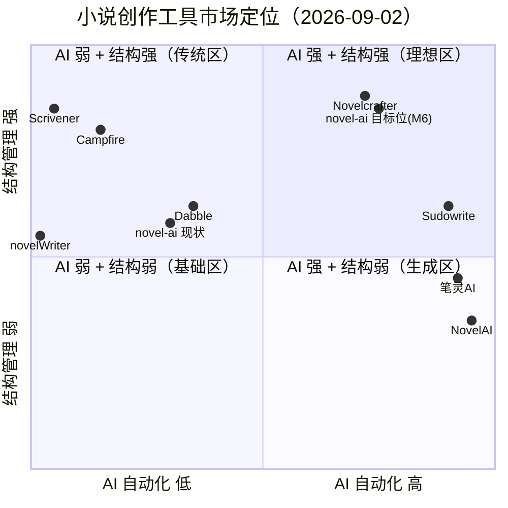

# Novel AI 竞品调研报告

| 项目 | 内容 |
|---|---|
| 调研日期 | 2026-09-02 |
| 调研方式 | 联网检索（WebSearch / WebFetch），逐条标注来源 URL |
| 调研对象 | 7 款同类 / 相邻产品（国外商业 4、国内商业 1、开源 2） |
| 服务对象 | `/Users/simpleli/workspace/novel-ai`（小说 AI 创作工作台，零运行时依赖） |
| 编写人 | 许清楚（产品经理） |

> **可信度说明**：本报告价格/功能均来自 2026-09-02 的检索结果。多个信息源冲突时已并列标注；无法查证的条目显式标注「未核实」，不做推测性补全。营销性质较强的来源（含返佣参数的 CSDN 文章）已单独标注可信度。

---

## 一、执行摘要（5 条核心发现）

1. **市场已分化为「AI 优先」与「结构优先」两条路线，中间地带是空位。**
   AI 派（Sudowrite / NovelAI / 笔灵 AI）卖生成能力，长篇一致性靠 Story Bible / Lorebook 这类「世界记忆层」兜底；结构派（Scrivener / Campfire / novelWriter）卖组织能力，AI 能力普遍薄弱或为零。**同时把「世界记忆层」和「长篇结构管理」做扎实的本地工具极少** —— 这正是本项目的机会窗口。

2. **「Codex / Story Bible / Lorebook」是本赛道已被验证的核心范式，且与本项目现有数据结构高度同构。**
   Novelcrafter 的 Codex 自动双向链接、NovelAI 的 Lorebook 关键词触发召回、Sudowrite 的 Story Bible，三者本质是同一件事：**设定条目 ↔ 正文的双向绑定 + 按需注入 AI 上下文**。本项目已有 `knowledge_entries`（含从未启用的 `embedding_ref` 列）与 `buildGraph()`，数据底座现成，缺的只是「自动链接」与「按需召回」两层。

3. **BYOK（自带密钥）是中型工具的标准答案，本项目目前是「半个 BYOK」。**
   Novelcrafter 全系 BYOK、支持接本地 Ollama/LM Studio；本项目 `novel-ai-provider.js` 已实现 OpenAI 兼容协议调用，但 **API Key 只能来自环境变量 `NOVEL_AI_API_KEY`，UI 的「保存 AI 配置」(F062) 只落库 `baseUrl` 与 `model`，无法配置密钥** —— 能力做了一半。

4. **长篇一致性不是靠更大的上下文，而是靠「伏笔/设定的生命周期管理」。**
   国内测评反复提到「过了 50 万字能不能不崩，只看有没有工具帮你锁住人设、伏笔、世界观」；NovelAI 用 Lorebook + Memory 双系统，灵蟹用「伏笔生命周期」。本项目有 `timeline_events`、`world_settings`、批注与待办，但**没有伏笔这一实体，也没有任何跨章节一致性校验的自动触发机制**（F032 冲突校验是单次 AI 调用，非持续追踪）。

5. **本项目的「零运行时依赖 + 本地单文件 SQLite」是真实差异化，但当前未被任何竞品对标项 Cover —— 也尚未被自己兑现。**
   所有商业竞品均为云订阅（$10–49/月），开源竞品（novelWriter / Manuskript）纯本地但无 AI。本项目理论上同时具备两者。但当前 **AI 侧默认走 mock、定时发布无后台调度器、切章丢稿**，差异化尚未兑现为体验优势。

---

## 二、竞品逐一分析

### 2.1 Sudowrite（美国 · 云 · 商业 · AI 优先）

| 维度 | 内容 |
|---|---|
| 定位 | 专为虚构写作打造的 AI 创作环境，强调「不夺走作者声音」 |
| 目标用户 | 长篇小说作者、系列作者、剧本作者；官方称 30 万+ 用户 |
| 技术形态 | 云端 SaaS，自研 Muse 模型 + 多模型接入（GPT-4/Claude/DeepSeek） |
| 核心能力 | Story Bible（设定中枢）、Write（~300 字续写）、Describe（五感描写）、Expand/Rewrite、Feedback（五维改进建议）、Canvas（可视化规划）、Brainstorm、1,000+ 插件、章节 Beats 生成 |
| 定价 | Hobby & Student $10/月（年付）、Professional $22/月、Max $44/月（年付，末档额度可结转 12 个月）；月付为 $19/$29/$59。**注：不同来源对 Professional 额度口径不一致（1,000,000 vs 450,000 credits），以官网为准，此处存疑** |
| 来源 | <https://sudowrite.com/blog/sudowrite-vs-chatgpt-best-ai-fiction-writer-2026>；<https://aitrendtool.com/tools/sudowrite>；<https://tools.forwardfuture.ai/details/sudowrite>（检索日 2026-09-02） |

**最值得借鉴的 2–3 个优点**

1. **Story Bible 作为唯一设定中枢**：所有 AI 调用无条件引用 Story Bible，避免「AI 遗忘设定」。→ 对应本项目应把 `knowledge_entries` 升格为强制注入层。
2. **Describe 五感描写（选中文本 → 定向增强）**：不是「润色全文」，而是「对选中片段做指定维度的改写」。→ 本项目 `runAi()` 已有 `selectedText` 字段，但传的是 `editor.value.slice(0, 1200)` 的正文开头，**并非用户真实选中内容**，能力未接通。
3. **Feedback 五维结构化评审**：把模糊的「帮我看看」变成固定的 5 个评审维度，输出稳定可比较。

**明显短板**：无永久免费档；订阅 + 额度双计费；云端存储，隐私敏感作者有顾虑；学习曲线集中在 Story Engine 工作流。

---

### 2.2 Novelcrafter（德国 · 云 · 商业 · 结构 + BYOK）

| 维度 | 内容 |
|---|---|
| 定位 | 「你的小说写作工具箱」，Codex 驱动的规划/写作/评审一体化工作区 |
| 目标用户 | 个人虚构作者（明确定位 B2C，无企业版）；官方称 11.6 万+ 作者 |
| 技术形态 | 浏览器端；**全系 BYOK，支持 OpenAI/Anthropic/Google/Meta/Mistral/OpenRouter 300+ 模型，以及本地 Ollama / LM Studio** |
| 核心能力 | **Codex**（自动检测并链接正文中提及的条目、别名/昵称识别、Progressions 追踪角色与设定的时间演化）、Grid / Outline 双规划视图、Scene Beats（要点转正文）、AI 场景摘要、AI 角色抽取、Workshop Chat、Word/Markdown/HTML 导入导出、修订历史、系列级 Codex 共享 |
| 定价 | Scribe $4/月、Hobbyist $8/月、Artisan $14/月、Specialist $20/月（AI 用量另付给模型厂商）；21 天全功能试用，免信用卡。**注：定价页按地区本地化，检索到新加坡区价格为 S$5.55/S$11.11/S$19.42/S$27.75，美元价以官方为准** |
| 来源 | <https://www.novelcrafter.com/features/codex>；<http://billing.novelcrafter.com/>；<https://knowara.com/ai-tools/writing/novelcrafter-review>（检索日 2026-09-02） |

**最值得借鉴的 2–3 个优点**

1. **Codex 自动提及检测（Automatic Mentions）**：作者打字时自动识别正文里的角色/地点/道具名并链接到 Codex 条目；支持别名与昵称。**这是本项目知识图谱最该补的一块** —— 本项目图谱完全靠手工 `add-*` 录入，正文中写了什么与图谱毫无联动。
2. **Progressions（演化追踪）**：同一个角色/地点在不同时间点的状态变化可版本化记录，直接解决「人设吃书」。
3. **Grid 视图显示「哪个 Codex 条目出现在哪个场景」**：把设定与场景的共现关系做成矩阵，一眼看出某角色是否长期缺席。

**明显短板**：无永久免费档；AI 成本与订阅费分离，实际总支出需另算；Workshop Chat 需 Artisan 档以上；部分 Advanced Review / Universes 功能标注仍在规划中。

---

### 2.3 Scrivener（英国 Literature & Latte · 桌面 · 买断 · 无 AI）

| 维度 | 内容 |
|---|---|
| 定位 | 长篇写作的事实标准：「数字活页夹 + 软木板 + 打字机」 |
| 目标用户 | 小说家、编剧、学术作者、记者；15+ 年历史，用户基数极大 |
| 技术形态 | 纯本地桌面（macOS/Windows/iOS），Dropbox 同步，**完全离线可用，无 AI** |
| 核心能力 | Binder 层级组织、Corkboard 索引卡、Outliner、Composition Mode（全屏专注）、Snapshot 快照版本控制、写作目标与历史统计、研究资料（图片/PDF/网页）内嵌、Compile 导出（Word/PDF/ePub/Final Draft/MultiMarkdown/LaTeX）、脚本写作模式、自动备份 |
| 定价 | **一次性买断**：macOS/Windows 各 $59.99（教育版 $49.99 / $50.99），iOS $23.99，双平台捆绑 $95.98–$99.99；30 天免费试用（非订阅） |
| 来源 | <https://blog.reedsy.com/scrivener-3/>；<https://scrivener.software/>；<http://toolradar.com/tools/scrivener>（检索日 2026-09-02） |

**最值得借鉴的 2–3 个优点**

1. **Snapshot 显式快照 + 自动备份**：本项目已有 `chapter_versions` 与回滚（F040/F040 相关），但**每次存稿都生成新版本**，缺乏「作者主动标记里程碑」的语义，也无数据库文件级自动备份。
2. **Compile 多格式导出**：一次配置，多种输出。本项目仅 JSON + TXT 两种，且 JSON 导出缺 8 张表（见 PRD 差距分析）。
3. **Composition Mode 全屏专注 + 打字机滚动**：写作工具的基础体验件，本项目完全没有专注模式。

**明显短板**：学习曲线陡峭；界面陈旧；Windows 版落后 Mac 版；无实时协作；仅支持 Dropbox 同步；**原生无 AI 能力**（这是本项目可正面进攻的点）。

---

### 2.4 NovelAI（美国 Anlatan · 云 · 商业 · AI 沙盒）

| 维度 | 内容 |
|---|---|
| 定位 | 沉浸式虚构叙事 / 角色扮演沙盒，非传统写作辅助 |
| 目标用户 | 同人作者、TRPG 玩家、互动小说创作者、对隐私极度敏感的创作者 |
| 技术形态 | 云端；**客户端加密存储（官方称员工无法读取）**；自研 Kayra / Clio / Erato / Xialong 模型；无公开 API |
| 核心能力 | **Lorebook**（关键词触发的持久化世界上下文，按档位 200/512/2048 token）、**Memory**（近期事件记忆）、Author's Note（隐藏指令，不出现在正文）、Biases（词汇与主题倾向调节）、分支剧情、自定义模块微调、图像生成、TTS、User Scripts |
| 定价 | Tablet $10/月、Scroll $15/月、Opus $25/月（年付约打 8 折）；无永久免费档，试用含 50 次文本生成。Opus 上下文 28,672 token |
| 来源 | <https://knowara.com/?p=1982/>；<https://buildfastwithai.com/ai-tools/novelai>；<https://aitexttools.net/tools/novelai>（检索日 2026-09-02） |

**最值得借鉴的 2–3 个优点**

1. **Lorebook 关键词触发式召回（而非全量注入）**：设定条目按需进入上下文，既省 token 又减少噪声。这直接指向本项目 `buildPrompt()` 的缺陷 —— **当前把整章正文 + 全部 relations + 全部 knowledge 无差别 `JSON.stringify` 塞进 prompt**（`novel-ai-provider.js:113-125`）。
2. **Memory 与 Lorebook 分离**：长期设定 vs 近期情节分开管理，职责清晰。
3. **Author's Note 隐藏指令**：给 AI 的指令不污染正文，作者可随时调整语气/走向。→ 本项目已有 `prompt_templates`，但**没有 per-project 的全局「作者备注」层**。

**明显短板**：无公开 API，无法自动化；上下文上限 28K（Opus），长篇仍需手工裁剪 Lorebook；定位偏沙盒/角色扮演，对严肃长篇写作帮助有限；图像为二次元风格，通用性弱。

---

### 2.5 Campfire（美国 · 云/桌面 · 商业 · 模块化世界构建）

| 维度 | 内容 |
|---|---|
| 定位 | 模块化写作与世界构建工具，按需购买模块 |
| 目标用户 | 奇幻/科幻等世界观重型作者 |
| 技术形态 | 浏览器 + Mac/Windows 桌面（可离线）；移动端模块子集 |
| 核心能力 | 模块制：Manuscript / Characters / Timeline / Maps（可打点地图）/ Encyclopedia（世界内 Wiki）/ Arcs / Relationships / Magic systems / Languages / Species / Cultures |
| 定价 | 免费档有模块上限（Manuscript 25,000 字、10 角色、20 时间线事件）；全模块 Standard $12/月、$99/年、$336 终身；单模块约 $5–15 或 $7.5 起 |
| 来源 | <https://scyn.app/blog/plottr-alternatives>；<https://scribeist.com/blog/best-novel-outlining-structuring-software-2026/>；<https://storyflow.so/blog/best-novel-planning-tools-2026>（检索日 2026-09-02） |

**最值得借鉴的 2–3 个优点**

1. **模块制产品形态**：不为用不到的功能付费，也避免界面膨胀。→ 本项目是单体工作台，可借鉴「面板按需展开/折叠」。
2. **Encyclopedia 内链 Wiki + Maps 打点**：把世界观条目做成可互链的百科，地图元素可挂接故事实体。
3. **Relationships 人物关系网模块**：本项目 `character_relations` + `buildGraph()` 已具备数据，缺的是可视化质量（见下）。

**明显短板**：模块多了界面变「仓库」；全模块价格累加；场景级 plotting 弱于 Plottr/Scrivener；AI 能力轻；主要服务类型文学，现实题材作者价值低。

---

### 2.6 Dabble（美国 · 云 · 商业 · 写作 + Plot Grid）

| 维度 | 内容 |
|---|---|
| 定位 | 介于 Scrivener 深度与纯文字处理器之间的清爽一体化工具 |
| 目标用户 | 想要结构但不想承受 Scrivener 复杂度的虚构作者 |
| 技术形态 | 纯云端 Web（全设备），AI 为付费附加项 |
| 核心能力 | **Plot Grid**（情节线 × 场景的二维网格，单元格即节拍，可追踪并行线索）、Story Notes（研究/角色/世界）、目标与连续打卡追踪、章节写作、云备份同步 |
| 定价 | Writer $19/月、Author $29/月、Bestseller $49/月（年付 8 折）；终身 Author Access $699；14 天试用。**注：另一来源称 $10/月或 $96/年（Standard），口径不一致，以官网为准** |
| 来源 | <https://scyn.app/blog/best-story-planning-software-2026>；<https://scribeist.com/blog/best-novel-outlining-structuring-software-2026/>；<https://typesofsoftware.com/best-book-writing-software-guide>（检索日 2026-09-02） |

**最值得借鉴的 2–3 个优点**

1. **Plot Grid 情节线 × 场景矩阵**：一眼看出某条副线在哪几章断了、哪个场景承载过多线索。**这是本项目缺失最明显的结构化视图** —— 当前只有章节列表与节点图，没有「线索 × 场景」的矩阵。
2. **目标 + 连续打卡（Streaks）**：把写作目标游戏化，比本项目静态的「今日 x/3000 字」更有行为驱动力。
3. **Story Notes 侧栏常驻**：参考资料不用来回切面板。

**明显短板**：无永久免费档；无终身（按档位描述存在冲突）；长期订阅成本高；深度不及 Scrivener；AI 需额外付费。

---

### 2.7 笔灵 AI（中国上海简办网络 · 云 · 商业 · 网文全流程）

| 维度 | 内容 |
|---|---|
| 定位 | 面向网文新人的「一键写全篇」全流程创作工具 |
| 目标用户 | 网文新人、日更压力大的签约作者（番茄/起点等平台） |
| 技术形态 | 云端 Web；关联主站 200+ 生成器与「百万级资料库」；云端自动存稿 |
| 核心能力 | 全篇编辑器（模板 → 大纲 → 章纲 → 正文）、**无限 AI 续写**（每章可续写，锚定初始人设与主线）、**拆书神器**（上传爆款文，拆解开篇结构/情绪节奏/爽点排布/悬念设置/角色塑造）、大纲生成器（含「10+ 审稿亮点 + 黄金 40 字导语 + 追更钩子」）、扩写/改写/润色、角色设定与人物关系生成、金手指/功法/兵器/场景等垂类生成器 |
| 定价 | 官网主推**终身会员**（赠 50 万 AI 字数，含资料库无限查看、AI 搜索总结无限制、拆书、编辑大纲等权益）；**具体月费/年费档位未在页面明确展示，未核实** |
| 来源 | <https://ibiling.cn/novel-editor>（官方站，WebFetch 实取，2026-09-02）；运营主体：上海简办网络科技有限公司（沪ICP备2023012375号-1） |

**最值得借鉴的 2–3 个优点**

1. **「拆书 / 反向工程爆款」**：上传同类爆款，输出结构公式。这是国内网文圈的高频刚需，且**与本项目已有的「知识库 + 术语表 + Prompt 模板」天然契合** —— 拆出来的公式可以直接存成 Prompt 模板与知识条目。
2. **续写强制锚定初始人设与主线**：不是纯续写，而是带约束的续写，直接对标作者最怕的「写跑偏」。
3. **垂类生成器矩阵（200+）**：金手指、功法、兵器、场景等。→ 本项目已有 23 个编辑器 AI 按钮，方向一致，可借鉴其「按题材/平台组织的模板货架」呈现方式。

**明显短板**：面向新人，长篇深度管理弱（第三方测评指出 50 万字后需人工盯设定、文风易套路化）；云端存储，无私有化；强依赖平台生态。（同类「作家助手妙笔版」据第三方测评存在**生成内容版权与阅文共享、硬核题材易被拦截**的问题，本项目若做云端需规避；该条来自二手测评，未核实官方条款。）

---

### 2.8 开源对照组：novelWriter（FOSS · 桌面 · 纯文本 · 无 AI）

| 维度 | 内容 |
|---|---|
| 定位 | 面向长篇的 Markdown 类纯文本编辑器 |
| 目标用户 | 偏好纯文本、重视数据主权的「规划型」作者 |
| 技术形态 | 跨平台（Linux/Windows/macOS）FOSS；**项目以纯文本文件存于本地，可直接纳入 git 版本管理**；完全离线 |
| 核心能力 | Project Tree 组织、类 Markdown 语法、注释/摘要/交叉引用元数据语法、角色与地点标注、Novel View 全书结构总览、Focus Mode、会话计时、写作统计 |
| 定价 | 免费开源。最新版本 2026.1.1（2026-06-28 发布） |
| 来源 | <https://novelwriter.io/>；<https://justpublishingadvice.com/choose-your-free-book-writing-software-for-your-new-book>（检索日 2026-09-02） |

**最值得借鉴的 2–3 个优点**

1. **纯文本 + git 可版本化**：数据主权与备份的终极形态。→ 本项目应至少提供「全量导出为可读文本 + 可回灌导入」，否则 SQLite 单文件损坏即全书尽失。
2. **交叉引用元数据语法**：在正文里用轻量标记引用角色/地点，工具自动汇总反向链接。→ 与 Novelcrafter 的 Automatic Mentions 殊途同归，且**零依赖可实现**（正则扫描即可）。
3. **会话计时 + 写作统计**：比单纯的字数统计更能反映创作投入。

**明显短板**：纯文本写作，无富文本；无 AI 能力；文件名非语义化，不便外部编辑；macOS 端 DMG 分发曾中断（需 PyPI 安装）。

---

## 三、横向对比矩阵（10 维度）

图例：`●` 完整支持　`◐` 部分支持 / 有重大限制　`○` 不支持 / 无　`—` 未核实

| 维度 | **本项目 novel-ai** | Sudowrite | Novelcrafter | Scrivener | NovelAI | Campfire | Dabble | 笔灵 AI | novelWriter |
|---|---|---|---|---|---|---|---|---|---|
| 定位 | 本地 AI 创作工作台 | AI 虚构写作环境 | 结构+BAAI 工作区 | 长篇写作标准 | AI 叙事沙盒 | 模块化世界构建 | 云端写作+情节网格 | 网文全流程 | 纯文本长篇 |
| 部署形态 | **本地（零依赖）** | 云 | 云 | 本地桌面 | 云 | 云+桌面 | 云 | 云 | 本地桌面 |
| 是否开源 | 是（本地仓库） | ○ | ○ | ○ | ○ | ○ | ○ | ○ | **● (FOSS)** |
| AI 能力 | ◐（已接通但默认 mock） | ● | ●（BYOK） | ○ | ● | ◐（轻） | ◐（付费附加） | ● | ○ |
| BYOK / 多模型 | ◐（**仅 env，UI 无法配密钥**） | ○ | **● (300+)** | ○ | ○ | ○ | ○ | — | ○ |
| 本地模型（Ollama 等） | ○ | ○ | **●** | ○ | ○ | ○ | ○ | ○ | ○ |
| 世界设定中枢（Codex/Lorebook） | ◐（有表有图，**未自动链接**） | ● Story Bible | **● Codex** | ◐ 研究夹 | **● Lorebook** | ● Encyclopedia | ◐ Story Notes | ◐ | ◐ 元数据 |
| 长篇结构视图 | ◐（章节列表 + 节点图） | ◐ Canvas | **● Grid/Outline** | ● 软木板/大纲 | ○ | ● 模块 | **● Plot Grid** | ◐ 章纲 | ● Project Tree |
| 伏笔 / 线索生命周期 | ○ | ◐ | ◐ | ○ | ○ | ◐ | ◐ | ◐ | ○ |
| 版本 / 快照 | ●（每存稿一版） | ◐ | ● 修订历史 | **● Snapshot** | ◐ | — | — | ◐ 云存稿 | **● (git)** |
| 定时 / 计划发布 | ◐（**无后台调度器**） | ○ | ○ | ○ | ○ | ○ | ○ | ◐ 平台同步 | ○ |
| 导出格式 | ◐（JSON/TXT，**JSON 缺 8 张表**） | ◐ | ● Word/MD/HTML | **● 多格式** | ◐ | ◐ | ◐ | ◐ | ● Pandoc |
| 导入 / 回灌 | ○（**完全无导入**） | ◐ | ● Word/MD/HTML | ● | ◐ | ◐ | ◐ | ● 上传草稿 | ● |
| 协作 | ○ | ○ | ●（高档位） | ○ | ○ | ◐ | ◐ | ○ | ○ |
| 价格 | **免费自用** | $10–59/月 | $4–20/月+BAAI 成本 | **$59.99 买断** | $10–25/月 | 免费档/$12 月/$336 终身 | $10–49/月 | 终身会员制（月费未核实） | **免费** |
| 数据主权 | **● 本地单文件** | ○ | ○ | ● | ◐ 客户端加密 | ○ | ○ | ○ | **●** |

---

## 四、市场定位象限图

横轴 = AI 自动化程度（低 → 高）；纵轴 = 长篇结构管理能力（弱 → 强）。

**读图说明**

- **象限 1（AI 强 + 结构强）**：目前只有 Novelcrafter 稳定在区内，Sudowrite 靠 Canvas 勉强触及边界。**这是本项目目标位（M6）**。
- **象限 2（AI 弱 + 结构强）**：拥挤区 —— Scrivener、Campfire、novelWriter 三款，靠买断/免费/离线取胜，但均无 AI。
- **象限 4（AI 强 + 结构弱）**：Sudowrite、笔灵 AI、NovelAI，生成力强但长篇一致性靠「记忆层」外挂兜底。
- **本项目现状 [0.30, 0.58]**：结构侧已有章节/版本/图谱/时间线/世界观等骨架（比象限 4 强），但 AI 侧因默认 mock、无真实召回与调度，实际自动化程度远低于代码表面的 23 个 AI 按钮所暗示的水平。**处于「中间偏左下」，尚未进入任何优势象限。**
- **移动路径**：
  - **横向（AI 0.30 → 0.75）** 靠：真实 provider 闭环 + 按需上下文召回 + 流式输出 + 定时调度器（对应 F075/F081/F082/F085）。
  - **纵向（结构 0.58 → 0.85）** 靠：Codex 式自动链接 + 大纲/场景网格 + 伏笔生命周期 + 完整导入导出（对应 F080/F083/F084/F078）。
- **象限评分口径说明**（保证可复核）：横轴 = 是否有真实模型调用 + 是否自动化注入上下文 + 是否有后台自动化任务；纵轴 = 是否具备多层级结构视图 + 设定实体是否结构化并与正文联动 + 版本/导出/导入完整度。分数为 0–1 主观标定，用于相对定位，非绝对测量。

---

## 五、竞品优点 → 本项目映射汇总

| 竞品 | 优点 | 本项目现状 | 引入难度 |
|---|---|---|---|
| Sudowrite | Story Bible 强制注入 | 有 `knowledge_entries`，但注入是无差别全量 | 低（改造 `buildPrompt`） |
| Sudowrite | Describe 选中片段定向改写 | `selectedText` 字段存在但传的是正文前 1200 字 | 低（补选区捕获） |
| Sudowrite | Feedback 结构化评审 | 无 | 中（新增任务类型 + 渲染） |
| Novelcrafter | Codex 自动提及 + 别名 | 完全无 | 中（正则扫描 + 反链表） |
| Novelcrafter | Progressions 状态演化 | 无 | 中 |
| Novelcrafter | Grid 条目 × 场景矩阵 | 无 | 中 |
| Novelcrafter | BYOK + 本地模型 | 半个（仅 env） | 中（涉及密钥存储，安全敏感） |
| Scrivener | Snapshot 里程碑快照 | 每存稿一版，无里程碑语义 | 低 |
| Scrivener | Compile 多格式导出 | 仅 JSON + TXT | 中 |
| Scrivener | 全屏专注模式 | 无 | 低 |
| NovelAI | Lorebook 关键词触发召回 | 无（全量注入） | 中 |
| NovelAI | Memory / Lorebook 分离 | 无 | 中 |
| NovelAI | Author's Note 隐藏指令 | 有 prompt 模板，无全局备注层 | 低 |
| Campfire | 模块制 / 面板折叠 | 单体，面板常驻 | 低 |
| Dabble | Plot Grid 情节线 × 场景 | 无 | 中 |
| Dabble | 目标 + 连续打卡 | 有静态目标进度 | 低 |
| 笔灵 AI | 拆书 / 反向工程爆款 | 无 | 中（可复用知识库 + Prompt 模板） |
| 笔灵 AI | 带约束续写（锚定人设主线） | 续写为无约束单次调用 | 中 |
| novelWriter | 纯文本导出 + 可回灌 | 导出不全、无导入 | 中 |
| novelWriter | 会话计时与写作统计 | 仅字数 | 低 |

> 逐条的需求编号、引入方式、前置依赖与风险见配套文档 `incremental-prd-2026-09-02.md` 第五章「竞品优点引入计划」。

---

## 六、结论与建议

1. **不要与 Sudowrite / 笔灵 AI 在「生成质量」上正面竞争** —— 它们有自研/微调模型与海量语料，本项目是 BYOK 壳层，拼生成必败。
2. **主攻「本地 + 结构 + 可控」三角**：数据在本地、上下文可控（作者清楚知道 AI 看到了什么）、结构可审计（伏笔/设定/时间线有明确状态）。这是所有云竞品的结构性弱点。
3. **优先补「世界记忆层」的自动化（Codex 式自动链接 + Lorebook 式按需召回）** —— 这是投入产出比最高、且与现有数据结构最契合的一块，也是从「象限 3/4」跃迁到「象限 1」的最短路径。
4. **尽快兑现已有的差异化承诺**：定时发布调度器、真实 AI 闭环、防丢稿，这三项属于「文档已承诺但未接通」，修复它们比新增功能更能建立可信度。
5. **严守零依赖红线**：本次调研中绝大多数优点（自动链接、按需召回、力导向布局、SSE 流式、ZIP 打包导出、本地 Ollama 调用）均可用 Node 内置模块（`node:zlib`、`node:http`、`node:sqlite` FTS5）实现。**唯一需要警惕的是向量嵌入（RAG）** —— 零依赖下无法本地生成高质量 embedding，建议采用「关键词 + TF-IDF 加权召回」的降级方案，或作为可选增强交由用户决策。

---

## 附：信息来源清单

| # | 产品 | 来源 URL | 检索日期 | 可信度 |
|---|---|---|---|---|
| 1 | Sudowrite | https://sudowrite.com/blog/sudowrite-vs-chatgpt-best-ai-fiction-writer-2026 | 2026-09-02 | 厂商自述（营销倾向） |
| 2 | Sudowrite | https://aitrendtool.com/tools/sudowrite | 2026-09-02 | 第三方，称已核对官方定价页 |
| 3 | Sudowrite | https://tools.forwardfuture.ai/details/sudowrite | 2026-09-02 | 第三方目录（标注 Checked 2026-08-22） |
| 4 | Novelcrafter | https://www.novelcrafter.com/features/codex | 2026-09-02 | 官方产品页 |
| 5 | Novelcrafter | http://billing.novelcrafter.com/ | 2026-09-02 | **官方定价页**（地区本地化价格） |
| 6 | Novelcrafter | https://knowara.com/ai-tools/writing/novelcrafter-review | 2026-09-02 | 第三方评测 |
| 7 | Scrivener | https://blog.reedsy.com/scrivener-3/ | 2026-09-02 | 第三方专业评测 |
| 8 | Scrivener | https://scrivener.software/ | 2026-09-02 | 第三方（价格口径清晰） |
| 9 | Scrivener | http://toolradar.com/tools/scrivener | 2026-09-02 | 第三方聚合（含 G2/Capterra 评分） |
| 10 | NovelAI | https://knowara.com/?p=1982/ | 2026-09-02 | 第三方评测（含实测描述） |
| 11 | NovelAI | https://buildfastwithai.com/ai-tools/novelai | 2026-09-02 | 第三方目录 |
| 12 | NovelAI | https://aitexttools.net/tools/novelai | 2026-09-02 | 第三方目录 |
| 13 | Campfire | https://scyn.app/blog/plottr-alternatives | 2026-09-02 | 第三方（标明核对至 2026-08-25 官方定价页） |
| 14 | Campfire | https://scribeist.com/blog/best-novel-outlining-structuring-software-2026/ | 2026-09-02 | 第三方评测 |
| 15 | Dabble | https://scyn.app/blog/best-story-planning-software-2026 | 2026-09-02 | 第三方（标明核对官方定价页） |
| 16 | Dabble | https://typesofsoftware.com/best-book-writing-software-guide | 2026-09-02 | 第三方导购 |
| 17 | 笔灵 AI | https://ibiling.cn/novel-editor | 2026-09-02 | **官方站**（WebFetch 实取） |
| 18 | 国内工具横评 | https://aitool.csdn.net/6a631bc7662f9a54cb93db41.html | 2026-09-02 | **低**（含返佣参数 `from=csdnnovelyczs0708`，营销性质强，仅用于产品名与定性描述） |
| 19 | novelWriter | https://novelwriter.io/ | 2026-09-02 | 官方站 |
| 20 | novelWriter | https://justpublishingadvice.com/choose-your-free-book-writing-software-for-your-new-book | 2026-09-02 | 第三方评测 |

**未核实项清单**：Sudowrite Professional 档额度（1,000,000 vs 450,000 credits，来源冲突）；笔灵 AI 月费/年费具体档位（官网仅展示终身会员）；阅文妙笔版版权归属条款（仅见二手测评）；Dabble 入门档价格（$19/月 vs $10/月，来源冲突）。
