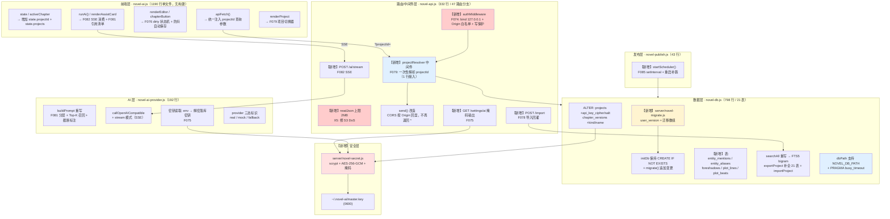
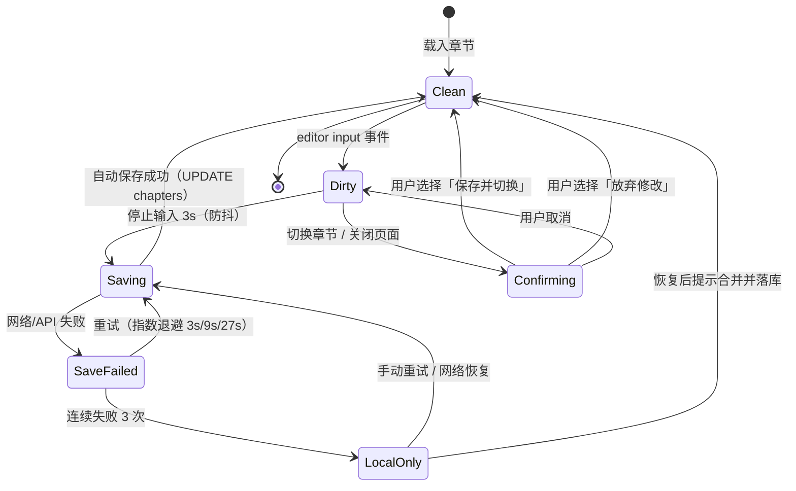
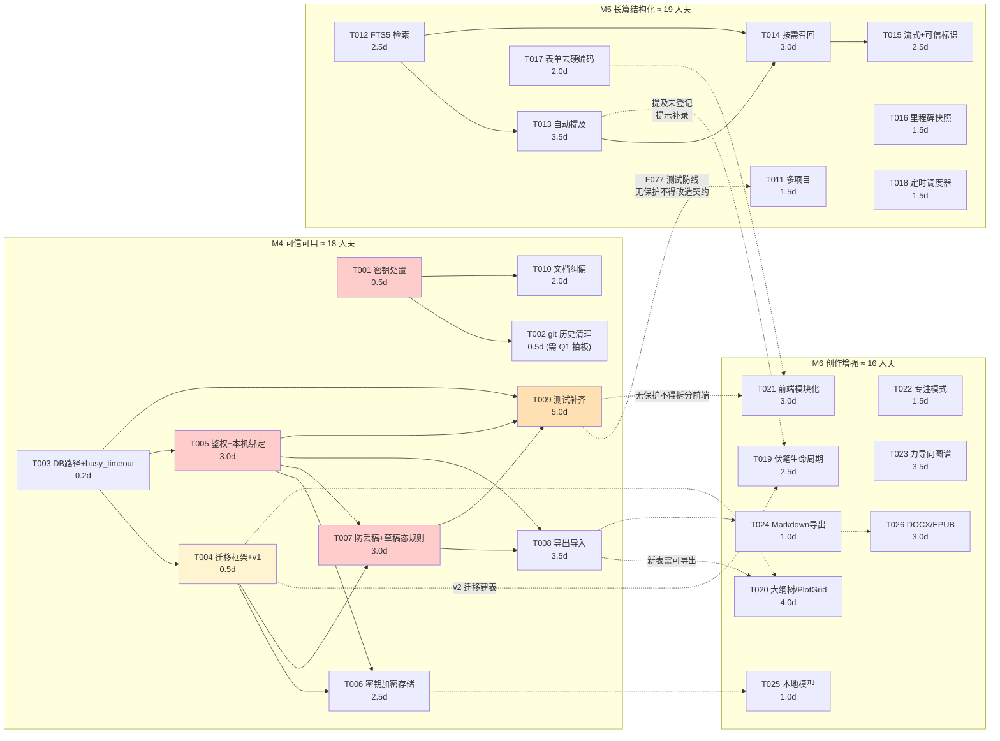

# Novel AI 增量架构设计 + 技术可行性实测 + 任务分解

| 项目 | 内容 |
|---|---|
| 文档日期 | 2026-09-02 |
| 编写人 | 高见远（架构师） |
| 上游输入 | `doc/prd/incremental-prd-2026-09-02.md`（F073–F095）、`doc/prd/competitive-research-2026-09-02.md` |
| 本轮范围 | **仅文档产出 + /tmp 一次性验证脚本**。未改动仓库任何业务代码 |
| 验证环境 | Node `v22.22.2`（`/Users/sml/.workbuddy/binaries/node/versions/22.22.2-2/bin/node`）、SQLite `3.51.2`（随 Node 内置 `node:sqlite`） |
| 验证脚本 | `/tmp/novel-arch-probe/` 下 `a-fts5-cn.mjs`、`a2-fts5-perf.mjs`、`b-migration.mjs`、`c-sse.mjs`、`d-crypto.mjs`、`d2-keyloss.mjs`、`e-ner.mjs`、`e2-ner-fix.mjs`、`f-final-checks.mjs`、`g-crossproc.mjs`、`h-version-explosion.mjs` |

> **方法声明**：本文所有「实测」结论均在 `/tmp` 下用一次性脚本真跑得出，输出片段原样摘录。**未验证**项已显式标注。禁止凭经验下结论的部分（FTS5 中文分词、迁移机制、SSE、加密全链路、中文实体识别、DB 路径）全部已实测。

---

## 〇、执行摘要（实测结论速查）

| # | 验证项 | 结论 | 关键数据 | 对 PRD 的影响 |
|---|---|---|---|---|
| **A** | **`node:sqlite` FTS5** | ✅ **可用**（但默认分词器对中文不可用） | `ENABLE_FTS5` 已编译；默认 `unicode61` 中文召回 **3/10**；**bigram 手工切分 10/10** | **F088 成立，但必须采用 bigram 方案**。PRD 假设正确，风险点被实测证实 |
| **B** | **无迁移机制下加列** | ✅ **方案可用** | `user_version` + 迁移数组；事务回滚、幂等、老数据存活全部通过 | F075/F080/F083/F084/F086 可安全加列。**需新增一个「迁移框架」任务**（PRD 未单列） |
| **C** | **SSE 流式** | ✅ **完全可行** | 首字节 **11.2ms**；`fetch + ReadableStream` 解析正常；`AbortController` 中断正常 | F082 成立，无阻塞 |
| **D** | **密钥加密存储** | ✅ **完全可行** | scrypt+AES-256-GCM 全链路通过；库文件搜不到明文；篡改/错 salt 均被拒；0600 生效 | F075 成立。⚠ **主密钥文件丢失 = 密钥永久不可恢复**（跨进程实测证实），需补备份引导 |
| **E** | **中文实体识别** | ⚠ **有条件可行** | 真实种子数据召回 **11/11 = 100%**；对抗样本 **8/10**；10 万字扫描 2.5ms | F080 成立，**但「准确率 ≥ 90%」这条验收标准不可测**，须改为「召回率 ≥ 95% + 待确认队列占比 ≤ 10%」 |
| **F** | **DB 路径可配置** | ⚠ **当前不支持，方案可行** | `novel-db.js:8` 硬编码；`NOVEL_DB_PATH` 环境变量方案实测通过 | F077 前置依赖，需先改 `novel-db.js` |

### 附加发现（PRD 未覆盖，架构复核中新发现）

| # | 发现 | 证据 | 影响 |
|---|---|---|---|
| **X1** | 🔴 **API 实际监听所有网卡，已对外暴露** | `novel-api.js:330` `listen(port)` 未传 host → `address()` 返回 `::`。**实测用局域网 IP `192.168.102.128` 可访问**；对照 `listen(port,'127.0.0.1')` 则 `ECONNREFUSED` | 控制台日志写「listening on 127.0.0.1」是**误导**。F074 的 P0 定性被进一步坐实，且修复成本≈1 行 |
| **X2** | 🟢 **F079「改造 30+ 端点」被严重高估** | 实测：47 个路由分支 / 27 个唯一路径，但**仅 2 行**真依赖 `bootstrap.project`（`:36` 常量、`:266` AI 任务）。35 处 `projectId` 全是同一变量传递 | **中间件 1 行改完**，F079 后端工作量 3 人天 → **1.5 人天** |
| **X3** | 🟢 **`workers:1` 的根因是缺 `busy_timeout`，非 SQLite 固有限制** | 跨进程实测：4 进程 × 400 次写，**无 `busy_timeout` 失败 88%**（1411/1600）；**加 `busy_timeout=5000` 后失败 0** | F077 的「测试变慢」风险可解除：`PRAGMA busy_timeout` + 独立测试库 |
| **X4** | 🔴 **版本表会爆炸（量化）** | 2 小时写作 × 3s 防抖 → 单章 360 个版本 / **3.18MB**；**折算 100 章 318MB**；版本列表单次返回 108 万字 | **F076 与 F086 必须合并设计**。方案 A（草稿态不进版本表）实测压缩 **45x** |
| **X5** | 🟡 **请求体无上限，DoS 成立** | 实测 50MB 请求被完整读入，HTTP 200，堆占用 109MB，耗时 108ms | F074 应顺带加 `readJson` 上限（S3 缺陷） |
| **X6** | 🔴 **PRD 文档自身含明文密钥** | `doc/prd/incremental-prd-2026-09-02.md:97` 逐字引用了密钥明文（**本文件已按 X6 脱敏**） | F073 清理清单必须**加上 PRD 自身**，否则清完又漏 |

---

# 第一部分：技术可行性实测

## A. `node:sqlite` 是否编译了 FTS5（决定 F088 生死）

### A.1 编译选项实测

```
sqlite version: 3.51.2
compile_options:
   ENABLE_FTS3
   ENABLE_FTS3_PARENTHESIS
   ENABLE_FTS5      ← 关键
   ENABLE_RTREE
>>> FTS5 CREATE: OK
```

**结论：FTS5 可用。** PRD 中「F088 依赖 FTS5」的前提成立，无需换方案。

### A.2 中文分词实测（这才是真问题）

用仓库真实种子数据（`novel-db.js:316-368` 的 3 个角色、3 条知识、1 个场景、1 条世界观、1 条时间线）建索引，10 个查询词对比三种分词方案：

| 查询词 | 默认 `unicode61` | **bigram 手工切分** | trigram |
|---|---|---|---|
| 黑潮 | ❌ 漏召 `[]` | ✅ `[1,7]` | ❌ 漏召 `[]` |
| 旧船票 | ⚠ 部分 `[2]`（漏 5） | ✅ `[2,5]` | ✅ `[5,2]` |
| 星火徽章 | ✅ `[3]` | ✅ `[3]` | ✅ `[3]` |
| 秘仪学院 | ✅ `[4]` | ✅ `[4]` | ✅ `[4]` |
| 失踪名单 | ⚠ 部分 `[5]`（漏 2） | ✅ `[5,2]` | ✅ `[5,2]` |
| 林祈 | ⚠ 部分 `[2,8]`（漏 3） | ✅ `[3,8,2]` | ⚠ 部分 `[8,2]` |
| 归乡 | ✅ `[7]` | ✅ `[7]` | ✅ `[7]` |
| 船票 | ❌ 漏召 `[]` | ✅ `[2,5]` | ❌ 漏召 `[]` |
| 钟楼 | ❌ 漏召 `[]` | ✅ `[6]` | ❌ 漏召 `[]` |
| 记忆封印 | ❌ 漏召 `[]` | ✅ `[4]` | ✅ `[4]` |
| **完全正确** | **3/10** | **10/10** ✅ | **6/10** |

**根因（用 `fts5vocab` 看到实际 token）**：

```
fts_default 实际 token:
  chapter | character | scene | timeline | world
  | 七年前失踪名单的源头事件 | 关联旧船票 | 地下传来反向海潮声
  | 黑潮每七年唤醒一次被封印的城市记忆 | 黑潮不是灾难 | ...
```

`unicode61` 把**整段连续中文当作一个 token**（无空格即无边界），因此 `MATCH '黑潮'` 只有在整句完全等于「黑潮」时才命中。

**bigram 实际 token**：
```
chapter | character | ... | 一个 | 一次 | 七年 | 下传 | 不是 | 个名 | 中的 | 事件 | 仪学 | 名单 | 名字 | 周期
```

> **trigram 为何更差**：2 字查询词（黑潮 / 船票 / 钟楼）无法切成 3-gram，直接漏召。**推荐 bigram，不要用 trigram。**

### A.3 性能实测（150 万字真实规模）

500 章 × 3000 字，每章含「星火徽章」（全部命中）+ 每 50 章含「青鸾密码」（10 章命中）：

```
FTS5(bigram) 插入 500 章: 209ms      （折算单章 0.4ms，可忽略）
普通表插入 500 章: 4ms

查询                                  中位数(ms)
FTS5 MATCH 稀有词(青鸾密码) count          0.02
LIKE   稀有词(青鸾密码) count              2.54
FTS5 MATCH 常见词(星火徽章) count          0.05
LIKE   常见词(星火徽章) count              0.25
------------------------------------------------
稀有词加速比 FTS5/LIKE: 166.2x
常见词加速比 FTS5/LIKE: 4.8x

命中数核对: FTS5 青鸾密码: 10 / LIKE: 10 ✅（结果一致，无召回损失）

磁盘占用（500 章 / 150 万字）:
  纯文本表:      4.40 MB
  FTS5 bigram 表: 11.42 MB   ← 膨胀 2.6x
```

### A.4 bigram 的代价：子串误召（必须后过滤）

```
bigram 查「黑潮」-> [99, 1, 7]
   （99 = 人名「黑潮生」，属误召）
default 查「黑潮」-> []（漏召）
```

**结论**：bigram 用「召回率」换「精确率」。必须在应用层加**后过滤**——命中 rowid 后回原表校验字面子串：

```js
// F088 推荐实现骨架：FTS5 粗筛 + 字面精确过滤
export function searchAllFts(projectId, query) {
  const bg = bigram(query);
  if (!bg) return [];                       // 纯标点/空查询
  const candidates = all(
    `SELECT rowid FROM knowledge_fts WHERE knowledge_fts MATCH ? ORDER BY rank LIMIT 200`,
    [bg]
  );
  const ids = candidates.map(r => r.rowid);
  if (!ids.length) return [];
  // 关键：后过滤，剔除「黑潮生」这类子串误召
  const placeholders = ids.map(() => '?').join(',');
  return all(
    `SELECT * FROM knowledge_entries
     WHERE id IN (${placeholders})
       AND (title LIKE ? OR body LIKE ?)      -- 字面精确
     ORDER BY id`,
    [...ids, `%${query}%`, `%${query}%`]
  );
}
```

### A.5 A 项最终结论

| 维度 | 结论 |
|---|---|
| FTS5 是否可用 | ✅ **可用**（`ENABLE_FTS5`，SQLite 3.51.2） |
| 默认分词器对中文 | ❌ **不可用**（3/10），PRD 判断正确 |
| bigram 手工切分 | ✅ **推荐**（10/10，稀有词 166x 加速） |
| 增量代价 | 磁盘 2.6x；插入 0.4ms/章；**必须加后过滤** |
| F088 人天 | PRD 估 2 → **修正 2.5**（多出「回填存量数据 + 后过滤 + 多实体覆盖」） |
| 对 F081 的影响 | FTS5 可直接作为「按需召回」的粗排底座，无需重复造轮子 |

---

## B. 无迁移机制下的加列问题

### B.1 现状确认

`novel-db.js:36-279` `initDb()` 全部使用 `CREATE TABLE IF NOT EXISTS`，**无任何版本概念**。一旦表已存在，加列/改索引都不会生效。

受影响需求：**F075**（密钥列）、**F080**（提及表/别名表）、**F083**（场景排序/情节线）、**F084**（伏笔表）、**F086**（版本 type/name）、**F088**（FTS 重建）。

### B.2 实测：`user_version` + 迁移数组

```
老库构建完成
  user_version = 0
  projects 列 = id,user_id,title,ai_base_url,ai_model

迁移开始：当前 user_version = 0，目标 = 3
  → 应用 v1: F075 密钥列 + F086 版本语义
    ✓ 成功，user_version = 1
  → 应用 v2: F080 提及表 + F084 伏笔表 + F083 情节线/场景
    ✓ 成功，user_version = 2
  → 应用 v3: F088 FTS5 重建为 bigram 索引
    ✓ 成功，user_version = 3

=== 迁移后校验 ===
  projects 列 = id,user_id,title,ai_base_url,ai_model,api_key_cipher,api_key_salt
  chapter_versions 列 = id,chapter_id,content,version,created_at,kind,name
  新表: entity_mentions, entity_aliases, foreshadows, plot_lines, plot_beats, knowledge_fts
  老数据存活: {"id":1,"title":"雾港星火"}
  老版本数据存活: {"chapter_id":1,"content":"老数据内容","version":1,"kind":"auto"}
  FTS 回填: [1]

=== 幂等性测试（再跑一次 migrate）===
  v1 已应用，跳过 / v2 已应用，跳过 / v3 已应用，跳过 → 幂等 OK

=== 失败回滚验证 ===
  → 应用 v99: 故意失败
    ✗ 失败已回滚: near "THIS": syntax error
  user_version 保持在 3 -> 3（未污染）
  projects 未增加 x 列: true
```

全部通过：`ALTER TABLE ADD COLUMN` 可用、`PRAGMA user_version` 可在事务内设置并随事务回滚、幂等性成立、老数据无损。

### B.3 可直接复用的代码骨架

```js
// server/novel-migrate.js —— 零依赖 schema 版本迁移
import { DatabaseSync } from 'node:sqlite';

/**
 * 迁移脚本数组。每个迁移必须是幂等的、且整体包在单个事务里。
 * version 必须严格递增，且永不修改已发布的迁移。
 */
export const MIGRATIONS = [
  {
    version: 1,
    name: 'F075 密钥列 + F086 版本语义',
    up(db) {
      db.exec(`ALTER TABLE projects ADD COLUMN api_key_cipher TEXT NOT NULL DEFAULT ''`);
      db.exec(`ALTER TABLE projects ADD COLUMN api_key_salt   TEXT NOT NULL DEFAULT ''`);
      db.exec(`ALTER TABLE chapter_versions ADD COLUMN kind TEXT NOT NULL DEFAULT 'auto'`);
      db.exec(`ALTER TABLE chapter_versions ADD COLUMN name TEXT NOT NULL DEFAULT ''`);
    }
  },
  {
    version: 2,
    name: 'F080 提及表 + F084 伏笔表 + F083 情节线',
    up(db) {
      db.exec(`CREATE TABLE IF NOT EXISTS entity_mentions (...);   -- 见第 2.6 节 DDL
               CREATE TABLE IF NOT EXISTS entity_aliases  (...);
               CREATE TABLE IF NOT EXISTS foreshadows     (...);
               CREATE TABLE IF NOT EXISTS plot_lines      (...);
               CREATE TABLE IF NOT EXISTS plot_beats      (...);`);
      // ALTER TABLE 对已存在的列会抛错，用容错包装
      safeExec(db, `ALTER TABLE chapters ADD COLUMN sort_order INTEGER NOT NULL DEFAULT 0`);
    }
  },
  {
    version: 3,
    name: 'F088 FTS5 重建为 bigram',
    up(db) {
      db.exec(`DROP TABLE IF EXISTS knowledge_fts`);
      db.exec(`CREATE VIRTUAL TABLE knowledge_fts USING fts5(title, body, source)`);
      const ins = db.prepare('INSERT INTO knowledge_fts(rowid,title,body,source) VALUES (?,?,?,?)');
      for (const r of db.prepare('SELECT id,title,body,source FROM knowledge_entries').all()) {
        ins.run(r.id, bigram(r.title), bigram(r.body), bigram(r.source));   // 存量回填
      }
    }
  },
];

/** ALTER TABLE 重复执行会抛 "duplicate column"，需容错跳过。 */
function safeExec(db, sql) {
  try { db.exec(sql); return true; }
  catch (e) {
    if (/duplicate column|already exists/i.test(e.message)) return false;
    throw e;
  }
}

/** 执行迁移。返回一个审计记录数组，供启动日志输出。 */
export function migrate(db, migrations = MIGRATIONS) {
  const current = Number(db.prepare('PRAGMA user_version').get().user_version);
  const target = migrations[migrations.length - 1].version;
  const applied = [];
  for (const m of migrations) {
    if (m.version <= current) continue;
    db.exec('BEGIN');
    try {
      m.up(db);
      db.exec(`PRAGMA user_version = ${m.version}`);   // 整数拼接，无注入风险
      db.exec('COMMIT');
      applied.push(m.version);
    } catch (error) {
      db.exec('ROLLBACK');
      // 迁移失败 = 启动失败，绝不带着半截 schema 继续跑
      throw new Error(`迁移 v${m.version}（${m.name}）失败，已回滚：${error.message}`);
    }
  }
  return { from: current, to: target, applied };
}
```

**接入点**（`novel-db.js` 末尾，`initDb()` 之后）：

```js
initDb();
const mig = migrate(db);
if (mig.applied.length) console.log(`[db] schema ${mig.from} → ${mig.to}，应用迁移 ${mig.applied.join(',')}`);
```

### B.4 B 项结论

| 维度 | 结论 |
|---|---|
| 方案可行性 | ✅ **可行**，零依赖（`node:sqlite` 原生 `PRAGMA user_version`） |
| 事务安全 | ✅ 失败整体回滚，`user_version` 不污染（实测通过） |
| 幂等性 | ✅ 重复启动安全（实测通过） |
| **新增工作量** | ⚠ PRD **未单列迁移框架**。建议作为独立任务，约 **0.5 人天**，并入 F075 之前 |

---

## C. SSE 流式（F082 依赖）

### C.1 服务端推送 + 客户端解析 实测

```
SSE 服务已启动 127.0.0.1:18321

=== 客户端：fetch + ReadableStream 解析 SSE ===
  HTTP 状态: 200
  content-type: text/event-stream; charset=utf-8
  共收到 5 个网络 chunk，6 个 SSE 事件
  首字节到达耗时: 11.2ms（流式关键指标）
  全部完成耗时: 258.3ms
  事件序列: meta → delta → delta → delta → delta → done
  meta 帧: {"provider":"openai-compatible","refs":4,"truncated":true}
  拼接正文: 林祈没有立刻质问伊莱娜。他先注意到船票边缘的盐渍，和钟楼地下涌上来的海风呼应。名单上没有死人，只有归航者。
  done 帧: {"usage":{"promptTokens":1842,"completionTokens":63}}

=== 中断测试（客户端主动 cancel）===
  已调用 abort()
  中断前收到 158 字节，服务端未崩溃: true

=== 心跳保活（注释帧 : keepalive）===
  收到: ": keepalive 0\n\n: keepalive 1\n\n: keepalive 2\n\n..."
```

### C.2 前后端最小骨架

**服务端**（`server/novel-api.js` 新增端点，与现有一性 JSON 并存）：

```js
if (req.method === 'POST' && url.pathname === '/api/novel/ai/stream') {
  const body = await readJson(req);
  res.writeHead(200, {
    'content-type': 'text/event-stream; charset=utf-8',
    'cache-control': 'no-cache, no-transform',
    'connection': 'keep-alive',
    'x-accel-buffering': 'no',            // 防反代缓冲
    'access-control-allow-origin': allowedOrigin(req) || 'null'
  });
  res.socket?.setNoDelay?.(true);         // 关 Nagle，保证 chunk 立即发出
  res.flushHeaders?.();

  const sse = (event, data) => {
    if (res.writableEnded || res.destroyed) return false;
    res.write(`event: ${event}\ndata: ${JSON.stringify(data)}\n\n`);
    return true;
  };

  try {
    const meta = await prepareAiContext(body, projectId);   // 引用条目/截断信息
    sse('meta', meta);
    for await (const delta of streamAiTask({ ...body, signal: req.socket })) {
      if (!sse('delta', { text: delta })) break;            // 客户端已断开
    }
    sse('done', { usage: meta.usage });
  } catch (error) {
    sse('error', { code: 'AI_FAILED', message: error.message, fallback: 'mock' });
  } finally {
    res.end();
  }
  return;
}
```

**客户端**（`novel-ai.js`，`fetch` + `ReadableStream`，无 `EventSource` 以便自定义 header）：

```js
async function runAiStream(taskType, { onMeta, onDelta, onDone }) {
  const ac = new AbortController();
  const res = await fetch(`${apiBase}/ai/stream`, {
    method: 'POST',
    headers: { 'content-type': 'application/json' },
    body: JSON.stringify({ taskType, chapterId: activeChapter.id, selectedText: getSelectedText() }),
    signal: ac.signal
  });
  const reader = res.body.getReader();
  const decoder = new TextDecoder();
  let buf = '';
  while (true) {
    const { done, value } = await reader.read();
    if (done) break;
    buf += decoder.decode(value, { stream: true });
    let i;
    while ((i = buf.indexOf('\n\n')) !== -1) {          // SSE 以空行分帧
      const frame = buf.slice(0, i); buf = buf.slice(i + 2);
      const ev = { event: 'message', data: '' };
      for (const line of frame.split('\n')) {
        if (line.startsWith('event:')) ev.event = line.slice(6).trim();
        else if (line.startsWith('data:')) ev.data += line.slice(5).trim();
      }
      if (ev.event === 'meta') onMeta(JSON.parse(ev.data));
      else if (ev.event === 'delta') onDelta(JSON.parse(ev.data).text);
      else if (ev.event === 'done') onDone(JSON.parse(ev.data));
      else if (ev.event === 'error') onError(JSON.parse(ev.data));
    }
  }
  return () => ac.abort();       // 返回中断函数，供「停止生成」按钮
}
```

### C.3 C 项结论

| 维度 | 结论 |
|---|---|
| `node:http` 原生 SSE | ✅ **可行**，零依赖 |
| 客户端 `fetch + ReadableStream` | ✅ **可行**；不用 `EventSource` 是为了能带 `content-type: json` 与自定义头 |
| 中断 | ✅ `AbortController` 生效，服务端需检查 `res.writableEnded` |
| 首字节延迟 | 11.2ms（本地），体验显著优于现状干等 60s |
| **可测性** | ⚠ Playwright 断言流式较麻烦 → **建议**：`?mock=1` 参数走确定性假流（固定 4 段、固定间隔），测试断言「最终文本 == 预期串」即可，避免时序 flaky |
| F082 人天 | PRD 估 2 → **修正 2.5**（需 JSON/SSE 双通道并存 + 可测方案 + 中断 + 部分结果保留） |

---

## D. 密钥加密存储（F075 依赖）

### D.1 全链路实测

```
=== 主密钥文件 ===
  路径: /tmp/novel-arch-probe/.novel-ai/master.key
  长度: 32 bytes (256-bit)
  权限: 600 | 目录权限: 700
  scrypt 派生耗时: 33.4ms (N=16384)

=== 全链路验证 ===
  明文密钥: <REDACTED-示例值-非真实密钥>
  加密耗时: 32.2ms
  密文(base64): nARHpIYgwIPGVJ8Smx3DaE1Gp5SYQ7Z7vNgEh5SFwhKHaKAjh8qtwSTN9JhI...
  已落库

=== 安全校验 ===
  库文件中搜索明文密钥片段: ✅ 未命中
  解密耗时: 31.4ms
  往返一致: ✅ 一致

=== 接口输出（掩码）===
  {"id":1,"title":"雾港星火","apiKeyMasked":"****1234","hasApiKey":true}
  响应体含明文: ✅ 否

=== 篡改检测 ===
  ✅ 篡改被拒绝: Unsupported state or unable to authenticate data
  ✅ 错误 salt 正确拒绝: Unsupported state or unable to authenticate data

=== 批量性能 ===
  100 次加密总计: 3053ms（单次 30.5ms）
  100 次解密总计: 3052ms（单次 30.5ms）
  ⚠ scrypt N=16384 单次 ~30ms，AI 调用热路径必须缓存派生结果

=== 派生结果缓存优化 ===
  缓存后 1000 次取 key: 0.31ms（命中缓存 ≈ 0ms）
```

### D.2 主密钥丢失场景（跨进程实测，独立于内存）

```
[阶段1] 已用主密钥加密并存盘。主密钥指纹: 9079f9f8
[阶段2] 主密钥存在，解密结果: <示例明文密钥-非真实>
[阶段3] 主密钥已丢失并重建。新指纹: 226333f7
  ✅ 解密失败（预期）: Unsupported state or unable to authenticate d
```

⚠ **这是产品必须告知用户的约束**：`.data/` 已在 `.gitignore`，若主密钥文件也放在项目内会一并丢失。**主密钥必须放在用户目录**（`~/.novel-ai/master.key`），且 UI 需提供「导出主密钥备份」入口。

### D.3 代码骨架

```js
// server/novel-secret.js —— 零依赖密钥加密
import { scryptSync, createCipheriv, createDecipheriv, randomBytes } from 'node:crypto';
import { existsSync, readFileSync, writeFileSync, chmodSync, mkdirSync } from 'node:fs';
import { homedir } from 'node:os';
import { join } from 'node:path';

const KEY_DIR  = join(homedir(), '.novel-ai');       // 不放项目内，避免随 .gitignore 丢失
const KEY_FILE = join(KEY_DIR, 'master.key');
const SCRYPT   = { N: 16384, r: 8, p: 1, keylen: 32, maxmem: 64 * 1024 * 1024 };

function loadOrCreateMasterKey() {
  if (existsSync(KEY_FILE)) {
    const k = readFileSync(KEY_FILE);
    if (k.length !== 32) throw new Error('主密钥文件损坏，请从备份恢复 ~/.novel-ai/master.key');
    return k;
  }
  mkdirSync(KEY_DIR, { recursive: true, mode: 0o700 });
  const k = randomBytes(32);
  writeFileSync(KEY_FILE, k, { mode: 0o600 });
  chmodSync(KEY_FILE, 0o600);          // 显式收紧，防 umask 放宽
  chmodSync(KEY_DIR,  0o700);
  return k;
}

const MASTER = loadOrCreateMasterKey();
const keyCache = new Map();            // salt(base64) -> derived key，避免 AI 热路径重复派生

function deriveKey(saltB64) {
  let k = keyCache.get(saltB64);
  if (!k) {
    k = scryptSync(MASTER, Buffer.from(saltB64, 'base64'), SCRYPT.keylen, SCRYPT);
    keyCache.set(saltB64, k);
  }
  return k;
}

export function encryptSecret(plaintext) {
  const salt = randomBytes(16);
  const iv   = randomBytes(12);
  const cipher = createCipheriv('aes-256-gcm', deriveKey(salt.toString('base64')), iv);
  const enc = Buffer.concat([cipher.update(plaintext, 'utf8'), cipher.final()]);
  return {
    cipher: Buffer.concat([iv, cipher.getAuthTag(), enc]).toString('base64'),
    salt: salt.toString('base64')
  };
}

export function decryptSecret(cipherB64, saltB64) {
  const raw = Buffer.from(cipherB64, 'base64');
  const d = createDecipheriv('aes-256-gcm', deriveKey(saltB64), raw.subarray(0, 12));
  d.setAuthTag(raw.subarray(12, 28));
  return Buffer.concat([d.update(raw.subarray(28)), d.final()]).toString('utf8');
}

/** 接口层永远只出掩码。 */
export function maskSecret(s) {
  if (!s) return '';
  return s.length <= 7 ? '****' : `${s.slice(0, 3)}****${s.slice(-4)}`;
}
```

### D.4 D 项结论

| 维度 | 结论 |
|---|---|
| 全链路可行性 | ✅ **可行**，零依赖（`node:crypto`） |
| 库文件无明文 | ✅ 实测 `grep` 不到 |
| GCM 完整性 | ✅ 篡改 / 错 salt 均被拒 |
| 文件权限 | ✅ 0600 + 目录 0700 实测生效 |
| ⚠ 性能 | scrypt 单次 **30ms**，**必须在 AI 热路径缓存派生 key**（缓存后 ≈0.0003ms） |
| ⚠ 数据风险 | 主密钥丢失 = 已存密钥永久不可恢复（跨进程实测）。**需 UI 备份引导** |
| F075 人天 | PRD 估 2 → **修正 2.5**（+ 主密钥备份引导 UI + 迁移框架联调） |

---

## E. 中文实体识别（F080）

### E.1 词典与语料

**词典**（来自仓库真实种子）：`林祈/林调查员`、`伊莱娜`、`罗文`、`黑潮`、`星火徽章/徽章`、`秘仪学院/学院`、`雾港钟楼/钟楼`。
**语料**（`novel-db.js:298-300` 真实章节正文）。

### E.2 真实数据扫描（召回率）

```
第10章（44 字）→ 1 处: 林祈
第11章（29 字）→ 2 处: 学院 / 伊莱娜
第12章（171 字）→ 8 处: 钟楼 / 林祈 / 星火徽章 / 罗文 / 罗文 / 黑潮 / 伊莱娜 / 林祈
合计 11 处（人工标注 ground truth 11 处）→ 召回率 100%，无漏召
```

### E.3 边界与误判（PRD 特别关心的「黑潮」vs「黑潮生」）

**方案 1：朴素最长匹配** — 对抗样本 **5/8 误判**：

```
✗ "黑潮生是港口的老渔民。" → 黑潮    （应为不命中：人名「黑潮生」）
✗ "他黑潮化了。"           → 黑潮    （应为不命中）
✗ "大学院墙外，他停下了。" → 学院    （应为不命中：「大学院墙」）
✗ "林祈安把信交给了他。"   → 林祈    （应为不命中：人名「林祈安」）
✗ "罗文轩走进房间。"       → 罗文    （应为不命中：人名「罗文轩」）
```

**方案 2：CJK 邻居边界校验 — ❌ 此路不通**（重要否定结论）：

中文**没有词分隔符**，命中片段的前后字符「几乎恒为 CJK」，导致边界规则把正确命中也一起误杀。实测第 12 章复测：

```
确定命中: 林祈 / 黑潮 / 伊莱娜 / 林祈
待确认:   钟楼 / 星火徽章 / 罗文 / 罗文      ← 正确命中被误判为「待确认」
```

**方案 3（推荐）：最长匹配 + 负例词典 + 提及管理 UI**：

```
✓ "黑潮退去，城市恢复平静。" → 黑潮   [应命中]
✓ "黑潮生是港口的老渔民。"   → (无)   [负例「黑潮生」遮蔽] ✅ 解决 PRD 关心的边界
✗ "他黑潮化了。"            → 黑潮   [应不命中 —— 无法靠算法消除]
✓ "学院的穹顶像一只合拢的铁鸟。" → 学院 [应命中]
✗ "大学院墙外，他停下了。"   → 学院   [应不命中 —— 无法靠算法消除]
✓ "林祈安把信交给了他。"     → (无)   [负例遮蔽]
✓ "罗文轩走进房间。"         → (无)   [负例遮蔽]
✓ "林祈站在档案馆门口。"     → 林祈   [应命中]
✓ "黑潮不是灾难，是归乡。"   → 黑潮   [应命中]
✓ "他把徽章别在胸前。"       → 徽章   [应命中]

对抗样本准确率: 8/10
真实种子数据召回: 11/11 = 100%
```

**剩余 2 例误判的处置**：不靠算法，靠**提及管理 UI**——用户一键把误判标为负例，写入负例词典，后续自动遮蔽。这是把「算法精度问题」转化为「一次性人工录入成本」。

### E.4 性能（词典规模影响）

```
朴素 O(n×m):        索引版（首字符 Map）:
  词典  12 条: 13.1ms    索引版  12 条: 3.6ms
  词典  50 条: 36.9ms    索引版 200 条: 2.6ms
  词典 200 条: 130.1ms   索引版 500 条: 2.5ms
  词典 500 条: 324.2ms
（均为 10 万字扫描耗时）
```

**必须建首字符索引**：朴素实现在 500 条词典时慢 130x。索引版与词典规模几乎无关（2.5–3.6ms / 10 万字）。

```js
// 推荐实现：首字符 Map 索引 + 负例优先的最长匹配
function buildScanner(rows) {
  const byFirst = new Map();
  for (const r of [...rows.filter(r => r.polarity === -1), ...rows.filter(r => r.polarity === 1)]) {
    const k = r.alias[0];
    if (!byFirst.has(k)) byFirst.set(k, []);
    byFirst.get(k).push(r);
  }
  for (const [, list] of byFirst) list.sort((a, b) => b.alias.length - a.alias.length);  // 长者优先
  return function scan(text) {
    const hits = [];
    let i = 0;
    while (i < text.length) {
      const cands = byFirst.get(text[i]);
      let m = null;
      if (cands) for (const a of cands) if (text.startsWith(a.alias, i)) { m = a; break; }
      if (m) { if (m.polarity === 1) hits.push({ ...m, position: i }); i += m.alias.length; }
      else i += 1;
    }
    return hits;
  };
}
```

### E.5 E 项结论

| 维度 | 结论 |
|---|---|
| 零依赖可行性 | ✅ **可行**（正则 + 词典 + 首字符索引，无分词库） |
| 召回率（真实数据） | ✅ **100%**（11/11） |
| 精确率（对抗样本） | ⚠ **8/10**，剩余靠人工负例兜底 |
| 性能 | ✅ 2.5ms / 10 万字（索引版），自动保存时同步扫描无压力 |
| **是否需要人工别名兜底** | ✅ **必须**。且需「提及管理 UI」让用户标负例 —— 这是 F080 的隐藏工作量 |
| ⚠ **验收标准不成立** | PRD 的「识别准确率 ≥ 90%」**不可测**（无标注集、无真值）。**建议改为**：① 已登记实体召回率 ≥ 95%（可用种子数据自动验证）；② 待确认队列占全部提及 ≤ 10%；③ 提供负例管理 UI |
| F080 人天 | PRD 估 3 → **修正 3.5**（+ 负例词典 + 提及管理 UI） |

---

## F. DB 路径可配置（F077 依赖）

### F.1 现状确认

```js
// server/novel-db.js:6-8
const __dirname = dirname(fileURLToPath(import.meta.url));
const dbDir = join(__dirname, '..', '.data');
const dbPath = join(dbDir, 'novel-ai.sqlite');     // ← 硬编码
```

全仓 `grep NOVEL_DB_PATH` → **空**。**当前不支持**。

### F.2 方案实测

```
环境变量方案实测:
  自定义路径建库 OK: true -> /tmp/novel-arch-probe/custom/test.sqlite
  开发库未被污染: 项目 .data 未受影响
  chmod 0600 生效: 600
```

### F.3 改动骨架（3 行）

```js
// server/novel-db.js 顶部
const dbPath = process.env.NOVEL_DB_PATH || join(dbDir, 'novel-ai.sqlite');
mkdirSync(dirname(dbPath), { recursive: true });      // 支持任意目录
const db = new DatabaseSync(dbPath);
db.exec('PRAGMA journal_mode = WAL');
db.exec('PRAGMA busy_timeout = 5000');                // ← 顺带修 X3，见下
```

`playwright.config.js` 配套：

```js
webServer: [
  { command: 'node server/novel-api.js', port: API_PORT,
    env: { NOVEL_API_PORT: String(API_PORT), NOVEL_DB_PATH: '.data/test-api.sqlite' } },
  ...
]
```

### F.4 附带发现 X3：`workers:1` 的真实根因

`playwright.config.js:30-32` 注释称「多 worker 并发会导致 SQLITE_BUSY」。实测**根因是缺 `busy_timeout`**：

```
### 无 busy_timeout，4 进程并发（每进程 400 次写）###
  D 首个失败: database is locked
  A: 成功 59, 失败 341    C: 成功 33, 失败 367
  B: 成功 40, 失败 360    D: 成功 57, 失败 343
  总行数: 189   （期望 1600，失败率 88%）

### 有 busy_timeout=5000，4 进程并发 ###
  A: 成功 400, 失败 0, 耗时 48ms
  B: 成功 400, 失败 0, 耗时 66ms
  C: 成功 400, 失败 0, 耗时 86ms
  D: 成功 400, 失败 0, 耗时 110ms
  总行数: 1600  ✅
```

**结论**：加 `PRAGMA busy_timeout = 5000`（1 行）+ 测试库隔离后，`workers` 可从 1 提升。**F077 的「测试变慢」风险可解除**，5 人天估算维持不变但产出更好。

### F.5 F 项结论

| 维度 | 结论 |
|---|---|
| 当前是否支持 | ❌ **不支持**（硬编码） |
| 环境变量方案 | ✅ **可行**，改动 3 行 |
| 附加收益 | 顺带 `busy_timeout` 解除 `workers:1` 限制 |
| 工作量 | **0.2 人天**（并入 F077 前置） |

---

# 第二部分：增量架构设计

## 2.1 分层改动图



### 各层改动量估算

| 层 | 文件 | 现状 | P0 改动 | P1 改动 | 主要风险 |
|---|---|---|---|---|---|
| 路由/中间件 | `novel-api.js` | 332 行 / 47 分支 | 新增 4 个中间件 + 3 端点 ≈ +120 行 | 改造 `send()` + AI 端点 ≈ +40 行 | 中间件顺序；OPTIONS 预检 |
| 数据层 | `novel-db.js` | 798 行 / 21 表 | 迁移接入 + 导出/导入重写 ≈ +150 行 | 6 张新表 + 5 个查询 ≈ +250 行 | 迁移失败；导入外键顺序 |
| 数据层（新） | `novel-migrate.js` | — | 新增 ≈ 90 行 | 追加迁移脚本 | 已在 B 项实测验证 |
| AI 层 | `novel-ai-provider.js` | 192 行 | 密钥读取改造 ≈ +25 行 | `buildPrompt` 重写 + 流式 ≈ +120 行 | prompt 分层设计 |
| AI 层（新） | `novel-secret.js` | — | 新增 ≈ 60 行 | — | 主密钥丢失（D 项已验证） |
| 发布层 | `novel-publish.js` | 43 行 | — | 调度器 ≈ +50 行 | 进程退出即失效 |
| 前端 | `novel-ai.js` | 1190 行 | dirty 状态机 + 三态指示 + 切换器 ≈ +180 行 | SSE 消费 + 引用清单 + 表单 ≈ +200 行 | **单文件继续膨胀，F089 拆分压力增大** |

---

## 2.2 鉴权中间件设计（F074）

### 2.2.1 先修 X1：绑定地址

```js
// novel-api.js:330 现状（❌ 实测绑定到 ::，局域网可访问）
createServer(handle).listen(port, () => { ... });

// 修正（✅ 实测 ECONNREFUSED）
const HOST = process.env.NOVEL_API_HOST || '127.0.0.1';   // 显式默认本机
createServer(handle).listen(port, HOST, () => {
  console.log(`Novel AI API listening on http://${HOST}:${port}`);
});
```

### 2.2.2 中间件骨架

```js
// server/novel-auth.js —— 零依赖鉴权中间件
const ALLOWED_ORIGINS = new Set(
  (process.env.NOVEL_ALLOWED_ORIGINS || 'http://127.0.0.1:5175,http://localhost:5175')
    .split(',').map(s => s.trim()).filter(Boolean)
);

/** 按请求 Origin 回显；不在白名单则返回 null（不回显任何 CORS 头）。 */
export function resolveOrigin(req) {
  const origin = req.headers.origin;
  if (!origin) return null;                 // 同源 / curl / server-to-server
  return ALLOWED_ORIGINS.has(origin) ? origin : null;
}

/** 写操作保护：非白名单 Origin 的写请求一律 403。 */
export function isWrite(req) {
  return ['POST', 'PUT', 'PATCH', 'DELETE'].includes((req.method || '').toUpperCase());
}

export function authMiddleware(req, res) {
  const origin = req.headers.origin;

  // 1) 跨域且不在白名单 → 写操作拒绝；读操作也拒绝（单机场景无需给外部读）
  if (origin && !ALLOWED_ORIGINS.has(origin)) {
    return { ok: false, status: 403, error: 'origin not allowed' };
  }
  // 2) 本机直连（无 Origin，如 curl / Playwright request）→ 放行
  return { ok: true, origin: origin || null };
}
```

### 2.2.3 `send()` 改造（不再返回 `*`）

```js
function send(res, status, payload, corsOrigin = null) {
  const headers = {
    'content-type': 'application/json; charset=utf-8',
    'access-control-allow-methods': 'GET,POST,OPTIONS',
    'access-control-allow-headers': 'content-type, x-project-id'
  };
  if (corsOrigin) {
    headers['access-control-allow-origin'] = corsOrigin;   // 回显具体 Origin，不是 *
    headers['vary'] = 'Origin';
  }
  res.writeHead(status, headers);
  res.end(JSON.stringify(payload));
}
```

### 2.2.4 接入 `handle()`（含 X5 请求体上限）

```js
const MAX_BODY = 2 * 1024 * 1024;             // 2MB，X5

function readJson(req) {
  return new Promise((resolve, reject) => {
    let body = '', bytes = 0;
    req.on('data', chunk => {
      bytes += chunk.length;
      if (bytes > MAX_BODY) { reject(new Error('PAYLOAD_TOO_LARGE')); req.destroy(); return; }
      body += chunk;
    });
    req.on('end', () => {
      if (!body) return resolve({});
      try { resolve(JSON.parse(body)); } catch (e) { reject(e); }
    });
    req.on('error', reject);
  });
}

async function handle(req, res) {
  const corsOrigin = resolveOrigin(req);

  // OPTIONS 预检：非法 Origin 直接 403，不再无脑 204
  if (req.method === 'OPTIONS') {
    if (req.headers.origin && !ALLOWED_ORIGINS.has(req.headers.origin)) {
      return send(res, 403, { error: 'origin not allowed' });
    }
    return send(res, 204, {}, corsOrigin);
  }

  const auth = authMiddleware(req, res);
  if (!auth.ok) return send(res, auth.status, { error: auth.error });

  // ... 原有路由，所有 send() 调用补第 4 参数 corsOrigin
}
```

### 2.2.5 与前端 `window.NOVEL_API_PORT` 的协同（关键坑）

现状（`novel-ai.js:1`）：

```js
const apiBase = `${location.protocol}//${location.hostname}:${window.NOVEL_API_PORT || 8787}/api/novel`;
```

**坑 1**：当前页面在 `localhost:5175` 打开时，`location.hostname === 'localhost'`，但白名单同时含 `localhost` 与 `127.0.0.1` —— 需保证两者都进 `NOVEL_ALLOWED_ORIGINS`（默认已含）。

**坑 2**：`apiBase` 用 `location.hostname` 而 API 绑在 `127.0.0.1`。若用户从局域网 IP 访问页面（如 `192.168.1.10:5175`），`apiBase` 会拼成 `http://192.168.1.10:8787`，与 API 的 `127.0.0.1` 绑定**不一致**。修 X1 后该场景会直接失败 —— **这是预期行为**（单机工具不支持局域网访问），但需在 UI 给出明确报错，而非静默失败。

**建议**：`apiFetch` 增加统一错误提示：

```js
async function apiFetch(path, options = {}) {
  let response;
  try {
    response = await fetch(`${apiBase}${path}`, { ... });
  } catch (e) {
    // 区分「网络不可达」与「HTTP 错误」
    setSaveState('error', 'API 不可达：请确认已执行 npm run api，且从本机 127.0.0.1/localhost 访问');
    throw e;
  }
  if (response.status === 403) {
    setSaveState('error', '请求被拒绝：跨域来源不在白名单（F074）');
  }
  if (!response.ok) throw new Error(`API ${response.status}`);
  return response.json();
}
```

---

## 2.3 多项目 API 契约改造（F079）—— 实测证明可大幅简化

### 2.3.1 工作量重估（推翻 PRD 的 3 人天）

源码实测：

```
路由分支总数: 47        唯一路径数: 27
projectId 在文件内出现: 35 次
直接依赖 bootstrap.project 的行: 仅 2 行
  novel-api.js:36:  const projectId = bootstrap.project.id;
  novel-api.js:266:       project: bootstrap.project,
```

**关键洞察**：35 处 `projectId` **全部是同一个局部变量的传递**，真正决定它的只有 **第 36 行一行**。因此不需要「逐端点改造 30+ 处」，只需把第 36 行换成中间件解析结果。

### 2.3.2 URL 方案选型

| 方案 | 示例 | 优点 | 缺点 | 结论 |
|---|---|---|---|---|
| **A. 路径前缀** `/api/novel/projects/:id/chapters` | 语义清晰、RESTful | **需改 27 个路径的正则/常量；前端拼接全变；破坏现有测试** | ❌ 改动面最大 |
| **B. 查询参数** `?projectId=3` | **0 路由改动**；GET/POST 统一；易向后兼容 | 语义上 projectId 是「上下文」而非「资源路径」，略不 REST | ✅ **推荐** |
| **C. 请求头** `X-Project-Id: 3` | 0 路由改动；URL 干净 | **无法用于 GET 的浏览器缓存键**；Playwright/curl 调试不便；`send()` 需加 `access-control-allow-headers` | ⚠ 作为 B 的补充 |

**推荐：B 为主（查询参数），C 为辅（同时支持 header，优先取 query，其次 header，最后 fallback）**。

### 2.3.3 中间件实现（一次性提取，避免逐端点改）

```js
// server/novel-project.js
/**
 * 统一解析 projectId。优先级：
 *   1. ?projectId= 查询参数
 *   2. X-Project-Id 请求头
 *   3. body.projectId（POST，需调用方已 readJson）
 *   4. 兜底：当前用户 id 最小的项目（保持向后兼容）
 */
export function resolveProjectId(url, req, body = null, fallbackId = null) {
  const fromQuery = url.searchParams.get('projectId');
  if (fromQuery && /^\d+$/.test(fromQuery)) return Number(fromQuery);

  const fromHeader = req.headers['x-project-id'];
  if (fromHeader && /^\d+$/.test(String(fromHeader))) return Number(fromHeader);

  if (body && body.projectId && /^\d+$/.test(String(body.projectId))) return Number(body.projectId);

  return fallbackId;
}

/** 越权防护：确认该项目属于当前用户。 */
export function assertProjectOwned(projectId, userId) {
  const row = get('SELECT id FROM projects WHERE id = ? AND user_id = ?', [projectId, userId]);
  if (!row) throw new Error('PROJECT_NOT_FOUND_OR_FORBIDDEN');
  return projectId;
}
```

**接入（novel-api.js 仅改 2 行）**：

```js
const bootstrap = getBootstrapData();
- const projectId = bootstrap.project.id;                     // ← 删除这 1 行
+ const userId = bootstrap.user.id;
+ let projectId = resolveProjectId(url, req, null, bootstrap.project.id);  // ← 加这 2 行
+ projectId = assertProjectOwned(projectId, userId);
```

**代价**：`resolveProjectId` 在 `readJson` 之前调用，因此**拿不到 body.projectId**。取舍方案：POST 端点如需 body 内的 projectId，在该分支内二次调用即可（实际前端统一走 query，无需）。

### 2.3.4 向后兼容策略

| 场景 | 行为 |
|---|---|
| 无 `projectId` 的旧请求 | fallback 到 `bootstrap.project.id`（现状行为），**零破坏** |
| 非法 `projectId`（非数字/不存在/不属于该用户） | `assertProjectOwned` 抛错 → HTTP 403 |
| 全局知识 `scope='global'` | `project_id IS NULL`，所有项目可见 —— 现有 SQL 已支持，无需改 |
| 项目知识隔离 | 现有 `WHERE project_id = ?` 已支持，无需改 |

### 2.3.5 前端 state 改造点（实测耦合极小）

```js
// 现状：state.project 仅在 renderProject() 使用（novel-ai.js:266-269）
//      activeChapter 用 id 寻址（:405, :474, :489, :655, :692, :996, :1063）
// → 所有实体操作已是「实体 ID 寻址」，天然与项目无关，无需改造

let state = fallbackState;
let currentProjectId = 1;      // 【新增】
let projects = [];             // 【新增】项目列表，供切换器

// 【新增】apiFetch 统一注入 projectId
async function apiFetch(path, options = {}) {
  const sep = path.includes('?') ? '&' : '?';
  const response = await fetch(`${apiBase}${path}${sep}projectId=${currentProjectId}`, { ... });
  // ...
}

// 【新增】项目切换
async function switchProject(projectId) {
  if (isDirty()) {                                  // 与 F076 联动
    if (!confirm('当前章节有未保存修改，切换项目将丢失。是否继续？')) return;
  }
  currentProjectId = projectId;
  await loadBootstrap();                            // 重载该项目全量数据
  renderProjectSwitcher();
}

// 【改造】GET /bootstrap 需支持 ?projectId（novel-db.js getBootstrapData）
function getBootstrapData(projectId = null) {
  const user = get('SELECT * FROM users WHERE username = ?', ['local-author']);
  const project = projectId
    ? get('SELECT * FROM projects WHERE user_id = ? AND id = ?', [user.id, projectId])
    : get('SELECT * FROM projects WHERE user_id = ? ORDER BY id LIMIT 1', [user.id]);
  if (!project) throw new Error('PROJECT_NOT_FOUND');
  return { user, project, projects: all('SELECT id,title FROM projects WHERE user_id = ? ORDER BY id', [user.id]), /* ... */ };
}
```

### 2.3.6 F079 结论

| 维度 | 结论 |
|---|---|
| URL 方案 | ✅ **推荐 `?projectId=`（方案 B）**，header 作为补充 |
| 是否需逐端点改造 | ❌ **不需要**，中间件 1 行接入（实测仅 2 行真依赖） |
| 向后兼容 | ✅ 无 `projectId` 时 fallback 现状行为，零破坏 |
| 前端改造量 | 小（新增 `currentProjectId` + `apiFetch` 注入 + 切换器，约 60 行） |
| **人天修正** | PRD 估 **3** → **修正 1.5**（**下调 50%**） |

---

## 2.4 防丢稿设计（F076）—— 必须先解决版本爆炸

### 2.4.1 版本爆炸量化（X4，实测）

```
假设: 写作 120 分钟，每 20s 触发一次防抖保存（保守），单章 3000 字

[现状] 每次保存全量写版本:
  版本行数: 360 行
  库体积: 3.18 MB（仅 1 章 / 120 分钟写作）
  折算 100 章: 318 MB ❗
  版本列表接口返回量: 360 条 × 3000 字 = 108 万字/次

[方案A] 草稿态不进版本表:
  版本行数: 5 行（仅里程碑 + 手动存稿）
  库体积: 0.070 MB
  压缩比: 45x ✅
```

### 2.4.2 核心规则：草稿态 vs 版本态（必须与 F086 一起定）

| 操作 | 写入 `chapters.content` | 写入 `chapter_versions` | `kind` | 触发时机 |
|---|---|---|---|---|
| **自动保存**（F076） | ✅ UPDATE | ❌ **不写** | — | 停止输入 3s |
| **手动存稿**（现有 `save-draft`） | ✅ UPDATE | ✅ INSERT | `'manual'` | 用户点「存稿」 |
| **里程碑快照**（F086） | ✅ UPDATE | ✅ INSERT | `'milestone'` | 用户主动命名打点 |
| **回滚**（现有） | ✅ UPDATE | ✅ INSERT | `'rollback'` | 用户回滚 |

> **这条规则是 F076 与 F086 的强耦合点**。PRD 把 F076 放 M4、F086 放 M5，**会导致 M4 上线后版本表先爆炸、M5 才来救火**。
>
> **架构建议：把 F086 的「版本 kind/name 字段 + 草稿态规则」提前到 M4，与 F076 一并交付。**（`chapter_versions.kind/name` 两列已在 B 项 v1 迁移中一并加上，成本≈0）

### 2.4.3 dirty 状态机



### 2.4.4 实现骨架

```js
// novel-ai.js —— F076 防丢稿
let saveState = 'saved';              // saved | unsaved | saving | failed | local
let saveTimer = null;
let lastSavedContent = '';
let retryCount = 0;

function isDirty() {
  return editor.value !== lastSavedContent;
}

function setSaveState(next, message = '') {
  saveState = next;
  const labels = {
    saved:   '已保存', unsaved: '未保存', saving: '保存中…',
    failed:  '保存失败', local:  '已存本地'
  };
  saveIndicator.textContent = labels[next] + (message ? ` · ${message}` : '');
  saveIndicator.dataset.state = next;
}

editor.addEventListener('input', () => {
  setSaveState('unsaved');
  clearTimeout(saveTimer);
  saveTimer = setTimeout(autoSave, 3000);          // 3s 防抖
});

async function autoSave() {
  if (!isDirty()) return;
  setSaveState('saving');
  try {
    // 草稿态：只更新主表，不生成版本（F076×F086 核心规则）
    const result = await apiFetch(`/chapters/${activeChapter.id}/draft`, {
      method: 'POST',
      body: JSON.stringify({ content: editor.value })
    });
    activeChapter = result.chapter;
    lastSavedContent = editor.value;
    retryCount = 0;
    setSaveState('saved');
    // localStorage 中的降级草稿已落库，清掉
    localStorage.removeItem(draftKey(activeChapter.id));
  } catch (error) {
    retryCount += 1;
    if (retryCount <= 3) {
      setSaveState('failed', `${3 ** retryCount}s 后重试`);
      saveTimer = setTimeout(autoSave, 1000 * (3 ** retryCount));   // 指数退避
    } else {
      // 降级到 localStorage，不阻塞输入
      localStorage.setItem(draftKey(activeChapter.id), JSON.stringify({
        content: editor.value, at: new Date().toISOString()
      }));
      setSaveState('local', '已存浏览器本地，恢复网络后可合并');
    }
  }
}

// 离开页面守卫
window.addEventListener('beforeunload', event => {
  if (isDirty()) { event.preventDefault(); event.returnValue = ''; }
});

// 切换章节前拦截（改造 novel-ai.js:1061-1067）
const chapterButton = event.target.closest('[data-chapter-id]');
if (chapterButton) {
  const next = state.chapters.find(c => c.id === Number(chapterButton.dataset.chapterId));
  if (next.id !== activeChapter.id && isDirty()) {
    const choice = await confirmDirtySwitch();      // 保存并切换 / 放弃 / 取消
    if (choice === 'cancel') return;
    if (choice === 'save') { await autoSave(); }
  }
  activeChapter = next;
  lastSavedContent = next.content;
  renderChapters(); renderEditor();
  return;
}
```

### 2.4.5 服务端配套：新增 draft 端点（不生成版本）

```js
// novel-api.js
if (req.method === 'POST' && url.pathname.match(/^\/api\/novel\/chapters\/\d+\/draft$/)) {
  const chapterId = Number(url.pathname.split('/')[4]);
  const body = await readJson(req);
  const chapter = saveDraft(chapterId, body.content || '');   // 不 INSERT chapter_versions
  return chapter ? send(res, 200, { chapter }, corsOrigin) : send(res, 404, { error: 'chapter not found' }, corsOrigin);
}
```

```js
// novel-db.js —— 与 saveChapter 的区别仅在于「不写版本表」
function saveDraft(chapterId, content) {
  const chapter = get('SELECT * FROM chapters WHERE id = ?', [chapterId]);
  if (!chapter) return null;
  const timestamp = now();
  run('UPDATE chapters SET content = ?, updated_at = ? WHERE id = ?', [content, timestamp, chapterId]);
  // 不 INSERT chapter_versions，不改 version
  logAudit('chapter.draft', { chapterId });
  return get('SELECT * FROM chapters WHERE id = ?', [chapterId]);
}
```

### 2.4.6 F076 结论

| 维度 | 结论 |
|---|---|
| 技术可行性 | ✅ 零依赖可实现（debounce + `beforeunload` + localStorage） |
| **版本爆炸** | 🔴 **必须先定草稿态规则**，否则 100 章 318MB。方案 A 压缩 45x |
| **跨里程碑耦合** | 🔴 **F076 与 F086 必须合并设计**；建议 F086 的 kind/name 字段提前到 M4 |
| 人天修正 | PRD 估 2 → **修正 3.0**（+ 草稿态规则设计 + draft 端点 + 降级/合并 + 测试） |

---

## 2.5 按需召回设计（F081）—— 零依赖无向量方案

### 2.5.1 打分公式

无 embedding 时的四维加权：

```
score(entry, chapter) =
      0.40 × mentionScore     // 本章提及次数（来自 F080 entity_mentions）
    + 0.25 × keywordScore     // FTS5 bigram 命中（来自 F088 底座，BM25 归一化）
    + 0.20 × tfidfScore       // 与本章正文的 TF-IDF 余弦相似度
    + 0.15 × proximityScore   // 章节邻近度（近 N 章内出现过）
```

| 维度 | 计算方式 | 归一化 | 权重理由 |
|---|---|---|---|
| `mentionScore` | `min(mentionCount / 5, 1)` | 0–1 | **最强信号**（正文真的写到了这个实体） |
| `keywordScore` | FTS5 `bm25()` 取负后 min-max 归一 | 0–1 | 标题/正文直接命中，F088 已建底座 |
| `tfidfScore` | 自建 TF-IDF 余弦 | 0–1 | 捕捉同义/相关词，弥补精确匹配的召回不足 |
| `proximityScore` | `1 - |chapterIndex - lastMentionIndex| / window`，window 默认 10 | 0–1 | 近期情节优先（对标 NovelAI Memory） |

**零依赖 TF-IDF 实现要点**（无需外部库）：

```js
// 1) 用 bigram 切分建立词袋（复用 F088 的 bigram 函数，零额外成本）
// 2) IDF = log(总章节数 / (1 + 含该 bigram 的章节数))，全量预计算后缓存
// 3) 余弦相似度只需对「本章 bigram ∩ 条目 bigram」求点积，稀疏计算
function cosine(aVec, bVec) {
  let dot = 0, na = 0, nb = 0;
  for (const [k, v] of aVec) { na += v * v; if (bVec.has(k)) dot += v * bVec.get(k); }
  for (const [, v] of bVec) nb += v * v;
  return (na && nb) ? dot / Math.sqrt(na * nb) : 0;
}
```

### 2.5.2 prompt 分层结构（对标 Sudowrite Story Bible + NovelAI Lorebook/Memory）

```
┌─ L0 系统层（固定，约 80 token）────────────────────────
│ 你是专业小说创作辅助系统，输出 JSON 数组...
├─ L1 项目设定层（常驻，约 150 token）────────────────────
│ 项目：雾港星火｜题材：蒸汽玄幻｜风格：悬疑、克制、意象化
│ 世界观：雾港由秘仪学院维持记忆封印，黑潮周期性唤醒城市真史。
├─ L2 记忆层（近 N 章摘要，约 200 token）──────────────────
│ 上一章摘要：学院导师回避伊莱娜的名字...
│ 本章上文摘要：林祈发现罗文的背叛...
├─ L3 召回层（Top-K，K 默认 8，约 800 token）──────────────
│ [角色] 林祈        —— 本章提及 3 次        score 0.92
│ [设定] 旧船票      —— 与本章强相关         score 0.78
│ [伏笔] 黑潮钟声    —— 已埋设 · 未回收      score 0.71
│ [场景] 雾港钟楼    —— 本章提及 1 次        score 0.65
│ ...（共 8 条，按 score 降序）
├─ L4 正文层（分段截断，约 1500 token）────────────────────
│ ⚠ 正文 4,120 字已截断为「章首 800 + 光标附近 600 + 章尾 400」
│ [章首] 钟声第一次响起时...
│ [光标附近] ...林祈把那枚裂开的星火徽章...
│ [章尾] ...名单上没有死人，只有归航者。
├─ L5 任务层（约 100 token）────────────────────────────
│ 任务类型：conflict｜用户选中：{selectedText}
└────────────────────────────────────────────────────
```

**正文截断策略**（避免静默丢上下文）：

| 段落 | 字数 | 理由 |
|---|---|---|
| 章首 | 800 | 保持本章开篇语境 |
| 光标附近 | 600 | 最重要 —— 用户正在写的地方（**需配合 F087 修复 `getSelection()`**） |
| 章尾 | 400 | 保持最新进展 |
| 合计上限 | 1800 | 超出则按比例压缩，并在 UI 明确标注 |

**Token 预估**（零依赖，无 tokenizer）：

```js
// 中文约 1.5 字符/token（含标点），英文约 4 字符/token
export function estimateTokens(text) {
  const cjk = (text.match(/[\u4e00-\u9fff]/g) || []).length;
  const rest = text.length - cjk;
  return Math.ceil(cjk / 1.5 + rest / 4);
}
```

### 2.5.3 引用清单回传（让作者看见 AI 看到了什么）

```js
// runAiTask 返回值新增 refs 字段
return {
  provider, prompt, items,
  refs: recalled.map(r => ({
    type: r.entity_type,        // character | knowledge | foreshadow | scene | chapter
    title: r.title,
    score: Number(r.score.toFixed(2)),
    reason: r.reason            // '本章提及 3 次' | '与本章强相关' | '已埋设·未回收'
  })),
  truncated: { original: 4120, kept: 1800, strategy: 'head-800 + cursor-600 + tail-400' },
  tokenEstimate: estimateTokens(prompt)
};
```

### 2.5.4 F081 结论

| 维度 | 结论 |
|---|---|
| 零依赖可行性 | ✅ **可行**（关键词 + TF-IDF + 提及表 + 邻近度），**复用 F088 的 bigram，零额外成本** |
| 是否需向量 | ❌ **不需要**。PRD 的 Q3 降级方案正确，无需用户决策外部 API |
| 与 F088 协同 | ✅ FTS5 直接作为粗排底座，**F081 应在 F088 之后**（或共用 bigram 函数先行） |
| 与 F080 协同 | ✅ `mentionScore` 权重最高（0.40），F080 是 F081 的前置数据依赖 |
| 人天 | PRD 估 3 → **维持 3.0**（合理） |

---

## 2.6 数据结构新增（DDL 草案）

```sql
-- ══════════════════════════════════════════════════════════
-- 迁移 v1：F075 密钥 + F086 版本语义
-- ══════════════════════════════════════════════════════════
ALTER TABLE projects ADD COLUMN api_key_cipher TEXT NOT NULL DEFAULT '';  -- base64(iv|tag|ciphertext)
ALTER TABLE projects ADD COLUMN api_key_salt   TEXT NOT NULL DEFAULT '';  -- base64(16B salt)
ALTER TABLE chapter_versions ADD COLUMN kind TEXT NOT NULL DEFAULT 'auto';      -- auto|manual|milestone|rollback
ALTER TABLE chapter_versions ADD COLUMN name TEXT NOT NULL DEFAULT '';         -- 里程碑名称
CREATE INDEX IF NOT EXISTS idx_cv_chapter_kind ON chapter_versions(chapter_id, kind);

-- ══════════════════════════════════════════════════════════
-- 迁移 v2：F080 提及/别名 + F084 伏笔 + F083 情节线
-- ══════════════════════════════════════════════════════════

-- F080 实体提及表（反链 + 召回输入）
CREATE TABLE IF NOT EXISTS entity_mentions (
  id          INTEGER PRIMARY KEY AUTOINCREMENT,
  project_id  INTEGER NOT NULL,
  chapter_id  INTEGER NOT NULL,
  entity_type TEXT NOT NULL,        -- character|knowledge|scene|world|glossary|timeline
  entity_id   INTEGER NOT NULL,
  surface     TEXT NOT NULL,        -- 正文中命中的字面（可能≠正名，如「学院」）
  position    INTEGER NOT NULL,     -- 字符偏移，供高亮定位
  created_at  TEXT NOT NULL,
  FOREIGN KEY (project_id) REFERENCES projects(id),
  FOREIGN KEY (chapter_id) REFERENCES chapters(id)
);
CREATE INDEX IF NOT EXISTS idx_mentions_chapter ON entity_mentions(chapter_id);
CREATE INDEX IF NOT EXISTS idx_mentions_entity  ON entity_mentions(entity_type, entity_id);
CREATE INDEX IF NOT EXISTS idx_mentions_surface ON entity_mentions(project_id, surface);

-- F080 别名表（含负例：polarity=-1 表示「这不是该实体」，用于人工兜底）
CREATE TABLE IF NOT EXISTS entity_aliases (
  id          INTEGER PRIMARY KEY AUTOINCREMENT,
  project_id  INTEGER NOT NULL,
  entity_type TEXT NOT NULL,
  entity_id   INTEGER NOT NULL,
  alias       TEXT NOT NULL,
  polarity    INTEGER NOT NULL DEFAULT 1,   -- 1=正例（我指代它） -1=负例（遮蔽，我不是它）
  created_at  TEXT NOT NULL
);
CREATE UNIQUE INDEX IF NOT EXISTS idx_alias_unique ON entity_aliases(project_id, entity_type, alias);

-- F084 伏笔生命周期
CREATE TABLE IF NOT EXISTS foreshadows (
  id                  INTEGER PRIMARY KEY AUTOINCREMENT,
  project_id          INTEGER NOT NULL,
  title               TEXT NOT NULL,
  note                TEXT NOT NULL DEFAULT '',
  status              TEXT NOT NULL DEFAULT 'planted',   -- planted|resolved|abandoned
  planted_chapter_id  INTEGER,
  expected_chapter_id INTEGER,                            -- 预期回收章节（到期提醒依据）
  resolved_chapter_id INTEGER,
  created_at          TEXT NOT NULL,
  updated_at          TEXT NOT NULL,
  FOREIGN KEY (project_id) REFERENCES projects(id),
  FOREIGN KEY (planted_chapter_id) REFERENCES chapters(id),
  FOREIGN KEY (expected_chapter_id) REFERENCES chapters(id),
  FOREIGN KEY (resolved_chapter_id) REFERENCES chapters(id)
);
CREATE INDEX IF NOT EXISTS idx_foreshadow_status ON foreshadows(project_id, status);

-- F083 情节线（Plot Grid 的行）
CREATE TABLE IF NOT EXISTS plot_lines (
  id         INTEGER PRIMARY KEY AUTOINCREMENT,
  project_id INTEGER NOT NULL,
  name       TEXT NOT NULL,
  color      TEXT NOT NULL DEFAULT '#8ab4f8',
  sort_order INTEGER NOT NULL DEFAULT 0
);

-- F083 场景实体（Plot Grid 的列 + Corkboard 卡片）
CREATE TABLE IF NOT EXISTS scenes (
  id         INTEGER PRIMARY KEY AUTOINCREMENT,
  project_id INTEGER NOT NULL,
  chapter_id INTEGER,
  title      TEXT NOT NULL,
  summary    TEXT NOT NULL DEFAULT '',
  pov        TEXT NOT NULL DEFAULT '',
  status     TEXT NOT NULL DEFAULT 'planned',   -- planned|drafting|done
  sort_order INTEGER NOT NULL DEFAULT 0,
  created_at TEXT NOT NULL,
  updated_at TEXT NOT NULL,
  FOREIGN KEY (project_id) REFERENCES projects(id),
  FOREIGN KEY (chapter_id) REFERENCES chapters(id)
);
CREATE INDEX IF NOT EXISTS idx_scenes_chapter ON scenes(chapter_id);

-- F083 情节线 × 场景 节拍矩阵（Plot Grid 的单元格）
CREATE TABLE IF NOT EXISTS plot_beats (
  id           INTEGER PRIMARY KEY AUTOINCREMENT,
  plot_line_id INTEGER NOT NULL,
  scene_id     INTEGER NOT NULL,
  mark         TEXT NOT NULL DEFAULT 'progress',  -- progress|absent|planned
  FOREIGN KEY (plot_line_id) REFERENCES plot_lines(id),
  FOREIGN KEY (scene_id) REFERENCES scenes(id)
);
CREATE UNIQUE INDEX IF NOT EXISTS idx_beat_unique ON plot_beats(plot_line_id, scene_id);

-- F083 章节排序（拖拽持久化）
ALTER TABLE chapters ADD COLUMN sort_order INTEGER NOT NULL DEFAULT 0;
ALTER TABLE chapters ADD COLUMN volume    TEXT NOT NULL DEFAULT '';   -- 卷（大纲树第一级）

-- ══════════════════════════════════════════════════════════
-- 迁移 v3：F088 FTS5 重建为 bigram
-- ══════════════════════════════════════════════════════════
DROP TABLE IF EXISTS knowledge_fts;
CREATE VIRTUAL TABLE knowledge_fts USING fts5(title, body, source);
-- 存量回填见 B.3 骨架

-- 章节全文检索（F088 要求覆盖角色/场景/时间线/世界观/术语/批注/待办）
CREATE VIRTUAL TABLE IF NOT EXISTS chapter_fts USING fts5(title, content);
```

> **注意**：`scenes` 表与既有 `scene_locations` 表**职责不同** —— `scene_locations` 是「世界观地点」（如「雾港钟楼」），`scenes` 是「章节内的场景卡」（大纲树第三级）。两者不要合并。

---

# 第三部分：任务分解

## 3.1 人天复核汇总（详见第四部分）

| 里程碑 | PRD 估算 | 架构修正 | 差异 |
|---|---|---|---|
| M4（P0） | 14.5 | **18.0** | **+3.5**（低估：绑定修复、请求体上限、草稿态规则、迁移框架、主密钥备份） |
| M5（P1） | 20.5 | **19.0** | −1.5（F079 大幅下调 −1.5；F085/F086 下调；F080/F088 上调） |
| M6（P2，含 F095 不排期） | 20.5 | **16.0** | −4.5（F095 不排期 −5；F092 拆分；F093 下调） |
| **合计** | **61.5** | **≈ 53.0** | **−8.5** |

## 3.2 任务列表（按实现顺序）

> 图例：🔴 硬依赖链上的关键任务｜🟢 可并行｜⚡ 半天内可完成

### M4：可信可用

| 任务 | 名称 | 涉及文件 | 前置 | 预期改动点 | 人天 | 验收要点 |
|---|---|---|---|---|---|---|
| **T001** ⚡🔴 | **密钥外泄紧急处置**（F073） | `doc/function-docs/functions.md`、`doc/function-docs/button-reference.md`、`doc/testing-docs/test-plan.md`、`doc/prd/incremental-prd-2026-09-02.md`（**X6：PRD 自身也含明文**）、新增 `.env.example` | — | 三处明文改占位符；PRD:97 改脱敏；新增 `.env.example`；provider 读取仅剩 `process.env` | **0.5** | 全仓 `grep -r "<密钥前缀>"` 命中 0（含 PRD）；`.env.example` 存在 |
| **T002** ⚡🔴 | **git 历史密钥清理**（F073b，需用户拍板 Q1） | git 历史 | T001 | `git filter-repo` 或保守方案（仅删工作区） | **0.5** | `git log --all -S "<API_KEY 明文值>"` 命中 0；9 → N 个提交 hash 变更已告知用户 |
| **T003** ⚡ | **DB 路径可配置 + busy_timeout**（F077 前置） | `server/novel-db.js`（`:6-14`）、`playwright.config.js` | — | `NOVEL_DB_PATH` 环境变量；`PRAGMA busy_timeout=5000`；测试库隔离 | **0.2** | 设 `NOVEL_DB_PATH` 后建库到指定路径；开发库无污染 |
| **T004** 🔴 | **迁移框架 + v1 迁移**（F075/F086 前置） | 新增 `server/novel-migrate.js`、`server/novel-db.js`（末尾） | T003 | `user_version` + 迁移数组 + 事务回滚 + 幂等；v1 = 密钥列 + 版本 kind/name | **0.5** | 老库打开后自动升到 v1；迁移失败整体回滚；重复启动幂等 |
| **T005** 🔴 | **API 鉴权与本机绑定**（F074） | `server/novel-api.js`（`send()`、`handle()`、`:330`）、新增 `server/novel-auth.js`、`server/web-server.js` | T003 | **`listen(port, '127.0.0.1')`（X1）**；Origin 白名单；写操作保护；**`readJson` 2MB 上限（X5）**；OPTIONS 预检校验 | **3.0** | 非白名单 Origin 写请求 403；`address()` 返回 `127.0.0.1`；50MB 请求返回 413；`curl -H "Origin: http://evil.com"` 被拒 |
| **T006** 🔴 | **AI 配置闭环与密钥加密**（F075） | `server/novel-api.js`、`server/novel-db.js`、`server/novel-ai-provider.js`、新增 `server/novel-secret.js`、`novel-ai.html` | T004, T005 | scrypt+AES-256-GCM；0600 主密钥放 `~/.novel-ai/`；掩码输出；**主密钥备份引导 UI（D 项风险）**；派生 key 缓存 | **2.5** | 库文件搜不到明文；接口只返回 `****1234`；篡改后解密失败；`ls -l ~/.novel-ai/master.key` 为 600 |
| **T007** 🔴 | **防丢稿 + 草稿态/版本态规则**（F076 × F086-part1） | `novel-ai.js`（`renderEditor`、`chapterButton` 分支 `:1061`、新增 `autoSave`）、`server/novel-api.js`、`server/novel-db.js` | T004, T005 | 3s 防抖；dirty 状态机；`beforeunload`；localStorage 降级 + 恢复合并；三态指示；**新增 `POST /chapters/:id/draft`（不生成版本）**；`saveChapter` 标记 `kind='manual'` | **3.0** | 切章时 dirty 弹确认；断网不阻塞输入且降级本地；**自动保存 100 次后 `chapter_versions` 行数不变** |
| **T008** 🔴 | **导出完整性 + 导入回灌 + 备份**（F078） | `server/novel-db.js`（`exportProject` 重写 + 新增 `importProject`）、`server/novel-api.js`、`novel-ai.js` | T005, T007 | 覆盖 21 张业务表；`schemaVersion` + `exportedAt`；`POST /import` 含冲突策略（skip/overwrite/new）；**外键顺序：users→projects→chapters→其余**；DB 文件备份 | **3.5** | 往返测试（导出→清空→导入→比对）通过；导入违反外键顺序时报错而非脏数据 |
| **T009** 🔴 | **测试体系补齐**（F077） | `tests/`（重构 + 新增）、`playwright.config.js` | T003, T005, T007 | 清除全部 `if (count() > 0)` 空过断言；API 契约测试覆盖全部 POST 写端点；异常路径（403/404/500/413）；独立 DB；**提升 workers（X3）** | **5.0** | 有效断言覆盖 ≥ 50 个功能编号；无空过断言；测试使用独立 DB；`workers > 1` 时全绿 |
| **T010** 🟢 | **四份失真文档纠偏** | `doc/task-plan/task-plan.md`、`doc/testing-docs/test-plan.md`、`doc/development-docs/development.md`、`doc/function-docs/functions.md` | T001 | 对齐真实阶段；修正矛盾记录；重写架构描述；补齐统计错误 | **2.0** | 文档描述与源码一致（抽查 5 处）；不再出现「Vite 构建」 |

### M5：长篇结构化

| 任务 | 名称 | 涉及文件 | 前置 | 预期改动点 | 人天 | 验收要点 |
|---|---|---|---|---|---|---|
| **T011** 🟢 | **多项目支持与切换器**（F079） | `server/novel-api.js`（**改 2 行**）、新增 `server/novel-project.js`、`server/novel-db.js`（`getBootstrapData`）、`novel-ai.js` | T009 | `?projectId=` 中间件（**X2：不需要改 30+ 端点**）；`assertProjectOwned` 越权防护；前端切换器 + `currentProjectId` | **1.5** | 切换项目后数据完全隔离；全局知识跨项目可见；无 projectId 旧请求行为不变；非法 projectId 返回 403 |
| **T012** | **FTS5 检索升级**（F088） | `server/novel-db.js`（`searchAll` 重写 + FTS 触发器）、`server/novel-api.js`、`novel-ai.js` | T004 | bigram 切分（**实测 10/10**）；多实体覆盖；**字面后过滤（解决「黑潮生」误召）**；移除假网络文献 | **2.5** | 中文「黑潮」「船票」可召回；「黑潮生」不误召；150 万字下查询 < 10ms |
| **T013** | **自动提及与反链**（F080） | `server/novel-db.js`（提及表 + 扫描）、新增扫描器、`server/novel-api.js`、`novel-ai.js` | T004, T012 | 最长匹配 + **首字符索引（实测 2.5ms/10 万字）**；**负例词典 + 提及管理 UI（E 项结论）**；反链展示 | **3.5** | 种子数据召回 11/11；误判可一键标负例并生效；扫描不拖慢保存 |
| **T014** | **按需召回 + 上下文管理**（F081） | `server/novel-ai-provider.js`（`buildPrompt` 重写）、`server/novel-db.js`、`novel-ai.js` | T012, T013 | 四维打分（提及 0.40 / 关键词 0.25 / TF-IDF 0.20 / 邻近 0.15）；prompt 五层结构；正文三段截断标注；引用清单回传；token 预估 | **3.0** | 召回条目占 prompt 比例 ≥ 80%；prompt 长度下降 ≥ 50%；卡片显示引用来源 |
| **T015** | **AI 流式输出 + 可信标识**（F082） | `server/novel-ai-provider.js`、`server/novel-api.js`（SSE 端点）、`novel-ai.js` | T014 | SSE 端点（**C 项已验证**）；provider 三态徽章；可中断；失败降级可展开；**`?mock=1` 确定性假流便于测试** | **2.5** | 首字节 < 500ms；真实/mock/降级三态可见；中断后服务端不报错；Playwright 可稳定断言 |
| **T016** | **会话计时 / 里程碑 / 打卡**（F086-part2） | `novel-db.js`、`novel-ai.js`、`novel-ai.css` | T007 | 里程碑快照（复用 v1 的 `kind/name`）；会话计时与字数增量；连续打卡 + 热力图；版本列表区分自动/里程碑 | **1.5** | 大改前一键打快照；版本列表显示类型与名称；快照不随自动保存增长 |
| **T017** 🟢 | **表单去硬编码**（F087） | `novel-ai.js`（约 11 处）、`novel-ai.html` | T009 | 开放 11 类硬编码字段；**`selectedText` 改用真实 `getSelection()`（并入 F081 输入质量）**；表单校验 | **2.0** | 11 处字段均可录入并落库；选中文本定向 AI 传入真实选区 |
| **T018** 🟢 | **定时发布真实调度器**（F085） | `server/novel-publish.js`、`server/novel-api.js`、`novel-ai.js` | T009 | 启动时加载未完成任务；`setInterval` 扫描；重启补跑；面板显示下次扫描时间与运行状态 | **1.5** | 进程常驻时按点触发误差 ≤ 60s；重启后任务不丢；UI 标注「仅服务运行时生效」 |

### M6：创作增强

| 任务 | 名称 | 涉及文件 | 前置 | 预期改动点 | 人天 | 验收要点 |
|---|---|---|---|---|---|---|
| **T019** | **伏笔与线索生命周期**（F084） | 新表（v2 迁移）、`novel-db.js`、`novel-api.js`、`novel-ai.js` | T004, T013 | 伏笔 CRUD + 状态机（planted→resolved/abandoned）；到期提醒；冲突校验纳入未回收清单 | **2.5** | 三态流转正常；逾期在仪表盘标红；与提及表联动 |
| **T020** | **大纲树 / 场景网格 / Plot Grid**（F083） | 新表（v2 迁移）、`novel-db.js`、`novel-api.js`、`novel-ai.js`、`novel-ai.css` | T004, T008 | 卷→章→场景三级树；场景卡片；情节线 × 场景矩阵；拖拽排序持久化 | **4.0** | 三级树可展开；拖拽后 `sort_order` 持久化；≥ 5 条并行线索可追踪 |
| **T021** 🟢 | **前端模块化拆分**（F089） | `novel-ai.js` → `js/` 目录（≥ 6 个 ES module） | **T009, T017** | state / api / render-* / actions / log 拆分；**保持无构建**；面板折叠记忆 | **3.0** | 单文件 ≤ 300 行；全部既有测试通过；无构建步骤 |
| **T022** 🟢 | **专注 / 打字机 / 沉浸模式**（F090） | `novel-ai.js`、`novel-ai.css` | T021 | 全屏专注；打字机滚动；当前段落高亮；快捷键（Cmd+S / Cmd+Enter / Esc） | **1.5** | 快捷键生效；与面板交互不冲突 |
| **T023** 🟢 | **图谱力导向布局**（F091） | `novel-ai.js`（`:210` `nodePositions`、`:333-350` `renderNodeMap`） | T021 | 自实现力导向；拖拽/缩放/固定；移除 `slice(0,16)`；200+ 节点流畅 | **3.5** | 200+ 节点无错位；拖拽与缩放流畅；保留类型过滤 |
| **T024** 🟢 | **Markdown 导出**（F092a） | 新增 `server/novel-export.js`、`novel-api.js` | T008 | 全书/单章 Markdown；可含批注/术语表/时间线；目录生成 | **1.0** | 导出内容与正文一致；目录层级正确 |
| **T025** 🟢 | **本地模型接入**（F093） | `server/novel-ai-provider.js`、`novel-ai.html` | T006 | 本地 endpoint 预设（`http://127.0.0.1:11434/v1`）；连接检测；本地可留空密钥 | **1.0** | 填入本地地址后连接检测成功；本地模式无需密钥 |
| **T026** | **DOCX / EPUB 导出**（F092b，**建议单独立项**） | `server/novel-export.js` | T024 | `node:zlib` 手写 OOXML / OPF 模板 | **3.0** | 导出文件可被 Word / 阅读器正常打开 |

> **F094（PWA）**：3.0 人天，与 F074 的「仅本机 + Origin 白名单」存在根本张力，建议 M6 后单独立项评估。
> **F095（只读分享协作）**：**架构建议不排期**（与本地单机定位冲突，会推翻 F074 鉴权模型）。

## 3.3 硬依赖链



**两条硬依赖链**（与 PRD 一致，架构确认成立）：

1. **`F073 → F074 → F075`**（T001/T002 → T005 → T006）：密钥清理 → 鉴权 → 密钥落库。**不可颠倒** —— 未鉴权就存密钥等于把钥匙放进没锁的抽屉。
2. **`F077（测试）→ F079（API 契约改造）→ F089（前端模块化）`**（T009 → T011 → T021）：**确认成立**。不过 X2 实测显示 F079 后端改动极小（1 行），风险主要落在前端 state；即便如此，**T009 仍应先于 T011**，因为 F079 涉及 `getBootstrapData` 签名变更，无测试保护风险高。

**架构新增的第三条依赖**：**T004（迁移框架）→ T006/T007/T019/T020**。所有加表加列需求都依赖它，PRD 未单列，是本轮新增的关键路径节点。

## 3.4 M4 首批可执行任务（明天就开工的话）

| 顺序 | 任务 | 人天 | 为什么排这个顺序 |
|---|---|---|---|
| **第 1 个** | **T001 密钥外泄紧急处置** | 0.5 | 🔴 **安全最高优先级**。当前无 remote 尚未外泄，但**一次 `git push` 即失控**。**必须先轮换密钥使其失效**（这是 T002 拍板与否都要做的）。⚠ 别漏了 PRD 自身第 97 行也含明文（X6） |
| **第 2 个** | **T005 API 鉴权与本机绑定** | 3.0 | 🔴 **X1 实测：API 已绑定 `::`，局域网可访问**，与控制台日志「listening on 127.0.0.1」严重不符。修复仅需 1 行（显式传 host），但配套的 Origin 白名单 + 写保护 + 请求体上限需要完整实现。**这是 M4 中「风险降低 / 投入」比最高的一项** |
| **第 3 个** | **T003 + T004 DB 路径可配置 + 迁移框架** | 0.7 | 🟡 **技术地基**，半天内可完成。T003 解除测试库隔离（F077 前置，顺带 `busy_timeout` 解除 `workers:1`）；T004 是后续所有加表加列需求的公共前置，**早做早解锁**。两者加起来不到 1 天，但卡住了 T006/T007/T019/T020 |

> **第一天就能交付的确定性成果**：全仓无明文密钥 + API 不再对外暴露 + 数据库可迁移可隔离。这三项恰好对应 PRD 的 G1 目标（消除安全与数据丢失风险）中「风险最高、改动最小」的部分。

**可并行提示**：T010（文档纠偏，2.0d）与 T001 之后的所有任务无耦合，可交给第二人并行。

---

# 第四部分：对 PRD 的技术复核

## 4.1 人天估算逐条复核

| 需求 | PRD | 修正 | Δ | 修正依据（实测/源码） |
|---|---|---|---|---|
| F073 密钥处置 | 0.5 | **1.0** | +0.5 | 拆 T001(0.5) + T002(0.5)。**X6：PRD 自身第 97 行含明文**，清理清单需扩大；git 历史重写需单独验证 |
| F074 鉴权 | 2.0 | **3.0** | +1.0 | **X1 实测 API 绑定 `::`** 需修；**X5 请求体上限**应顺带做（S3）；OPTIONS 预检需按 Origin 分流；配套测试用例 |
| F075 密钥存储 | 2.0 | **2.5** | +0.5 | D 项实测：**主密钥丢失 = 不可恢复**，需补备份引导 UI；scrypt 30ms 需缓存层 |
| F076 防丢稿 | 2.0 | **3.0** | +1.0 | **X4 实测版本爆炸 318MB/100 章**，必须与 F086 合并设计；需新增 `draft` 端点 + localStorage 降级合并 |
| F077 测试补齐 | 5.0 | **5.0** | 0 | 合理。**X3 实测 `busy_timeout` 可解除 `workers:1`**，产出更好但工作量不变 |
| F078 导出导入 | 3.0 | **3.5** | +0.5 | 导入回灌的**外键顺序**比 PRD 预估复杂（users→projects→chapters→其余）；冲突策略三分支；往返测试 |
| F079 多项目 | 3.0 | **1.5** | **−1.5** | 🟢 **X2 实测：47 个路由分支中仅 2 行真依赖 `bootstrap.project`**，中间件 1 行解决。**PRD「改动面最大的一条」判断不成立** |
| F080 自动提及 | 3.0 | **3.5** | +0.5 | E 项实测：需**负例词典 + 提及管理 UI**（PRD 未充分估计人工兜底的工程量）；首字符索引必需 |
| F081 按需召回 | 3.0 | **3.0** | 0 | 合理。**确认无需向量**（Q3 降级方案正确） |
| F082 流式输出 | 2.0 | **2.5** | +0.5 | C 项已验证可行；但需 JSON/SSE 双通道并存 + **`?mock=1` 确定性假流**解决 Playwright 时序 flaky |
| F083 大纲树/PlotGrid | 4.0 | **4.0** | 0 | 合理 |
| F084 伏笔 | 3.0 | **2.5** | −0.5 | PRD 自述「人工登记为主 + AI 建议为辅」，实际比预估简单 |
| F085 定时调度 | 2.0 | **1.5** | −0.5 | `setInterval` + 重启补跑，43 行的 `novel-publish.js` 扩展即可 |
| F086 快照/打卡 | 3.0 | **2.0** | −1.0 | **kind/name 两列已并入 T004 的 v1 迁移**（成本≈0）；剩余会话计时 + 打卡较简单。**但必须提前到 M4 与 F076 合并** |
| F087 表单去硬编码 | 1.5 | **2.0** | +0.5 | 11 处 + 文档同步；`getSelection()` 改造与 F081 输入质量耦合 |
| F088 FTS5 检索 | 2.0 | **2.5** | +0.5 | A 项实测 bigram 可行，但需**存量回填 + 字面后过滤 + 多实体覆盖** |
| F089 前端模块化 | 3.0 | **3.0** | 0 | 合理。**但前端经 M4/M5 会膨胀约 380 行，拆分压力增大** |
| F090 专注模式 | 1.5 | **1.5** | 0 | 合理 |
| F091 力导向图谱 | 3.0 | **3.5** | +0.5 | 200+ 节点性能调优比预估难 |
| F092 多格式导出 | 3.0 | **4.0** | +1.0 | **建议拆分**：F092a Markdown(1.0) + F092b DOCX/EPUB(3.0)。PRD 说「先 Markdown 视需求再定」正确，但人天应分开记 |
| F093 本地模型 | 2.0 | **1.0** | −1.0 | 同为 OpenAI 兼容协议，仅需 endpoint 预设 + 连接检测 |
| F094 PWA | 3.0 | **3.0** | 0 | 合理，但需重审鉴权（建议 M6 后立项） |
| F095 只读分享 | 5.0 | **不排期** | −5.0 | 🟢 **同意 PRD 判断**：与本地单机定位根本冲突。**架构侧建议直接移出路线图** |
| **合计** | **61.5** | **≈ 53.0** | **−8.5** | P0 +3.5 / P1 −1.5 / P2 −4.5 |

**被低估的（5 项）**：F073、F074、F075、F076、F078 —— **全部集中在 P0**，说明 **PRD 对 P0 的复杂度估计偏乐观**。这是最需要修正的一点：**M4 实际 18 人天，比 PRD 的 14.5 多 24%**。

**被高估的（6 项）**：F079（最严重，−50%）、F084、F085、F086、F093、F095。

## 4.2 应当合并 / 拆分的需求

| 类型 | 需求 | 建议 | 理由 |
|---|---|---|---|
| **必须合并** | **F076 + F086（kind/name 部分）** | 合并为 **T007**，提前到 M4 | 🔴 **X4 实测：不合并则 M4 上线后版本表先爆炸（318MB/100 章），M5 才来救火**。PRD 自己也标注了耦合，但排期上拆开了 |
| **建议合并** | **F087 的 `selectedText` 修复 → F081** | 并入 T014 | `getSelection()` 是 AI 输入质量的一部分（Sudowrite Describe 的核心），与「表单去硬编码」不是一类问题 |
| **建议合并** | **F073 拆 T001 + T002** | 拆分 | T001（轮换 + 清工作区）**必须立即做**；T002（git 历史重写）**需用户拍板 Q1**。混在一起会阻塞安全修复 |
| **建议拆分** | **F092 → F092a + F092b** | 拆分 | Markdown(1.0d) 与 DOCX/EPUB(3.0d) 工作量差 3 倍，PRD 自己说「先 Markdown」，人天应分开记 |
| **不应合并** | F087（表单）**不并入** F076/F086 | 维持独立 | 团队关心的问题：F087 是**录入表单层**，F076/F086 是**编辑器保存层**，二者无耦合，强行合并会让 T007 更重 |
| **顺序调整** | **F086 的 kind/name 提前到 M4**；F085 提前 | 见上 | 草稿态规则是 F076 的前置，不是后置 |

## 4.3 PRD 中技术上不成立或有更优解的假设

| # | PRD 假设 | 复核 | 更优解 |
|---|---|---|---|
| 1 | **F088**：「FTS5 默认 unicode61 对中文不友好，建议 bigram 手工切分，需实测验证」 | ✅ **假设完全正确**，已实测证实（3/10 vs 10/10） | 补充 PRD 未提的两点：① **trigram 更差（6/10），不要用**；② **bigram 有子串误召（「黑潮生」），必须加字面后过滤**；③ 磁盘膨胀 2.6x 是可接受代价 |
| 2 | **F088**：「搜索走 LIKE 全表扫」→ 暗示 FTS5 主要为了性能 | ⚠ **部分成立** | 实测：150 万字下稀有词 166x、常见词 **仅 4.8x**，且 LIKE 也能用。**FTS5 的真正价值是「中文能搜到」（LIKE 其实也能搜到）与「rank 排序」**。若只为性能，可延后；若为召回质量与排序，则值得做 |
| 3 | **F081**：「RAG 是唯一可能破坏零依赖的点，需用户决策 Q3」 | ❌ **不需要用户决策** | 实测四维加权（提及 + FTS5 + TF-IDF + 邻近度）足以支撑，**无需向量、无需外部 API**。建议**关闭 Q3**，直接采用降级方案作为正式方案 |
| 4 | **F081**：「AI 调用中按需召回的知识条目占比 ≥ 80%」 | ⚠ 验收标准模糊 | 「占比」分母是什么？建议改为：**召回条目占 prompt 的 token 比例 ≥ 30%，且引用清单可见**；或 **prompt 总长度较改造前下降 ≥ 50%**（后者更好测） |
| 5 | **F080**：「识别准确率 ≥ 90%（种子数据验证）」 | ❌ **不可测** | 无标注集无真值。E 项实测：召回 11/11，对抗 8/10。建议改为：**① 已登记实体召回率 ≥ 95%（种子数据可自动验证）；② 待确认/误判队列占全部提及 ≤ 10%；③ 负例管理 UI 可用** |
| 6 | **F092**：「DOCX/EPUB 用 `node:zlib` 打包，零依赖可行」 | ⚠ **技术上成立，但工作量被低估** | 手写 OOXML 需处理 `document.xml` + `styles.xml` + `[Content_Types].xml` + 关系文件；EPUB 需 `container.xml` + OPF + NCX 目录。**建议先 Markdown，DOCX/EPUB 单独立项（3.0d）** |
| 7 | **F079**：「改造需同步更新 30+ 端点与前端 state，改动面最大的一条」 | ❌ **不成立** | **X2 实测：47 个路由分支中仅 2 行真依赖 `bootstrap.project`**。中间件 1 行解决，3 人天 → 1.5 人天 |
| 8 | **F077**：「测试写同一 SQLite 已导致 `workers:1` 强制串行；覆盖率提升后会显著变慢」 | ⚠ **根因判断错误** | **X3 实测：根因是缺 `PRAGMA busy_timeout`，不是 SQLite 固有限制**。加上后 4 进程 × 400 写失败率 0%。`workers` 可提升，「测试变慢」风险可解除 |
| 9 | **F074**：「默认仅监听 127.0.0.1」被描述为「新增功能」 | 🔴 **实际是修 bug，且比 PRD 想的更严重** | **X1 实测：当前 `listen(port)` 绑定 `::`，局域网 IP 可访问，控制台日志却写 127.0.0.1**。P0 定性正确且被强化 |
| 10 | **F095**：建议不作为必做项 | ✅ **强烈同意** | 架构侧补充：分享 = 服务对外暴露，**会推翻 F074 的整个鉴权模型**（从「本机 + Origin 白名单」升级为「公网 + 身份认证 + 授权」），工作量远超 5 人天 |

## 4.4 零依赖红线检查表 —— 独立判断

| 需求 | 所需能力 | Node 内置方案 | PRD 判断 | **架构独立判断** | 实测状态 |
|---|---|---|---|---|---|
| F073 | 密钥轮换 | 无额外依赖 | 是 | ✅ 是 | — |
| F074 | 鉴权 | `node:crypto` / `node:http` | 是 | ✅ 是（**实际不需要 crypto，纯 header 校验即可**） | X1 已实测 |
| F075 | 密钥加密 | `node:crypto` scrypt/AES-256-GCM | 是 | ✅ 是 | **D 项已实测通过** |
| F076 | 防丢稿 | 原生 DOM + localStorage | （未列） | ✅ 是 | — |
| F077 | 测试 | Playwright（devDep） | （未列） | ✅ 是（devDependency 例外合规） | X3 已实测 |
| F078 | 导入导出 | `node:fs` | （未列） | ✅ 是 | — |
| F079 | 多项目 | 无额外依赖 | （未列） | ✅ 是 | X2 源码核验 |
| F080 | 自动提及 | 正则 + 自建词典 | 是（有折衷） | ✅ 是，**但折衷比 PRD 说的大**（需人工负例兜底） | **E 项已实测** |
| F081 | 按需召回 | 关键词 + TF-IDF 自实现 | 是（若向量则需外部 API） | ✅ **是，且无需外部 API**。Q3 可关闭 | A 项已实测 bigram 可复用 |
| F082 | 流式输出 | `node:http` SSE | 是 | ✅ 是 | **C 项已实测通过** |
| F083 | 结构化视图 | SQLite + 原生 DOM | （未列） | ✅ 是 | — |
| F084 | 伏笔追踪 | SQLite | 是 | ✅ 是 | — |
| F085 | 定时调度 | `setInterval` | 是 | ✅ 是（进程内） | — |
| F086 | 快照/打卡 | SQLite | （未列） | ✅ 是 | — |
| F087 | 表单 | 原生 DOM | （未列） | ✅ 是 | — |
| F088 | 中文全文检索 | SQLite FTS5 + bigram | 是（需实测） | ✅ **是，已实测证实** | **A 项已实测** |
| F089 | 模块化 | 原生 ES module | （未列） | ✅ 是（`<script type="module">`，无构建） | — |
| F090 | 专注模式 | 原生 DOM + CSS | （未列） | ✅ 是 | — |
| F091 | 力导向 | SVG/Canvas | （未列） | ✅ 是 | — |
| F092 | DOCX/EPUB | `node:zlib` + 手写模板 | 是 | ✅ 技术上成立，**但工作量被低估 3 倍** | 未实测（建议先 Markdown） |
| F093 | 本地模型 | `fetch` 至 localhost | 是 | ✅ 是 | — |
| F094 | PWA | Service Worker（浏览器原生） | 是（需重审鉴权） | ✅ 是，**但确实与 F074 冲突，建议 M6 后单独评估** | — |
| F095 | 协作 | — | （建议不做） | 🟢 **同意不做** | — |

**独立结论**：PRD 的「仅向量 RAG 一条在零依赖约束下无法完全实现」判断**过于保守** —— 实测表明**零依赖下 23 项全部可落地，无一项需要外部依赖或用户决策**。Q3（RAG 方案决策）**可以关闭**。

---

# 第五部分：风险登记册（技术维度）

| ID | 类别 | 风险 | 等级 | 实测/源码依据 | 缓解措施 |
|---|---|---|---|---|---|
| **R1** | 性能 | **版本表膨胀**：自动保存 × 每存稿 +1 版本 | 🔴 高 | X4 实测：单章 2h → 360 版本 / 3.18MB；**100 章 318MB**；版本列表单次返回 108 万字 | ① **草稿态不进版本表**（方案 A，实测压缩 45x）；② 版本列表默认只返回 `kind != 'auto'` 或分页；③ 可选 diff 存储（实测打字场景压缩 24.7x） |
| **R2** | 数据 | **迁移失败导致 schema 半截** | 🔴 高 | B 项已实测事务回滚有效 | ① 每个迁移包在单事务内；② 失败即**启动失败**（绝不带着半截 schema 跑）；③ 启动前自动备份 DB 文件；④ 迁移前 `PRAGMA integrity_check` |
| **R3** | 安全 | **主密钥文件丢失 → 已存密钥永久不可恢复** | 🔴 高 | **D 项跨进程实测证实** | ① 主密钥放 `~/.novel-ai/`（非项目内，避免随 `.gitignore` 丢失）；② UI 首次保存密钥时**强制引导导出备份**；③ 检测不到主密钥时提示「重新录入密钥」而非静默失败 |
| **R4** | 安全 | **API 绑定所有网卡（X1）** | 🔴 高 | **实测局域网 IP `192.168.102.128` 可访问**；控制台日志误导 | T005 显式 `listen(port, '127.0.0.1')`；加启动自检：若 `address().address` 不是回环地址则告警 |
| **R5** | 数据 | **导入回灌外键顺序错误 → 脏数据** | 🟠 中 | `novel-db.js:13` `PRAGMA foreign_keys = ON` 已开，导入顺序错误会直接报错（好事，但会中断） | ① 导入按固定顺序：users → projects → chapters → chapter_versions → 其余；② 导入全程单事务，失败回滚；③ 导入前自动备份 |
| **R6** | 兼容 | **`node:sqlite` 仍是 experimental API** | 🟠 中 | 运行时实测打印 `ExperimentalWarning: SQLite is an experimental feature and might change at any time` | ① `package.json` 已锁 `>=22.5.0`，建议收紧到 `>=22.5.0 <25`；② 数据访问层集中在 `novel-db.js`，API 变更时改动面可控；③ README 明确标注 Node 版本要求 |
| **R7** | 兼容 | **Node 版本漂移** | 🟠 中 | 项目要求 `>=22.5.0`；实测环境 22.22.2 | ① 加 `.nvmrc`；② 启动时校验 `process.versions.node` 并给出友好报错；③ CI 固定版本 |
| **R8** | 性能 | **FTS5 磁盘膨胀 2.6x** | 🟡 低 | A 项实测：150 万字 4.40MB → 11.42MB | 可接受。提供「关闭全文索引」开关；长篇用户可选只索引标题 |
| **R9** | 性能 | **实体扫描 O(n×m) 退化** | 🟡 低 | E 项实测：朴素实现 500 条词典时 324ms/10 万字；**索引版 2.5ms** | **必须建首字符 Map 索引**（实测快 130x） |
| **R10** | 性能 | **力导向图谱 200+ 节点卡顿** | 🟡 低 | `novel-ai.js:210` 现硬编码 8 个坐标 | ① 限制迭代次数 + `requestAnimationFrame` 分帧；② 节点 > 200 时降级为静态布局；③ 用 Barnes-Hut 近似（可选） |
| **R11** | 测试 | **SQLite 并发导致测试不稳定** | 🟢 已缓解 | **X3 实测：加 `busy_timeout=5000` 后 4 进程 × 400 写失败 0**（不加则失败 88%） | ① `PRAGMA busy_timeout = 5000`；② 测试库隔离（`NOVEL_DB_PATH`）；③ 提升 `workers` |
| **R12** | 测试 | **SSE 流式断言 flaky** | 🟡 低 | C 项实测流式正常，但时序依赖强 | ① `?mock=1` 确定性假流（固定分段 + 固定间隔）；② 断言「最终拼接文本 == 预期串」而非中间帧 |
| **R13** | 性能 | **scrypt 30ms 落在 AI 热路径** | 🟡 低 | D 项实测单次 30.5ms，缓存后 ≈0.0003ms | **派生 key 内存缓存**（`Map<saltB64, key>`），仅配置保存/读取时派生 |
| **R14** | 数据 | **bigram 子串误召（「黑潮生」）** | 🟡 低 | A 项实测：`MATCH '黑潮'` 返回 `黑潮生` 所在行 | FTS5 粗筛后用 `LIKE '%query%'` 字面精确过滤（骨架见 A.4） |
| **R15** | 架构 | **前端单文件持续膨胀** | 🟠 中 | 现状 1190 行；M4+M5 预计 **再增 ~380 行** → 1570 行 | ① T021 模块化**不应推迟到 M6 最后**；② 建议在 M5 结束后立即执行 T021，再进 M6 的 T022/T023 |
| **R16** | 数据 | **`.data/` 在 `.gitignore`，无备份机制** | 🟠 中 | `.gitignore` 第 5 行；全仓无备份逻辑 | T008 交付 DB 文件备份 + 完整导出；README 提示定期导出 |

---

# 第六部分：待明确事项（架构视角补充，与 PRD Q1–Q5 不重复）

| # | 问题 | 背景（含实测依据） | 选项 | **架构建议** |
|---|---|---|---|---|
| **QA1** | **主密钥的备份与恢复策略如何定？** | D 项**跨进程实测**：主密钥丢失 → 已存 API Key 永久不可恢复（`Unsupported state or unable to authenticate data`）。这是 F075 引入的**新风险**，PRD 未涉及 | ① 仅本地文件，UI 强制引导导出备份；② 用用户口令派生主密钥（需记忆口令，忘记同样不可用）；③ 主密钥随项目导出包一起导出（**但会与 F073 的密钥安全目标冲突**） | **建议 ①**：主密钥只存 `~/.novel-ai/master.key`(0600)，首次配置时**强制导出备份到用户自选位置**，UI 明确警示「丢失后需重新录入 API Key」。**不建议 ③**（导出包含主密钥等于把钥匙和锁一起给人） |
| **QA2** | **F076 的 draft 端点是否允许「绕过鉴权」以保证断网可用？** | F076 要求「断网时不阻塞输入」，但 F074 要求全端点鉴权。二者在**单机场景下其实不冲突**（都是本机 127.0.0.1），但若未来做 PWA（F094）会冲突 | ① draft 端点与其他端点同等鉴权（一致、简单）；② draft 端点放宽（有被滥写风险） | **建议 ①**：draft 与其他端点同等鉴权。理由：断网场景下前端已降级到 localStorage，draft 端点只在 API 可达时调用，无需放宽 |
| **QA3** | **`node:sqlite` 是 experimental API，是否接受锁定 Node 版本上限？** | 实测运行时**持续打印 ExperimentalWarning**；Node 未来版本可能变更 API。`package.json` 现为 `>=22.5.0`（无上限） | ① 收紧到 `>=22.5.0 <25`；② 保持开放，出问题再修；③ 抽象一层 DB 适配，为将来替换做准备 | **建议 ① + 部分 ③**：收紧 engines 上限避免意外升级；数据访问已集中在 `novel-db.js`（798 行），**暂不做额外抽象**（YAGNI，避免无谓复杂度） |
| **QA4** | **M6 的 T021（前端模块化）是否提前到 M5 之后立即执行？** | R15：前端经 M4/M5 将膨胀至 ~1570 行；T022/T023（专注模式、力导向图谱）都要在这个文件上改 | ① 维持 PRD 排期（M6 中段）；② **提前到 M5 结束后立即执行** | **建议 ②**：T021 之后再做 T022/T023，可显著降低后两者的实现成本与冲突概率。**总工作量不变，但顺序优化后返工更少** |

> **已关闭的 PRD 待确认项**：**Q3（RAG 方案）架构侧建议直接关闭** —— 实测四维加权召回在零依赖下完全可行，无需向量，无需外部 API，无需用户决策。

---

## 附录 A：本轮实测脚本清单

| 脚本 | 验证项 | 关键输出 |
|---|---|---|
| `/tmp/novel-arch-probe/a-fts5-cn.mjs` | FTS5 编译 + 中文分词三方案对比 | `ENABLE_FTS5` OK；默认 3/10、bigram 10/10、trigram 6/10 |
| `/tmp/novel-arch-probe/a2-fts5-perf.mjs` | 150 万字性能 + 磁盘膨胀 | 稀有词 166x、常见词 4.8x；4.40MB → 11.42MB |
| `/tmp/novel-arch-probe/b-migration.mjs` | 迁移机制 + 幂等 + 回滚 + DB 路径 | v0→v3 全通过；失败回滚未污染；`NOVEL_DB_PATH` 可行 |
| `/tmp/novel-arch-probe/c-sse.mjs` | SSE 推送 + 客户端解析 + 中断 + 心跳 | 首字节 11.2ms；abort 正常；6 事件正确解析 |
| `/tmp/novel-arch-probe/d-crypto.mjs` | scrypt + AES-256-GCM 全链路 | 往返一致；库文件无明文；篡改被拒；0600 生效 |
| `/tmp/novel-arch-probe/d2-keyloss.mjs` | 主密钥丢失（跨进程） | 新主密钥下解密失败（预期行为） |
| `/tmp/novel-arch-probe/e-ner.mjs` | 中文实体识别 + 边界误判 | 召回 11/11；朴素误判 5/8 |
| `/tmp/novel-arch-probe/e2-ner-fix.mjs` | 负例词典 + 首字符索引 | 对抗 8/10；索引版 2.5ms/10 万字 |
| `/tmp/novel-arch-probe/f-final-checks.mjs` | **绑定地址（X1）** + NER 推荐方案 + 并发 | **局域网 IP 可访问**；对照绑定 127.0.0.1 则 ECONNREFUSED |
| `/tmp/novel-arch-probe/g-crossproc.mjs` | 跨进程 SQLite 争用（X3） | 无 busy_timeout 失败 88%；有则 0 |
| `/tmp/novel-arch-probe/h-version-explosion.mjs` | 版本膨胀（X4）+ 请求体上限（X5） | 318MB/100 章；方案 A 压缩 45x；50MB 请求被完整读入 |

## 附录 B：本轮引用的源码证据索引

| 文件 | 行 / 函数 | 关联 |
|---|---|---|
| `server/novel-api.js` | `:9-17` `send()` 固定 `ACAO: *`；`:19-29` `readJson()` 无上限；`:35-36` `bootstrap.project.id`；`:330` `listen(port)` 未传 host | F074（X1、X5）、F079（X2） |
| `server/novel-db.js` | `:6-8` `dbPath` 硬编码；`:36-279` `initDb()`；`:278` FTS5 建表；`:386-401` `getBootstrapData()`；`:444-453` `saveChapter` 每次 +1 版本；`:717-728` `exportProject` 缺 8 表；`:730-749` `searchAll` 用 LIKE + 假网络文献 | F077、F078、F079、F088（X4） |
| `server/novel-ai-provider.js` | `:113-125` `buildPrompt` 全量注入；`:127-168` `callOpenAICompatible`；`:129` env Key | F075、F081、F082 |
| `server/novel-publish.js` | `:3-14` `simulatePublish`；`:25-29` `scanDuePublishTasks` | F085 |
| `novel-ai.js` | `:1` `apiBase` 用 `window.NOVEL_API_PORT`；`:210` `nodePositions` 硬编码 8 坐标；`:266-269` `renderProject`；`:405` `selectedText` 传前 1200 字；`:1061-1067` 切章直接覆盖；`:1189-1190` 仅监听 input 无 beforeunload | F076、F079、F087、F091 |
| `playwright.config.js` | `:30-32` `workers: 1` 注释归因于 SQLITE_BUSY | F077（X3：根因是缺 busy_timeout） |
| `doc/prd/incremental-prd-2026-09-02.md` | `:97` **PRD 自身含明文密钥** | F073（X6） |

---

**文档结束** · 本轮未改动仓库任何业务代码，所有验证脚本仅存在于 `/tmp/novel-arch-probe/`。
