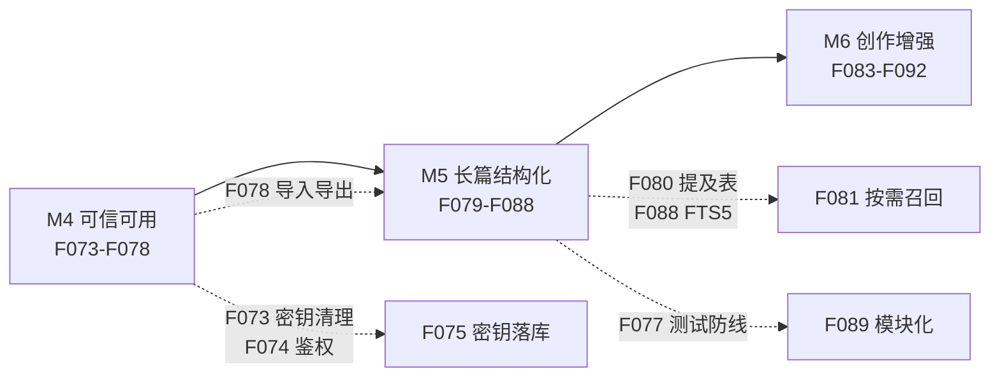

# Novel AI 增量 PRD（功能建议 · 需求池 · 竞品优点引入计划）

| 项目 | 内容 |
|---|---|
| 文档日期 | 2026-09-02 |
| 编写人 | 许清楚（产品经理） |
| 配套文档 | `doc/prd/competitive-research-2026-09-02.md`（竞品调研） |
| 需求编号 | **F073 起**，延续 `doc/function-docs/functions.md` 的 F001–F072 体系 |
| 里程碑 | **M4 / M5 / M6**，延续 `doc/task-plan/task-plan.md` 的 M1–M3 |
| 本轮范围 | **仅文档产出，不含任何代码改动** |

---

## 一、产品目标（5 条，可衡量）

| # | 目标 | 衡量指标（M6 完成时） | 基线（2026-09-02 实测） |
|---|---|---|---|
| G1 | **消除安全与数据丢失风险**，让工具可被信任地承载真实稿件 | 仓库与 git 历史中 0 处明文密钥；API 拒绝未授权跨域写操作；切换章节 0 次静默丢稿 | 3 个文件明文密钥 + 2 个历史提交；CORS `*` 全开；切章必丢稿 |
| G2 | **兑现已承诺但未接通的能力**，让「72 个功能」名实相符 | 「文档写了但未接通」清单（本文表 3.2，共 13 项）清零 | 13 项未接通 |
| G3 | **建立世界记忆层**，让 AI 结果真正由项目设定驱动 | AI 调用中按需召回的知识条目占比 ≥ 80%（而非全量注入）；正文提及的已登记实体自动链接率 ≥ 90% | 全量注入（100% 无差别）；自动链接率 0% |
| G4 | **补齐长篇结构化能力**，从「章节列表」升级为「结构可审计」 | 支持大纲树、情节线 × 场景网格、伏笔生命周期三视图；支持 ≥ 5 条并行线索追踪 | 仅章节列表 + 节点图 |
| G5 | **测试从点缀变为防线** | 有效断言覆盖功能编号 ≥ 70%（50/72）；API 层单测覆盖全部写端点；CI 可跑 | 有效断言约 8 条，覆盖约 11%；0 个 API 层测试 |

---

## 二、用户故事

### 场景 A：作者本人 · 单机写作（核心场景）

| ID | 用户故事 |
|---|---|
| US-A1 | 作为**单机长篇作者**，我希望编辑内容自动保存并在切换章节前被保护，以便**不会因为一次误点丢失两小时的稿子** |
| US-A2 | 作为**单机长篇作者**，我希望我在正文里写到「林祈」时，系统自动关联到角色档案与相关伏笔，以便**AI 建议能真正贴合我已建立的设定** |
| US-A3 | 作为**单机长篇作者**，我希望 AI 调用时只带与当前章节相关的设定，以便**长篇后期不因上下文过大而失效，且我清楚 AI 看到了什么** |
| US-A4 | 作为**单机长篇作者**，我希望有全屏专注模式和里程碑快照，以便**在重要节点前能安心大改，随时回到「改之前」** |
| US-A5 | 作为**单机长篇作者**，我希望 AI 结果明确标注来自真实模型还是本地 mock，以便**不会把演示数据误当成 AI 建议采纳** |

### 场景 B：多项目并行

| ID | 用户故事 |
|---|---|
| US-B1 | 作为**同时开三本书的作者**，我希望能在项目之间切换且互不串数据，以便**每本书的角色、世界观、知识库各自独立** |
| US-B2 | 作为**系列作者**，我希望跨书共享通用知识（如「网文黄金三章」）同时隔离项目设定，以便**复用方法论但不污染单书世界观** |
| US-B3 | 作为**多项目作者**，我希望仪表盘显示当前项目的独立统计，以便**清楚每本书的日更进度** |

### 场景 C：投稿与发布

| ID | 用户故事 |
|---|---|
| US-C1 | 作为**需要定时更新的连载作者**，我希望设定的发布时间到点自动触发推送，**而不是等我打开面板才补跑** |
| US-C2 | 作为**多平台投稿作者**，我希望按平台规则批量改写并保留各平台版本，以便**同一章适配不同平台调性** |
| US-C3 | 作为**要换机器或备份的作者**，我希望一键导出完整可读的项目档案并能原样导入，以便**数据库损坏时不至于全书尽失** |
| US-C4 | 作为**连载作者**，我希望看到伏笔/待办的到期提醒，以便**不会写到 50 万字才发现第 12 章埋的钩子忘了回收** |

---

## 三、现状能力盘点与差距分析

> 所有结论均来自 2026-09-02 对本仓库源码与文档的实读，逐条给出 **文件路径 + 行号 / 函数名** 证据。

### 3.1 已扎实交付的能力（不应在增量中被破坏）

| 能力 | 证据 |
|---|---|
| 零运行时依赖架构（后端 `node:http`+`node:sqlite`，前端原生 ES module，无构建） | `server/web-server.js:14-18`；`package.json` devDependencies 仅 `@playwright/test` |
| 静态服务目录穿越防护（三层校验）+ 正确 MIME | `server/web-server.js:52-70` 注释与实现 |
| 21 张表的完整数据模型，首次启动自动建表 | `server/novel-db.js:36-279` `initDb()` |
| 章节版本与回滚（每次存稿/回滚生成新版本） | `server/novel-db.js:444-476` `saveChapter` / `rollbackChapter` |
| 审计日志覆盖全部写操作 | `server/novel-db.js:382-384` `logAudit`，各写函数均有调用 |
| 真实 OpenAI 兼容协议调用 + mock 降级 | `server/novel-ai-provider.js:127-190` |
| fetch 超时控制（60s，AbortController） | `server/novel-ai-provider.js:133-154` |
| 前端 XSS 防护（innerHTML 一律 escapeHtml） | `novel-ai.js:4-7` `escapeHtml`，各 render 函数均调用 |
| 日志系统容量守卫（4MB + 500 条上限） | `novel-ai.js:15-34` `log()` |

### 3.2 「文档写了但实际未接通」清单（13 项 · 逐条证据）

| # | 声称的能力 | 实际状态 | 证据（文件:行号 / 函数） |
|---|---|---|---|
| 1 | **F001 新建项目** | **空操作**，点击仅弹出一句说明文案 | `novel-ai.js:1178` `if (action === 'new-project') return flashAssist('新建项目入口', '全栈实现时将进入项目创建向导…')` |
| 2 | **多项目支持**（F004 创建项目） | 项目可创建但**永远无法切换**：bootstrap 固定取该用户 id 最小的第一个项目，所有端点隐式绑定它 | `novel-db.js:386-401` `getBootstrapData()` → `WHERE user_id = ? ORDER BY id LIMIT 1`；`novel-api.js:35-36` 全部端点复用 `bootstrap.project.id`，URL 无 projectId |
| 3 | **定时发布推送**（README 六大能力之一） | **无后台调度器**，仅在有人打开发布面板 `GET /publish` 时惰性补跑 | 全仓 `server/` 无 `setInterval` / `cron`；`novel-api.js:304-307` 仅在 GET 分支调用 `scanDuePublishTasks()`；`novel-publish.js:25-29` |
| 4 | **真实平台推送** | 纯模拟；失败条件是平台名里含「失败」二字（调试用） | `novel-publish.js:3-14` `simulatePublish()` → `const shouldFail = task.platform.includes('失败')` |
| 5 | **F009 知识库搜索 · 网络文献召回** | 网络文献是硬编码假数据，永远返回同一条 | `novel-db.js:744-746` `const networkRows = [{ title: '网络文献：…', source: 'mock-web-search' }]` |
| 6 | **全文检索**（FTS5 已建表并写入） | 建表 + 写入都做了，但**查询端完全没用 FTS5**，走 LIKE 全表扫 | 建表 `novel-db.js:278`；写入 `novel-db.js:378`；查询 `novel-db.js:730-749` `searchAll()` 用 `LIKE ?`，全仓无 `MATCH` 关键字 |
| 7 | **向量/RAG 能力**（`embedding_ref` 列） | **死列**：全仓仅出现在建表语句，无写入、无读取 | `novel-db.js:111` `embedding_ref TEXT NOT NULL DEFAULT ''` |
| 8 | **F071 辅助面板标签（ideas/risks/checks）** | 三个 Tab **恒定渲染硬编码静态内容**，AI 结果靠前插卡片临时显示，切 Tab 即被覆盖 | `novel-ai.js:291-294` `renderAssist(tab)` → `const items = fallbackAssist[tab]`；`novel-ai.js:393-395` `flashAssist` 仅 `insertAdjacentHTML('afterbegin', …)` |
| 9 | **选中文本定向 AI**（`selectedText` 参数） | 传的不是用户选中内容，而是**正文前 1200 字** | `novel-ai.js:405` `selectedText: editor.value.slice(0, 1200)`；前端无 `getSelection()` 调用 |
| 10 | **F060 导出项目 JSON** | 仅导出 6 类数据，**缺 8+ 张表**；且**完全没有导入能力**，导出档案不可回灌 | `novel-db.js:717-728` `exportProject()` 仅含 project/chapters/relations/knowledge/prompts/platforms；缺 `characters`、`timeline_events`、`scene_locations`、`world_settings`、`chapter_versions`、`chapter_annotations`、`creative_todos`、`glossary_terms`、`ai_feedback`、`writing_goals`、`writing_progress` |
| 11 | **F062 保存 AI 配置** | 只能保存 baseUrl 与 model，**无法配置 API Key**；Key 只能走环境变量 | `novel-api.js:57-60` body 仅取 `baseUrl`/`model`；`novel-db.js:671-676` `updateAiSettings()`；`novel-ai-provider.js:129` `process.env.NOVEL_AI_API_KEY` |
| 12 | **任务计划与阶段状态** | `task-plan.md` 与交付严重脱节（详见 3.4） | `doc/task-plan/task-plan.md:10-38` |
| 13 | **测试结果记录** | 73 条用例全部标记 ⏳ Pending，却记录「26 条 100% 通过」 | `doc/testing-docs/test-plan.md:20-144`（全部 Pending）；`:150-153` 执行日志 |

### 3.3 安全与可靠性缺陷（P0 依据）

| # | 缺陷 | 证据 | 影响 |
|---|---|---|---|
| S1 | **明文 API Key 入库，且已进入 git 历史** | `doc/function-docs/functions.md:145-147`；`doc/function-docs/button-reference.md:180-186`（含完整 curl Authorization 头）；`doc/testing-docs/test-plan.md:13`。`git log --all -S "<API_KEY 明文值>"` 命中提交 `8047b6f`、`2ab3821`（**本文件已于 2026-09-02 按 X6 脱敏，复核时请把 `<API_KEY 明文值>` 替换回真实密钥再执行该命令**） | 当前 `git remote -v` **为空**，尚未推送到远端 → 属「尚未外泄但随时外泄」。一旦 `git push` 或开源即失控 |
| S2 | **API 完全无鉴权 + CORS 全开** | `novel-api.js:9-17` `send()` 固定返回 `access-control-allow-origin: *`；`handle()` 全流程无任何 token/session/Origin 校验 | 任何网页或本机进程可读可写全部稿件数据（含删除知识、覆盖章节） |
| S3 | **请求体无大小上限** | `novel-api.js:19-29` `readJson()` 无限制累积 `body += chunk` | 内存型 DoS；单文件 SQLite 被撑爆 |
| S4 | **切换章节静默丢弃未保存内容** | `novel-ai.js:1061-1067` chapterButton 分支直接 `renderEditor()` 覆盖 `editor.value`，无 dirty 检查、无 confirm、无自动保存 | **必然性数据丢失**，长篇写作场景下后果严重 |
| S5 | **无自动保存、无离开页面守卫** | 全仓无 `beforeunload`、无 debounce 自动保存；存稿仅 `save-draft` 手动触发 | 刷新/崩溃即丢稿 |
| S6 | **无数据库备份机制** | `.data/` 已在 `.gitignore`；全仓无备份/快照逻辑 | SQLite 单文件损坏 = 全书尽失，且无导入可恢复 |
| S7 | **测试近乎失效** | `tests/` 共 3 文件 110 行；`knowledge.spec.js:23-27,31-35,37-41` 与 `publishing.spec.js:23-27,29-33` 为 `if (count() > 0)` 条件断言 → **元素缺失时空过**。真正有效断言约 8 条 | 重构与增量无回归保护；覆盖率约 11%（8/72） |

### 3.4 文档体系失真（需一并纠偏）

| 文档 | 失真点 | 证据 |
|---|---|---|
| `task-plan.md` | Phase 2「Real AI backend integration」标记未完成，**实际已接通**；Phase 3 知识库全项标记 Planned，**实际已全部交付**；Phase 5「Version control system」标记 Planned，**实际已实现**（`chapter_versions` + 回滚）；「Infrastructure: Existing Vite build pipeline」与零依赖架构**直接矛盾**；M2(2026-08-01)/M3(2026-09-01) 均已过期且未标记完成 | `task-plan.md:10-38, 47-53, 69`；对照 `novel-ai-provider.js:127-190` |
| `test-plan.md` | 仍写「67 个功能点（F001-F067）」，与 `functions.md` 的 72 不符；73 条用例全 Pending 却记录 26 条 100% 通过；API Base 又暴露一次第三方端点 | `test-plan.md:7, 13, 20-144, 150-153` |
| `development.md` | 称「State managed via localStorage」「AI simulation: Mock responses」「Part of main Vite build」——三项**均与现状相反**（现为 SQLite + 真实 provider + 零依赖静态服务） | `development.md:24-26, 39-42` |
| `functions.md` | 统计汇总表重复两行「面板开关按钮 \| 2」；编辑器 AI 按钮数 23 与表格行数（F011-F033 = 23）一致，但「总计 72」与分类加总不闭合 | `functions.md:129-141` |

---

## 四、需求池（F073 – F095）

优先级定义：**P0 = 不做则不应承载真实稿件**（安全/数据丢失）；**P1 = 竞品优点引入 + 核心体验补齐**；**P2 = 锦上添花 / 长期**。

### P0：安全与可靠性（6 条 · 约 14.5 人天）

| 编号 | 功能名称 | 用户价值 | 验收标准（可测） | 影响模块 | 人天 | 风险 |
|---|---|---|---|---|---|---|
| **F073** | 密钥外泄处置与环境化 | 阻止明文密钥随 `git push` 外泄，消除最高危安全问题 | ① 全仓（含 git 历史）`grep -r "<密钥前缀>"` 命中 0；② 三份文档改为占位符 + 指向环境变量说明；③ provider 读取路径仅剩 `process.env`；④ 提供 `.env.example` | `functions.md`、`button-reference.md`、`test-plan.md`、`novel-ai-provider.js` | 0.5 | **重写 git 历史会改变 9 个提交的 hash**，需用户拍板（见 Q1）。无论是否重写，**密钥必须立即轮换失效** |
| **F074** | API 鉴权与本机绑定 | 阻止任意网页/进程读写全部稿件 | ① 默认仅监听 `127.0.0.1`；② CORS 白名单仅允许 `http://127.0.0.1:5175` 与 `http://localhost:5175`，不再返回 `*`；③ 非白名单 Origin 的写请求返回 403；④ 全端点接入统一鉴权中间件；⑤ 新增对应测试用例 | `novel-api.js`（`send()`、`handle()`）、新增中间件 | 2 | 若后续要上 PWA/移动端（F094），需重新设计鉴权。当前单机场景足够 |
| **F075** | AI 配置闭环与密钥安全存储 | 让 F062「保存 AI 配置」名实相符，用户无需改环境变量即可换模型 | ① 设置面板可填写并持久化 API Key；② 落库前加密（Node `node:crypto` 内置，密钥派生自本地随机 salt 文件，权限 0600）；③ 列表/详情接口永不返回密钥原文，仅返回掩码 `****`;④ 未配置时 UI 明确提示「当前为本地演示模式」 | `novel-api.js`、`novel-db.js`（需新增列 + 迁移，见风险）、`novel-ai-provider.js`、`novel-ai.html` | 2 | **需新增 DB 列**：当前建表仅 `CREATE TABLE IF NOT EXISTS`，**无迁移机制**，加列需写一次性迁移逻辑（风险见 F077 关联） |
| **F076** | 编辑器防丢稿 | 消除必然性数据丢失 | ① 编辑后 3s 防抖自动保存（本地草稿优先，网络失败降级到 localStorage 并在恢复后提示合并）；② 切换章节/关闭页面时若 dirty 则弹确认；③ 顶部显示「已保存 / 未保存 / 保存失败」三态；④ 断网时不阻塞输入 | `novel-ai.js`（`renderEditor`、`saveDraft`、`chapterButton` 分支） | 2 | 自动保存与手动存稿并存会**加速版本号膨胀**（当前每存稿即 +1 版本），需配套引入「草稿态 vs 版本态」区分，建议与 F086 里程碑快照一并设计 |
| **F077** | 测试体系补齐 | 让后续重构与增量有回归防线 | ① 有效断言覆盖 ≥ 50 个功能编号（70%）；② 清除全部 `if (count() > 0)` 空过断言；③ API 层新增契约测试覆盖全部 POST 写端点；④ 新增异常路径（404/500/非法入参）；⑤ 测试使用独立 DB（`NOVEL_DB_PATH` 环境变量），不污染开发库；⑥ 引入覆盖率门槛并在 README 标注 | `tests/`（重构 + 新增）、`playwright.config.js`、`novel-db.js`（DB 路径可配置） | 5 | 测试写同一 SQLite 已导致 `workers:1` 强制串行；若不加测试库隔离，覆盖率提升后会显著变慢 |
| **F078** | 导出完整性 + 导入回灌 + 备份 | 让数据可迁移、可恢复，不再「一损俱损」 | ① `exportProject` 覆盖全部 21 张业务表；② 新增 `POST /api/novel/import` 支持全量回灌（含冲突策略：跳过/覆盖/新建）；③ 导出格式带 `schemaVersion` 与 `exportedAt`；④ 提供一次性 DB 文件备份接口/脚本；⑤ 往返测试（导出→清空→导入→比对）通过 | `novel-db.js`（`exportProject` 重写 + 新增 import）、`novel-api.js`、`novel-ai.js` | 3 | 导入是**高风险写操作**，必须在 F074 鉴权之后落地；且需处理外键顺序与 `users` 表复用 |

### P1：竞品优点引入 + 核心体验补齐（10 条 · 约 26.5 人天）

| 编号 | 功能名称 | 用户价值 | 验收标准（可测） | 影响模块 | 人天 | 风险 |
|---|---|---|---|---|---|---|
| **F079** | 多项目支持与项目切换器 | 兑现 F004 与 US-B1/B2/B3，让工具能承载「同时开三本书」 | ① 侧栏顶部项目下拉可切换；② 切换后 bootstrap 返回该项目全量数据；③ 全部端点以 `projectId` 显式寻址（路径或查询参数）；④ 全局知识（scope=global）跨项目可见，项目知识隔离；⑤ 无 projectId 的旧请求向后兼容（默认当前项目） | `novel-db.js`（`getBootstrapData`）、`novel-api.js`（**全端点签名改造**）、`novel-ai.js`（state + 切换器） | 3 | **改动面最大的一条**：现有 API 契约隐式依赖单例项目，改造需同步更新 30+ 端点与前端 state。建议与 F077 测试补齐并行，先补测试再改造 |
| **F080** | Codex 式自动提及与反链 | 让知识库从「手工录入的死库」变为「随写作自动生长的记忆层」（US-A2） | ① 章节保存时扫描正文，自动识别已登记实体（角色/场景/道具/世界观/术语）并写入提及表；② 支持别名与昵称（如「林祈」/「林调查员」）；③ 知识条目详情页显示「被哪些章节提及」反链；④ 编辑器侧栏显示本章提及实体；⑤ 识别准确率 ≥ 90%（种子数据验证） | `novel-db.js`（新增提及表 + 扫描逻辑）、`novel-api.js`、`novel-ai.js` | 3 | **零依赖可实现**（正则 + 词典匹配），但中文分词无外部库可用 → 需自建实体词典 + 最长匹配；生僻别名需人工补录入口 |
| **F081** | 上下文窗口管理与按需召回 | 长篇后期 AI 不再因全量注入而失效；作者可见 AI 看到了什么（US-A3） | ① `buildPrompt` 改为按相关性召回 Top-K 条目（K 可配，默认 8）；② 正文超长时按「章首 + 章尾 + 光标附近」三段截断并标注已截断；③ AI 结果卡片附带「本次引用了哪些条目」清单；④ 单次 prompt token 数可预估并在超限前告警；⑤ 与 F080 提及表联动，本章提及实体优先召回 | `novel-ai-provider.js`（`buildPrompt` 重写）、`novel-db.js`（召回查询）、`novel-ai.js` | 3 | **RAG 是唯一可能破坏零依赖的点**：本地生成 embedding 需模型。零依赖降级方案 = 关键词 + TF-IDF 加权召回（见 Q3）。若要接 embedding API 则需外发数据 + 用户决策 |
| **F082** | AI 流式输出与结果可信标识 | 长任务不再干等 60s；用户能区分真实模型与 mock（US-A5） | ① AI 结果以 SSE 流式返回（`node:http` 原生，零依赖）；② 卡片显著标注 provider：`真实模型 / 本地演示(mock) / 调用失败已降级`；③ 失败降级时给出可展开的错误原因；④ 可中断生成；⑤ 超时后部分结果可保留 | `novel-ai-provider.js`、`novel-api.js`（SSE 端点）、`novel-ai.js`（`runAi` + 卡片渲染） | 2 | SSE 需新增端点且与现有一次性 JSON 返回并存；Playwright 对流式断言较麻烦，需设计可测方案 |
| **F083** | 大纲树 / 场景网格（Corkboard + Plot Grid） | 补齐最缺失的结构化视图（G4，对标 Scrivener 软木板 + Dabble Plot Grid） | ① 大纲树：卷→章→场景三级，支持拖拽排序；② 场景卡片：标题/摘要/POV/字数/状态；③ Plot Grid：情节线 × 场景矩阵，单元格标记节拍；④ 卡片与章节/场景数据双向同步；⑤ 拖拽后章节顺序持久化 | 新增前端视图 + `novel-db.js`（场景实体、排序字段、情节线表） | 4 | **需新增数据实体**（场景所属章节、排序序号、情节线），依赖 F078 的迁移/导入导出能力先行，否则导出会再次缺表 |
| **F084** | 伏笔与线索生命周期 | 解决「写到 50 万字才发现钩子忘了回收」（US-C4，对标灵蟹/NovelAI） | ① 伏笔实体：埋设章节 / 内容 / 预期回收章节 / 状态（已埋设→已回收→已废弃）；② 到期未回收在仪表盘与待办中提醒；③ 冲突校验（F032）自动纳入未回收伏笔清单；④ 与 F080 提及表联动，检测「提及但未登记伏笔」 | 新表 + `novel-db.js`、`novel-api.js`、`novel-ai.js`（仪表盘/待办） | 3 | 自动识别伏笔准确率难保证，建议**人工登记为主 + AI 建议为辅**，避免给用户制造噪声 |
| **F085** | 定时发布真实调度器 | 兑现 README 六大能力之一「定时发布推送」（US-C1） | ① 进程启动时加载未完成任务；② 后台定时器按 `scheduled_at` 触发（误差 ≤ 60s）；③ 进程重启后任务不丢失、遗漏任务补跑；④ 面板显示「下次扫描时间」与调度器运行状态；⑤ 真实平台适配器留接口，缺省仍走模拟并明确标注 | `novel-publish.js`（新增调度器）、`novel-api.js`（状态端点）、`novel-ai.js` | 2 | 进程内 `setInterval` 在进程退出后即失效；若要求「关机也能发」需系统级调度（launchd/cron），见 Q4 |
| **F086** | 写作会话、里程碑快照与目标打卡 | 对标 Scrivener Snapshot + Dabble Streaks（US-A4） | ① 会话计时与本次字数增量；② 里程碑快照（作者主动命名，区别于自动版本）；③ 连续打卡天数与日历热力图；④ 版本列表区分「自动版本 / 里程碑快照」；⑤ 大改前一键打快照 | `novel-db.js`（版本表加 type/name 字段）、`novel-ai.js` | 3 | 与 F076 自动保存强耦合：若自动保存每 3s 生成版本，版本表会爆炸。需先定「草稿态不进版本表」规则 |
| **F087** | 表单去硬编码 | 让录入功能真正可用，而非塞入假数据 | ① 逐一排查并开放硬编码字段；② 至少覆盖：项目（worldView/targetPlatform/writingStyle）、角色（motivation/arc）、场景（description）、时间线（eventTime/description）、世界观（category/content）、术语（definition）、待办（dueAt）、批注（severity）、目标（deadline/note）、平台（accountName/rules）、定时发布（scheduledAt 可选而非固定 +1h）；③ 表单校验与错误提示 | `novel-ai.js`（约 11 处函数）、`novel-ai.html` | 1.5 | 涉及面广但每处改动小；需同步更新 `functions.md` 与 `button-reference.md`，否则文档再次失真 |
| **F088** | 全文检索升级 FTS5 + 跨实体搜索 | 让已建好却闲置的 FTS5 真正生效；搜索覆盖全部实体 | ① 章节与知识走 FTS5 `MATCH`；② 搜索范围扩展至角色/场景/时间线/世界观/术语/批注/待办；③ 支持高亮与结果分类；④ 中文检索可用（需配置 tokenizer，见风险）；⑤ 移除 `searchAll` 中的假网络文献，或明确标注为「占位」 | `novel-db.js`（`searchAll` 重写 + FTS 触发器）、`novel-api.js`、`novel-ai.js` | 2 | SQLite FTS5 默认 `unicode61` tokenizer **对中文不友好**（整段中文会被视为一个 token），零依赖下无法引入分词器 → 建议采用「bigram 手工切分后入库」的零依赖降级方案，需实测验证 |

### P2：锦上添花 / 长期（7 条 · 约 20.5 人天）

| 编号 | 功能名称 | 用户价值 | 验收标准（可测） | 影响模块 | 人天 | 风险 |
|---|---|---|---|---|---|---|
| **F089** | 前端模块化拆分 | 降低 1190 行单文件的维护成本，为后续增量铺路 | ① 按职责拆分为 ≥ 6 个 ES module（state/api/render-*/actions/log）；② 保持**无构建步骤**（直接 `<script type="module">` 引入）；③ 全部既有测试通过；④ 单文件 ≤ 300 行 | `novel-ai.js` → `src/` 或 `js/` 目录 | 3 | 纯重构，无功能变化，但**必须在 F077 测试补齐之后**做，否则无回归保护 |
| **F090** | 专注 / 打字机 / 沉浸模式 | 对标 Scrivener Composition Mode，改善长时写作体验 | ① 全屏专注模式（隐藏侧栏面板）；② 打字机滚动（光标保持垂直居中）；③ 当前段落高亮；④ 快捷键（Cmd+S 存稿、Cmd+Enter 切章节、Esc 退出）；⑤ 可切换字号/行宽/主题 | `novel-ai.js`、`novel-ai.css` | 1.5 | 低。注意与现有「面板常驻」交互冲突 |
| **F091** | 图谱力导向布局与交互 | 当前图谱硬编码 8 个坐标，超过即错位，长篇不可用 | ① 自实现力导向布局（零依赖，SVG/Canvas）；② 支持拖拽、缩放、节点固定；③ 移除 `slice(0,16)` 上限；④ 支持 200+ 节点流畅渲染；⑤ 保留现有按类型过滤 | `novel-ai.js:210, 333-350`（`nodePositions`、`renderNodeMap`） | 3 | 自写力导向易在节点多时卡顿；可与 F089 模块化一并做 |
| **F092** | 多格式导出（Markdown / DOCX / EPUB） | 对标 Scrivener Compile，覆盖投稿与自出版需求 | ① 全书/单章导出 Markdown；② DOCX 与 EPUB（**用 `node:zlib` 内置模块打包，零依赖**）；③ 导出选项：是否含批注/术语表/时间线；④ 章节合并与目录生成 | 新增 `server/novel-export.js`、`novel-api.js` | 3 | DOCX/EPUB 需手写 OOXML / OPF 模板，工作量大且边界情况多；建议**先做 Markdown，DOCX/EPUB 视需求再定** |
| **F093** | 本地模型接入（Ollama / LM Studio） | 对标 Novelcrafter，实现「零外发 + 零订阅」的完全本地 AI | ① provider 支持配置本地 endpoint（`http://127.0.0.1:11434/v1`）；② 设置面板提供「本地模型」预设；③ 连接检测与友好报错；④ 与 F075 密钥配置共存（本地可留空） | `novel-ai-provider.js`、`novel-ai.html` | 2 | 低（同为 OpenAI 兼容协议）。依赖用户本机已部署模型服务 |
| **F094** | PWA 离线与移动端适配 | 随时随地记录灵感 | ① Service Worker 缓存静态资源，离线可打开；② 离线编辑入队，恢复后同步；③ 移动端布局适配；④ 与 F074 鉴权方案协同 | 新增 `sw.js`、`manifest.json`、`novel-ai.css` | 3 | **与 F074 的「仅本机 + Origin 白名单」存在张力**：局域网/移动设备访问需重新设计鉴权。建议放到最后并单独评估 |
| **F095** | 只读分享与协作 | 对标 Novelcrafter 协作档，便于给编辑/试读看稿 | ① 生成只读分享链接（带有效期与撤销）；② 评论与批注（只读方）；③ 协作者角色区分（Viewer/Editor） | 新表 + `novel-api.js`、`novel-ai.js` | 5 | 与「本地单机、零依赖」定位存在根本张力：分享意味着**服务需对外暴露**，安全模型（F074）需整体升级。**建议不作为本路线图内的必做项** |

**工作量汇总**：P0 ≈ 14.5 人天　|　P1 ≈ 26.5 人天　|　P2 ≈ 20.5 人天　|　合计 ≈ **61.5 人天**（单人估算，不含评审与返工）

---

## 五、竞品优点引入计划（用户重点关注）

### 5.1 引入映射总表

| # | 竞品优点（来源） | 本项目是否已有 | 引入方式 | 落地需求 | 依赖与前置 | 预期收益 | 引入风险（零依赖约束） |
|---|---|---|---|---|---|---|---|
| 1 | **Story Bible 强制注入**（Sudowrite） | 部分：`knowledge_entries` 存在，但注入为无差别全量 | **改造**：`buildPrompt` 分层（设定层 / 近期层 / 正文层） | **F081** | F080（需先知道哪些条目相关） | AI 结果贴合设定，长篇不失效 | 无风险，纯字符串处理 |
| 2 | **Codex 自动提及 + 别名**（Novelcrafter） | 无 | **新建**：提及扫描 + 反链表 + 别名表 | **F080** | F077（测试）、F078（导出需含新表） | 知识库从死库变活库，是 G3 的核心 | **零依赖可行**；中文分词靠自建词典 + 最长匹配，准确率需人工兜底 |
| 3 | **Lorebook 关键词触发召回**（NovelAI） | 无（全量注入） | **新建**：相关性召回 + Top-K 截断 | **F081** | F080、F088（FTS5 提供召回底座） | 省 token、降噪声、长篇可用 | **零依赖可行**（关键词/TF-IDF）。**若要向量 embedding 则破坏零依赖**，需接入外部 API 并外发数据 → 由用户决策（Q3） |
| 4 | **Memory / Lorebook 分离**（NovelAI） | 无 | **新建**：近期情节记忆层（近 N 章摘要） | **F081** | F025 章节摘要已有 AI 能力，需持久化 | 短期连贯 + 长期设定互不干扰 | 无风险 |
| 5 | **Progressions 状态演化**（Novelcrafter） | 无 | **新建**（简化版）：角色/设定按时间点的状态快照 | **F084**（作为伏笔/设定的时间维度） | F084 | 解决「人设吃书」 | 中：数据模型复杂，建议简化为「状态变更日志」 |
| 6 | **Grid 条目 × 场景矩阵**（Novelcrafter） | 无 | **新建**：场景 × 实体共现矩阵视图 | **F083** | F078（新表需可导出） | 一眼看出角色缺席/线索断裂 | 无风险，前端渲染 |
| 7 | **Plot Grid 情节线 × 场景**（Dabble） | 无 | **新建**：情节线实体 + 二维网格 | **F083** | F078 | 并行线索可视化，G4 关键项 | 无风险 |
| 8 | **Corkboard 索引卡**（Scrivener） | 无（只有章节列表） | **新建**：场景卡片视图 | **F083** | F078 | 拖拽调整结构，比列表直观 | 无风险 |
| 9 | **Snapshot 里程碑快照**（Scrivener） | 有版本但未区分里程碑 | **增强**：版本加 type/name 语义 | **F086** | F076（先定草稿态规则） | 大改前可安心打点 | 低；需防版本表膨胀 |
| 10 | **BYOK + 本地模型**（Novelcrafter） | **半个**：协议已通，Key 仅 env，UI 无法配 | **改造**：密钥持久化 + 本地 endpoint 预设 | **F075**、**F093** | **F073（先清密钥）、F074（先鉴权）** | 用户可自由换模型/接本地，兑现差异化 | **安全敏感**：密钥落库必须加密，且必须排在 F073/F074 之后 |
| 11 | **Describe 选中片段定向改写**（Sudowrite） | **已有字段但接错**：`selectedText` 传的是正文前 1200 字 | **改造**：真实捕获 `getSelection()` | **F087**（顺带修复） | 无 | 23 个 AI 按钮中的定向类才真正可用 | 低 |
| 12 | **Author's Note 隐藏指令**（NovelAI） | 有 prompt 模板，无全局备注层 | **增强**：项目级全局备注字段 | **F087** | 无 | 随时调整 AI 语气/走向，不污染正文 | 低 |
| 13 | **Feedback 结构化评审**（Sudowrite） | 无 | **新建**：新增评审类任务 + 固定维度渲染 | **F082**（卡片渲染部分） | F081 | 评审结果稳定可比较 | 低 |
| 14 | **拆书 / 反向工程爆款**（笔灵 AI） | 无 | **新建**：上传文本 → 拆解为大纲/爽点/悬念 → 存为知识条目与 Prompt 模板 | **F083**（可并入）或独立 P2 | F078（需支持文本导入） | 国内网文刚需；与已有知识库/Prompt 模板天然契合 | **需文本导入解析能力**，纯文本零依赖可行；若支持 DOCX 解析则需 `node:zlib`（内置，可行） |
| 15 | **带约束续写（锚定人设主线）**（笔灵 AI） | 续写为无约束单次调用 | **改造**：续写前强制注入人设 + 主线 + 未回收伏笔 | **F081** + **F084** | F080、F084 | 直接解决「写跑偏」 | 低 |
| 16 | **目标 + 连续打卡 Streaks**（Dabble） | 有静态目标进度 | **增强**：连续天数 + 日历热力 + 会话计时 | **F086** | 无 | 行为驱动力 | 低 |
| 17 | **全屏专注 / 打字机模式**（Scrivener / novelWriter） | 无 | **新建** | **F090** | F089（模块化后更好做） | 长时写作体验 | 低 |
| 18 | **纯文本导出 + 可回灌**（novelWriter） | 导出不全、无导入 | **改造 + 新建** | **F078** | F074（导入是危险写操作） | 数据主权兜底 | 低 |
| 19 | **交叉引用元数据语法**（novelWriter） | 无 | **可选**：与 #2 自动提及二选一 | **F080** | F080 | 显式引用，准确率更高 | 需改变作者书写习惯，接受度存疑 |
| 20 | **Compile 多格式导出**（Scrivener） | 仅 JSON + TXT | **新建** | **F092** | F078 | 投稿/自出版闭环 | **零依赖可行**：DOCX/EPUB 用 `node:zlib` 打包。但需手写 OOXML 模板，工作量偏大 |
| 21 | **模块制 / 面板折叠**（Campfire） | 单体，面板常驻 | **增强**：面板可折叠/记忆状态 | **F089**（模块化时顺带） | F089 | 界面不膨胀 | 低 |
| 22 | **Story Notes 常驻侧栏**（Dabble） | 需开抽屉 | **增强**：参考资料常驻 | **F083** | F089 | 减少来回切换 | 低 |
| 23 | **会话计时与写作统计**（novelWriter） | 仅字数 | **增强** | **F086** | 无 | 反映真实创作投入 | 低 |

### 5.2 「可直接抄」 vs 「必须按零依赖架构重新设计」

| 类别 | 条目 | 说明 |
|---|---|---|
| **可直接抄（#1–#22 中大部分）** | #1、#5、#6、#7、#8、#9、#11、#12、#13、#16、#17、#18、#21、#22、#23 | 本质是**前端视图或数据模型**，与依赖无关。竞品虽是云/Web 实现，但交互范式可直接借鉴，用原生 DOM + CSS 重写即可 |
| **需按零依赖架构重新设计** | **#2 自动提及** | 竞品依赖成熟 NLP/分词。零依赖下需自建实体词典 + 最长匹配 + 人工别名补录，**准确率靠人工兜底而非算法** |
| | **#3 按需召回（RAG）** | 竞品用向量检索。**零依赖下无法本地生成 embedding**。降级方案：关键词 + TF-IDF + 章节邻近度加权。**若坚持向量方案，必须引入外部 embedding API → 破坏零依赖且外发稿件数据，需用户明确决策（Q3）** |
| | **#10 BYOK + 本地模型** | 竞品把 Key 存云端账号体系。本项目单机、无账号，**密钥落本地 SQLite 必须加密 + 文件权限控制**，且接口永不返回明文 |
| | **#13 结构化评审 / #14 拆书** | 竞品靠强模型保证质量。本项目是 BYOK 壳层，**输出质量取决于用户接的模型**，需设计「弱模型下结果退化」的容错与提示 |
| | **#20 多格式导出** | 竞品用成熟库（Pandoc 等）。零依赖下需手写 OOXML/OPF 模板，用 `node:zlib` 打包。**可行但工作量大，建议先 Markdown 后 DOCX/EPUB** |
| **明确不建议引入** | #19 元数据语法 | 需改变作者书写习惯，与「自动提及」目标重叠，且中文语境接受度存疑。建议**只做自动提及** |
| | 云端协作（对应 F095） | 与「本地单机、零依赖、数据主权」定位**根本冲突**。引入意味着服务对外暴露，F074 的鉴权模型需整体推翻重做 |

### 5.3 零依赖红线检查表

| 需求 | 所需能力 | Node 内置方案 | 是否守住零依赖 |
|---|---|---|---|
| F073 | 密钥轮换 | 无额外依赖 | 是 |
| F074 | 鉴权 | `node:crypto` | 是 |
| F075 | 密钥加密存储 | `node:crypto`（scrypt/AES-256-GCM） | 是 |
| F080 | 自动提及 | 正则 + 自建词典 | 是（准确率有折衷） |
| F081 | 按需召回 | 关键词 + TF-IDF 自实现 | **是（若改用向量则需外部 API，见 Q3）** |
| F082 | 流式输出 | `node:http` SSE | 是 |
| F084 | 伏笔追踪 | SQLite | 是 |
| F085 | 定时调度 | `setInterval` | 是（进程内；系统级需 launchd/cron，见 Q4） |
| F088 | 中文全文检索 | SQLite FTS5 + bigram 手工切分 | 是（需实测验证） |
| F092 | DOCX/EPUB 导出 | `node:zlib` + 手写模板 | 是 |
| F093 | 本地模型 | `fetch` 至 localhost | 是 |
| F094 | PWA 离线 | Service Worker（浏览器原生） | 是（但需重审鉴权） |

**结论：23 项竞品优点中，仅「向量 RAG」一条在零依赖约束下无法完全实现，已有明确降级方案，其余全部可在零依赖下落地。**

---

## 六、引入路线图（M4 / M5 / M6）

### M4：可信可用（Trustworthy）

| 项 | 内容 |
|---|---|
| **目标** | 消除安全与数据丢失风险，兑现已承诺但未接通的能力，让工具**可以被信任地承载真实稿件** |
| **包含需求** | **F073**（密钥处置）、**F074**（鉴权）、**F075**（AI 配置闭环）、**F076**（防丢稿）、**F077**（测试补齐）、**F078**（导出完整性 + 导入 + 备份） |
| **配套纠偏** | 重写 `task-plan.md`（对齐真实阶段）、修正 `test-plan.md` 的矛盾记录、重写 `development.md` 的架构描述、补齐 `functions.md` 的统计错误 |
| **体量** | ≈ 14.5 人天 |
| **完成判据** | ① 全仓与 git 历史 `grep "<密钥前缀>"` 命中 0，密钥已轮换失效；② 非白名单 Origin 写请求返回 403；③ 切换章节不再静默丢稿（自动化用例覆盖）；④ 有效断言覆盖 ≥ 50 个功能编号，测试使用独立 DB；⑤ 导出→清空→导入→比对 往返测试通过；⑥ 三份失真文档已重写并评审通过 |

### M5：长篇结构化（Structured for Long-form）

| 项 | 内容 |
|---|---|
| **目标** | 建立世界记忆层与长篇结构视图，**从象限图 [0.30, 0.58] 移动到约 [0.55, 0.80]** |
| **包含需求** | **F079**（多项目）、**F080**（自动提及/反链）、**F081**（按需召回 + 上下文管理）、**F082**（流式 + 可信标识）、**F086**（会话/里程碑/打卡）、**F087**（表单去硬编码）、**F088**（FTS5 检索升级） |
| **体量** | ≈ 20.5 人天（F079 3 + F080 3 + F081 3 + F082 2 + F086 3 + F087 1.5 + F088 2 = 17.5，含联调缓冲取 20.5） |
| **完成判据** | ① 项目可切换且数据隔离，全局知识跨项目共享；② 正文提及已登记实体自动链接率 ≥ 90%（种子数据验证）；③ AI 调用按需召回条目占比 ≥ 80%，prompt 长度较改造前下降 ≥ 50%；④ AI 卡片明确显示 provider 三态；⑤ 中文全文检索可用（bigram 方案实测通过）；⑥ 硬编码假数据清零 |

### M6：创作增强（Creative Boost）

| 项 | 内容 |
|---|---|
| **目标** | 补齐结构化创作视图与写作体验，进入**象限 1（AI 强 + 结构强）**，达到目标位 [0.75, 0.85] |
| **包含需求** | **F083**（大纲树 / 场景网格 / Plot Grid）、**F084**（伏笔生命周期）、**F085**（真实定时调度器）、**F089**（前端模块化）、**F090**（专注模式）、**F091**（图谱力导向）、**F092**（多格式导出，至少 Markdown） |
| **顺延至后续** | F093（本地模型）、F094（PWA）、F095（协作）—— 视用户决策再排 |
| **体量** | ≈ 17.5 人天（F083 4 + F084 3 + F085 2 + F089 3 + F090 1.5 + F091 3 + F092 首期 Markdown 1） |
| **完成判据** | ① 卷→章→场景三级大纲 + 拖拽排序可用；② Plot Grid 可追踪 ≥ 5 条并行线索；③ 伏笔状态机（已埋设/已回收/已废弃）跑通，到期提醒生效；④ 定时发布在进程常驻时按点触发，误差 ≤ 60s，重启不丢任务；⑤ 前端单文件 ≤ 300 行且全部既有测试通过；⑥ 图谱支持 200+ 节点无错位 |

### 里程碑依赖图



**关键路径说明**：`F073 → F074 → F075` 与 `F077（测试）→ F079（多项目改造）→ F089（模块化）` 是两条硬依赖链，不可并行颠倒。其中 **F077 必须先于 F079 与 F089** —— 在没有回归保护的情况下改造 API 契约与拆分前端，风险过高。

---

## 七、UI 设计稿建议（文字 + ASCII 线框）

### 7.1 界面一：项目切换器 + 大纲/场景网格（对应 F079 + F083，M5/M6）

**设计意图**：解决两个最痛的问题 —— 「切不了项目」与「看不到结构」。项目切换器常驻侧栏顶部，大纲区从「章节列表」升级为「卡片网格」，可在列表 / 卡片 / 情节网格三种视图间切换。

```
┌──────────────┬────────────────────────────────────────────────────────────────┐
│ 雾港星火  v  │ [存稿] [续写建议] [冲突校验] [批注] … 23 个 AI 按钮（折叠 ▾）  │
│──────────────│────────────────────────────────────────────────────────────────│
│ ▾ 项目       │  视图: [列表] [卡片] [情节网格]        [+ 新章节]  [+ 新场景]   │
│   ● 雾港星火 │────────────────────────────────────────────────────────────────│
│   ○ 第二本书 │                                                                │
│   ○ 短篇集   │  ┌─ 第 10 章 · 黑潮钟声 ──────────────────────────┐           │
│   [+ 新建]   │  │ ┌──────────┐ ┌──────────┐ ┌──────────┐        │           │
│              │  │ │场景 10-1 │ │场景 10-2 │ │场景 10-3 │        │           │
│ ▾ 大纲树     │  │ │钟声响起  │ │档案馆外  │ │地下海潮  │        │           │
│  ▾ 第一卷    │  │ │POV: 林祈 │ │POV: 林祈 │ │POV: 旁白 │        │           │
│    ▸ 第10章  │  │ │1,204 字  │ │  860 字  │ │  642 字  │        │           │
│    ▾ 第11章  │  │ │[已存稿]  │ │[写作中]  │ │[待校验]  │        │           │
│      · 场景1 │  │ └──────────┘ └──────────┘ └──────────┘        │           │
│      · 场景2 │  │  ⚑ 伏笔: 黑潮钟声 (已埋设 → 预期第 15 章回收)  │           │
│    ▸ 第12章  │  └────────────────────────────────────────────────┘           │
│  ▸ 第二卷    │                                                                │
│              │  情节网格视图（切换到「情节网格」时显示）:                      │
│ ▾ 伏笔       │  ┌─────────┬────────┬────────┬────────┬────────┐             │
│  ⚑ 3 待回收  │  │         │ 第10章 │ 第11章 │ 第12章 │ 第13章 │             │
│  ⚠ 1 已逾期  │  ├─────────┼────────┼────────┼────────┼────────┤             │
│              │  │ 黑潮真相 │   ●    │   ○    │   ●    │   ▸    │             │
│ ▾ 知识库     │  ├─────────┼────────┼────────┼────────┼────────┤             │
│  提及 24     │  │ 林祈身世 │   ○    │   ●    │   ●    │   ▸    │             │
│  未链接 5    │  ├─────────┼────────┼────────┼────────┼────────┤             │
│              │  │ 罗文背叛 │   ○    │   ○    │   ●    │   ▸    │             │
└──────────────┴──┴─────────┴────────┴────────┴────────┴────────┴─────────────┘
                   ● 有进展  ○ 未出现  ▸ 计划中  ⚑ 伏笔  ⚠ 逾期
```

**关键交互**
1. **项目切换器**（左上）：下拉列出全部项目；切换后整页重载该项目 bootstrap（对应 F079）。全局知识（scope=global）跨项目可见，项目知识隔离。
2. **大纲树**（左下）：卷 → 章 → 场景三级，支持拖拽排序；点击定位。
3. **三视图切换**：列表（现状）/ 卡片（Corkboard，对标 Scrivener）/ 情节网格（Plot Grid，对标 Dabble）。
4. **伏笔状态内嵌**（对应 F084）：章节卡片下方直接显示该章埋设/回收的伏笔，逾期变红。
5. **知识库未链接提示**（对应 F080）：「未链接 5」表示正文中出现但未登记为知识条目的实体，点击可批量补录。

---

### 7.2 界面二：AI 结果卡片（对应 F081 + F082，M5）

**设计意图**：解决「不知道 AI 看到了什么」与「分不清真实模型还是 mock」。当前 AI 结果是一张无来源、无状态、切 Tab 就消失的卡片；改造后成为**可追溯、可中断、可反馈**的结果单元。

```
┌─ AI 辅助侧栏 ────────────────────────────────────────────────────────────┐
│ [构思] [风险] [校验]                                    难度不限          │
│──────────────────────────────────────────────────────────────────────────│
│ ┌──────────────────────────────────────────────────────────────────────┐ │
│ │ 冲突校验  ·  情节校验冲突                    [真实模型 · GPT-4o] ▾    │ │
│ │ ──────────────────────────────────────────────────────────────────── │ │
│ │ 林祈在第 8 章说自己从未去过码头，本章船票需标注为失忆前经历。        │ │
│ │                                                                       │ │
│ │ ▸ 本次引用了 4 条上下文                              1,842 tokens    │ │
│ │   ├─ [角色] 林祈         ── 本章提及 3 次                            │ │
│ │   ├─ [设定] 旧船票       ── 与本章强相关                             │ │
│ │   ├─ [伏笔] 黑潮钟声     ── 已埋设 · 未回收                          │ │
│ │   └─ [章节] 第 11 章摘要 ── 上一章                                   │ │
│ │   ⚠ 正文 4,120 字已截断为「章首 800 + 光标附近 600 + 章尾 400」       │ │
│ │ ──────────────────────────────────────────────────────────────────── │ │
│ │  [采纳并插入]  [复制]  [重新生成]  [有用] [无用]     耗时 6.2s        │ │
│ └──────────────────────────────────────────────────────────────────────┘ │
│ ┌──────────────────────────────────────────────────────────────────────┐ │
│ │ 续写建议  ·  AI 接口降级                   [调用失败已降级 · mock] ▾  │ │
│ │ ──────────────────────────────────────────────────────────────────── │ │
│ │ ⚠ 真实模型调用失败，已切换本地演示数据：AI provider failed: 429      │ │
│ │    [查看完整错误]                                                     │ │
│ │ 下一段可让林祈不立刻质问伊莱娜，而是先注意船票上的盐渍……              │ │
│ └──────────────────────────────────────────────────────────────────────┘ │
└──────────────────────────────────────────────────────────────────────────┘
```

**关键交互**
1. **Provider 三态徽章**（右上，对应 F082）：`真实模型 · <model>`（绿）/ `本地演示 · mock`（灰）/ `调用失败已降级`（橙，可展开错误详情）。**这是当前最缺失的信息** —— 现状下 mock 与真实结果外观完全一致。
2. **上下文来源清单**（对应 F081，对标 Sudowrite Story Bible / NovelAI Lorebook）：可展开看到本次 AI 究竟引用了哪些条目及其来源（角色/设定/伏笔/章节摘要），并可点击跳转。作者第一次能回答「AI 凭什么这么说」。
3. **截断告警**：正文过长时明确告知截断了什么、按什么策略截断，避免静默丢上下文。
4. **流式渲染**（对应 F082）：生成中显示打字机效果 + 「中断」按钮，替代当前干等 60s。
5. **反馈闭环**：`有用/无用` 写入 `ai_feedback` 表（表已存在，当前仅前端「有用」按钮写入硬编码 rating=5，无「无用」路径）。
6. **Tab 不再覆盖结果**（修复 F071）：AI 结果作为持久卡片留在当前 Tab，切换 Tab 后返回仍可见。

---

## 八、待确认问题（需用户拍板，5 条）

| # | 问题 | 背景 | 建议 |
|---|---|---|---|
| **Q1** | **密钥外泄如何处置？** 是否接受用 `git filter-repo` 重写历史以彻底清除？ | 密钥已存在于 2 个历史提交（`8047b6f`、`2ab3821`）。重写会**改变全部 9 个提交的 hash**，与 README 中「保留 9 个原创提交、不改写历史以保可追溯」的既定原则直接冲突 | **建议：无论如何先轮换密钥使其失效**（这是必须做的）。历史清理二选一：① 保守 —— 仅删除三处明文 + 轮换，接受历史中残留（当前无 remote，风险可控）；② 彻底 —— filter-repo 重写。**倾向 ②**，因为「保可追溯」的价值低于「密钥外泄」的风险，且源仓库已有 `git bundle` 全量备份 |
| **Q2** | **鉴权做到什么程度？** 当前是完全开放的本地服务 | 场景是单机单用户，但 CORS `*` 意味着任何网页都能读写 | **建议分两级**：① 必做 —— 绑定 `127.0.0.1` + Origin 白名单 + 写操作校验；② 可选 —— 本地 token（首次启动生成，存 `~/.novel-ai/token`）。**不建议**在单机场景引入账号体系 |
| **Q3** | **RAG 召回采用哪种方案？**（唯一可能破坏零依赖的点） | 零依赖下无法本地生成 embedding | **建议采用降级方案**：关键词 + TF-IDF + 章节邻近度加权，配合 F080 的提及表与 F088 的 FTS5。若效果不足，再以「可选增强」形式提供 embedding API 接入，**默认关闭且明确告知会外发稿件数据**，由用户自行开启 |
| **Q4** | **定时发布要「进程内」还是「系统级」？** | 进程内 `setInterval` 实现简单，但进程退出即失效；系统级（launchd/cron）可关机也发，但需写宿主配置 | **建议先做进程内（F085 范围内）**，并在 UI 明确标注「调度器仅在服务运行时生效」。若用户确有「关机也发」需求，再单独评估系统级方案 |
| **Q5** | **多项目改造是否现在做？** | F079 需改造 30+ 个端点的 API 契约与前端 state，是改动面最大的一条；但「多项目」在 `task-plan.md` 中原属 Phase 5（远期），且 F004 已声称支持 | **建议做，但必须排在 F077（测试补齐）之后**。理由：F004 已对外声称支持多项目，属「名实不符」，优先级应高于新增的锦上添花功能；但契约改造无测试保护风险极高 |

---

## 九、明确的非目标（本轮不做）

| # | 非目标 | 排除理由 |
|---|---|---|
| 1 | **不做任何代码改动** | 本轮交付范围限定为 `doc/prd/` 下的两份文档。所有需求待用户评审拍板后再排期 |
| 2 | **不引入任何 npm 运行时依赖** | 零运行时依赖是本项目核心卖点。任何需要新增运行时依赖的方案必须单独标注替代方案并由用户决策 |
| 3 | **不做云端同步 / 多端实时协作** | 与「本地单机、数据主权」定位根本冲突；会推翻 F074 的鉴权模型。对应 F095，本路线图内不排期 |
| 4 | **不自研或微调 AI 模型** | 本项目定位是 BYOK 壳层。生成质量竞争（对标 Sudowrite Muse / NovelAI Kayra）不在能力范围内，输出质量取决于用户接入的模型 |
| 5 | **不接入真实第三方发布平台 API** | 涉及各平台审核、授权与合规，远超本轮范围。F085 仅实现调度器，推送仍为模拟并明确标注，同时预留适配器接口 |
| 6 | **不做移动端原生应用** | PWA（F094）已覆盖离线与移动适配的主要诉求，且与零依赖架构冲突较小；原生应用需引入构建工具链，破坏零依赖 |
| 7 | **不重写既有功能以追平竞品** | 如：用富文本编辑器替换现有 `textarea`、引入插件市场、做图像生成。这些属于「有则更好」，当前优先级低于安全、可靠性与结构能力 |
| 8 | **不在本轮修正 `doc/function-docs/` 之外的历史文档** | 文档纠偏限定在 M4 范围内随需求一起交付（`task-plan.md` / `test-plan.md` / `development.md` / `functions.md`），不单独发起文档专项 |

---

## 附录 A：需求编号总表

| 优先级 | 编号区间 | 条数 | 人天 |
|---|---|---|---|
| P0 | F073 – F078 | 6 | 14.5 |
| P1 | F079 – F088 | 10 | 26.5 |
| P2 | F089 – F095 | 7 | 20.5 |
| **合计** | **F073 – F095** | **23** | **≈ 61.5** |

## 附录 B：本轮引用的源码证据索引

| 文件 | 涉及行 / 函数 | 关联需求 |
|---|---|---|
| `server/novel-api.js` | 9-17 `send()`、19-29 `readJson()`、35-36 `bootstrap.project.id`、57-60 AI 配置、304-307 发布扫描 | F074、F075、F079、F085 |
| `server/novel-db.js` | 36-279 `initDb()`、111 `embedding_ref`、278 FTS5、378 FTS 写入、386-401 `getBootstrapData()`、671-676 `updateAiSettings()`、717-728 `exportProject()`、730-749 `searchAll()`、744-746 假网络文献 | F078、F079、F080、F081、F088 |
| `server/novel-ai-provider.js` | 113-125 `buildPrompt()`、127-168 `callOpenAICompatible()`、129 env Key | F075、F081、F082、F093 |
| `server/novel-publish.js` | 3-14 `simulatePublish()`、25-29 `scanDuePublishTasks()` | F085 |
| `novel-ai.js` | 210 `nodePositions`、291-294 `renderAssist()`、333-350 `renderNodeMap()`、393-395 `flashAssist()`、405 `selectedText`、1061-1067 章节切换、1178 `new-project` 空操作 | F076、F080、F082、F086、F087、F089、F091 |
| `doc/function-docs/functions.md` | 129-141 统计错误、145-147 明文密钥 | F073 |
| `doc/function-docs/button-reference.md` | 180-186 明文密钥 + curl 示例 | F073 |
| `doc/testing-docs/test-plan.md` | 7 功能数不符、13 明文端点、20-144 全 Pending、150-153 矛盾记录 | F073、F077 |
| `doc/task-plan/task-plan.md` | 10-38 阶段失真、47-53 里程碑过期、69 Vite 描述矛盾 | M4 配套纠偏 |
| `doc/development-docs/development.md` | 24-26、39-42 架构描述失真 | M4 配套纠偏 |
| `tests/knowledge.spec.js` | 23-27、31-35、37-41 条件断言空过 | F077 |
| `tests/publishing.spec.js` | 23-27、29-33 条件断言空过 | F077 |
