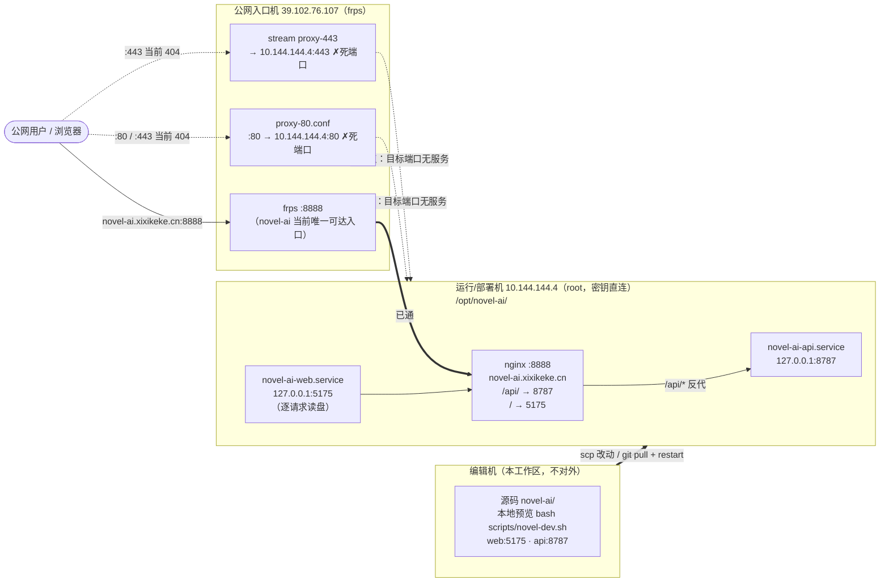

# Novel AI 部署文档（M6 / schema v7 版）

| 项目 | 内容 |
|---|---|
| 文档日期 | 2026-09-17（重写，对齐 M6 收口 + 当前 live 拓扑） |
| 适用范围 | 本地部署、live 部署到 10.144.144.4、公网入口 39.102.76.107、数据备份恢复、换机迁移、进程常驻、升级回滚、故障排查、公网断流修复 |
| 前置阅读 | `README.md`（快速开始）· `doc/architecture/architecture.md` §七（安全模型）· `doc/function-docs/functions.md` |
| 安全红线 | **密钥严禁写入本文档**（见 §十一）。`.env` 已在 `.gitignore`，主密钥 `~/.novel-ai/master.key` 不入库 |

---

## 一、部署形态定位

**单机单用户的本地写作工具**，但已具备一台运行/部署机（10.144.144.4）与一台公网入口机（39.102.76.107）。默认所有服务只绑定 `127.0.0.1`，仅本机/同机 nginx 能访问；稿件数据无账号体系保护，暴露到网络等于任何人可读写全部稿件（F074 刻意设计）。

| 形态 | 支持度 | 说明 |
|---|---|---|
| 本机日常使用 | ✅ 推荐 | `bash scripts/novel-dev.sh`（web:5175 + api:8787） |
| live 部署机自启 | ✅ 一等公民 | 10.144.144.4 上 systemd 两服务 + nginx :8888 |
| 换机迁移 / 备份恢复 | ✅ 一等公民 | 见 §六、§七 |
| 局域网访问（个人多设备） | ⚠️ 可行但自担风险 | 见 §九，需同时评估密钥备份端点 |
| 公网多用户 / 协作 | ❌ 不支持 | 需账号体系与鉴权重构，属显式非目标（F095 不排期） |

---

## 二、环境要求与安装

- **Node.js >= 22.5.0**（`node:sqlite` 最低版本）。启动时打印 `ExperimentalWarning: SQLite` 属正常。
- **零运行时依赖**：后端仅用 `node:http` + `node:sqlite`，前端为原生 ES module + CSS，无构建步骤。
- 唯一 devDependency：`@playwright/test`（测试用）。以下命令仅装测试依赖与工程化工具，不引入运行时包：

```bash
git clone <repo> && cd novel-ai
npm install          # 仅 @playwright/test + 工程化 devDep，无运行时依赖
bash scripts/novel-dev.sh   # 本地预览：API 8787 + Web 5175
```

- 验证：浏览器打开 `http://localhost:5175/novel-ai.html`，顶栏显示「API 在线」即部署成功；首次启动自动建库并写入演示项目「雾港星火」。

---

## 三、环境变量完整矩阵

所有变量均可经环境变量或进程管理器（systemd `EnvironmentFile=`）注入。AI 能力建议写入 `.env`（`cp .env.example .env`，已被 gitignore）。

| 变量 | 默认值 | 说明 |
|---|---|---|
| `NOVEL_AI_BASE_URL` | 空（走项目库设置） | OpenAI 兼容服务地址，末尾不带 `/chat/completions` |
| `NOVEL_AI_MODEL` | `mock-novel-copilot` | 模型名；保持默认即 mock 演示模式 |
| `NOVEL_AI_API_KEY` | 空 | 优先级低于项目库加密保存的密钥（F075）；本地模型可留空 |
| `NOVEL_API_PORT` | `8787` | API 端口 |
| `NOVEL_API_HOST` | `127.0.0.1` | API 绑定地址；改 `0.0.0.0` 见 §九（暴露风险） |
| `NOVEL_WEB_PORT` | `5175` | 静态服务端口；改动需同步给 API 白名单 |
| `NOVEL_WEB_HOST` | `127.0.0.1` | 静态服务绑定地址；改 `0.0.0.0` 见 §九 |
| `NOVEL_ALLOWED_ORIGINS` | `http://127.0.0.1:5175,http://localhost:5175` | 逗号分隔 Origin 白名单；非白名单一律 403（F074） |
| `NOVEL_DB_PATH` | `.data/novel-ai.sqlite` | 相对路径按项目根解析；备份/测试隔离用 |
| `NOVEL_MASTER_KEY_PATH` | `~/.novel-ai/master.key` | **仅测试用**；生产指向项目内目录会导致主密钥随 `.gitignore` 丢失 |

> 当前版本**不会自动加载 `.env` 文件**——`.env` 供 `export` 后手动启动，或由 systemd `EnvironmentFile=` 注入。最简单：`set -a; source .env; set +a; npm run dev`。

---

## 四、当前部署拓扑（live）

- **编辑机**：本工作区（源码，不对外；本地预览 `bash scripts/novel-dev.sh`）。
- **运行/部署机** `10.144.144.4`（smlhome，root，密钥直连）：部署目录 `/opt/novel-ai/`（含 `novel-ai.css/html`、`.env`、`.git`、`js/`、`scripts/`、`node_modules`）。
  - systemd：`novel-ai-api.service`（api 监听 `127.0.0.1:8787`）+ `novel-ai-web.service`（web 监听 `127.0.0.1:5175`，**逐请求读盘**，换 css 即时生效无需重启）。
  - nginx 仅监听 `:8888`（`server_name novel-ai.xixikeke.cn`）：`location /api/` → 8787、`location /` → 5175。
- **公网入口机** `39.102.76.107`（frps）：frps 监听 `:8888`；`proxy-80.conf` 把公网 `:80` → `10.144.144.4:80`（**死端口**），stream `proxy-443` → `10.144.144.4:443`（**死端口**）。而 novel-ai 实际只在 `:8888` → **公网站点 `:80/:443` 当前 404（待修复，见 §十）**。
- SSH：`ssh root@10.144.144.4` / `ssh root@39.102.76.107`，本会话均密钥直连。



> 断流本质：公网 `:80`/`:443` 的反代 upstream 指向部署机的 `:80`/`:443`，而 novel-ai 实际只监听 `:8888`，故这两个端口无服务、返回 404。frps `:8888` 已正确命中 nginx，可临时作为入口。

---

## 五、部署到 live（10.144.144.4）

两种方式二选一，改动后**必须重启对应 systemd 服务**使其生效。

### 方式 A：scp 推送改动（适合单文件热修，如只改 css/html）
```bash
# 编辑机执行（密钥直连）
scp novel-ai.html novel-ai.css root@10.144.144.4:/opt/novel-ai/
scp -r js root@10.144.144.4:/opt/novel-ai/
# web 服务逐请求读盘，css/html 无需重启即生效；
# 若改了 server/*.js，需重启 api 服务（见 §八）
ssh root@10.144.144.4 'systemctl restart novel-ai-api'
```

### 方式 B：git pull + restart（适合整轮提交）
```bash
ssh root@10.144.144.4
cd /opt/novel-ai
git pull
npm install            # 仅当 devDep 变化（如 playwright 升级）
systemctl restart novel-ai-api novel-ai-web
systemctl status novel-ai-api novel-ai-web --no-pager
```

### 部署后验证
```bash
curl -s http://127.0.0.1:8787/api/novel/bootstrap | head -c 200   # API 健康
curl -s -o /dev/null -w '%{http_code}\n' http://127.0.0.1:5175/novel-ai.html   # Web 健康
curl -s -o /dev/null -w '%{http_code}\n' http://127.0.0.1:8888/   # nginx :8888
```

---

## 六、数据资产清单与备份

仅两类需备份的数据资产：

| 资产 | 位置 | 内容 | 丢失后果 |
|---|---|---|---|
| 业务数据库 | `.data/novel-ai.sqlite`（+ `-wal`/`-shm` 伴生文件） | 全部稿件、知识库、AI 历史、发布任务、审计 | 稿件全丢 |
| 主密钥 | `~/.novel-ai/master.key` | 解密「设置面板保存的 API Key」所需的 32 字节密钥 | 已保存的 AI 密钥**永久不可解密**（需重新录入；稿件本身不受影响） |

### 6.1 备份
```bash
sqlite3 .data/novel-ai.sqlite ".backup '/backup/novel-ai-$(date +%F).sqlite'"
# 或停服后整拷 .data/（必须含 -wal/-shm）
cp ~/.novel-ai/master.key /backup/master.key.bak
```
应用内逻辑备份：设置区「导出项目 JSON」（`GET /api/novel/export/project`），F078 后已覆盖全部业务表（永不携带密钥）；与文件级备份互补。

### 6.2 恢复（文件级，库损坏或整库回退）
```bash
# 1) 停服  2) 恢复库（三份产物放回 .data/，或替换并删 -wal/-shm）
cp /backup/novel-ai-2026-09-17.sqlite .data/novel-ai.sqlite
rm -f .data/novel-ai.sqlite-wal .data/novel-ai.sqlite-shm
# 3) 恢复主密钥（换机时）
mkdir -p ~/.novel-ai && cp /backup/master.key.bak ~/.novel-ai/master.key && chmod 600 ~/.novel-ai/master.key
# 4) 重启，确认顶栏「API 在线」、章节与版本完整
```
> 主密钥与数据库**要一起备份**：库里密文用旧主密钥加密，只恢复库不恢复密钥，AI 密钥照样解不开。

---

## 七、换机迁移

1. 旧机按 §6.1 备份（数据库 + 主密钥）。
2. 新机安装 Node >= 22.5.0，克隆仓库，`npm install`。
3. 按 §6.2 恢复两份资产（主密钥放到新机 `~/.novel-ai/master-key`）。
4. `.env` 若有自建配置一并拷贝；启动服务。
5. 首次启动日志出现 `[db] schema vN → vM，已应用迁移 …` 属正常（迁移框架自动补 schema）。

---

## 八、进程常驻（systemd，10.144.144.4）

拆成两个 unit 便于独立重启，`.env` 走 `EnvironmentFile=`：

`/etc/systemd/system/novel-ai-api.service`
```ini
[Unit]
Description=Novel AI API
After=network.target

[Service]
WorkingDirectory=/opt/novel-ai
ExecStart=/usr/bin/node server/novel-api.js
EnvironmentFile=/opt/novel-ai/.env
Environment=NOVEL_API_PORT=8787
Environment=NOVEL_API_HOST=127.0.0.1
Restart=on-failure

[Install]
WantedBy=multi-user.target
```

`/etc/systemd/system/novel-ai-web.service`
```ini
[Unit]
Description=Novel AI Web
After=network.target

[Service]
WorkingDirectory=/opt/novel-ai
ExecStart=/usr/bin/node server/web-server.js
EnvironmentFile=/opt/novel-ai/.env
Environment=NOVEL_WEB_PORT=5175
Environment=NOVEL_WEB_HOST=127.0.0.1
Restart=on-failure

[Install]
WantedBy=multi-user.target
```

```bash
systemctl daemon-reload
systemctl enable --now novel-ai-api novel-ai-web
journalctl -u novel-ai-api -u novel-ai-web -f
```

注意点：
- 进程退出不影响数据：SQLite 已落盘；未保存的浏览器草稿在 localStorage（换浏览器会丢）。
- 发布调度器为进程内实现（F085），**仅在服务存活时生效**；关机不触发，重启后自动补跑过期任务；当前推送均为模拟适配器，不会发起真实平台调用（UI 已标注）。
- 系统休眠/重启后 `Restart=on-failure` 自动拉起。

---

## 九、局域网访问（高风险，逐条确认后再做）

放开绑定**等于把无鉴权的稿件库暴露给同网段所有设备**。确需时：
```bash
NOVEL_API_HOST=0.0.0.0 NOVEL_WEB_HOST=0.0.0.0 \
NOVEL_ALLOWED_ORIGINS=http://192.168.1.10:5175 \
NOVEL_WEB_PORT=5175 node server/web-server.js
```
放行前必须确认：① `NOVEL_ALLOWED_ORIGINS` 改成实际来源；② 先摘除主密钥端点 `GET /api/novel/settings/ai/master-key`（仅本机可达才安全）；③ 可信网络；④ 不与公网端口映射/内网穿透叠加；⑤ 优先「设备上跑一份 + 定期同步备份」。

---

## 十、公网断流修复方案（novel-ai.xixikeke.cn 的 :80/:443 返回 404）

**现象**：公网访问 `novel-ai.xixikeke.cn`（默认 80/443）返回 404；而 `:8888` 正常。
**根因**：公网入口机 `39.102.76.107` 的 `proxy-80.conf` / stream `proxy-443` 把流量导向部署机 `10.144.144.4` 的 `:80`/`:443`，但 novel-ai 实际只监听 `:8888`（nginx），这两个端口无服务 → 404。

目标：让公网 `:80`/`:443` 命中部署机 `10.144.144.4:8888`（nginx，已正确分流 `/api/`→8787、`/`→5175）。

### 方式一（推荐，改公网入口机反代 upstream）
在 `39.102.76.107` 上修改 `proxy-80.conf` 与 stream `proxy-443` 的 upstream 端口：
```
# proxy-80.conf（HTTP 反代）
upstream novel_ai { server 10.144.144.4:8888; }
server {
    listen 80;
    server_name novel-ai.xixikeke.cn;
    location / { proxy_pass http://novel_ai; }
}
# stream proxy-443（TCP 透传，若需 HTTPS）
server { listen 443; proxy_pass 10.144.144.4:8888; }
```
即把原 `10.144.144.4:80` / `:443` 改为 `10.144.144.4:8888`。重载 frps / 反代配置。

### 方式二（改部署机 nginx 监听 :80/:443）
在 `10.144.144.4` 的 nginx 上新增 `listen 80` 的 server（复用现有 `:8888` 的 server 块，加 `listen 80;`；443 需启用 TLS `listen 443 ssl;` 并配置证书），使现有 `proxy-80.conf`（`→:80`）与 stream `proxy-443`（`→:443`）直接命中。此方式不动公网入口机配置。

### 回归验证（两种方式修复后必做）
```bash
# 公网域名（默认 80）
curl -s -o /dev/null -w 'web : %{http_code}\n' http://novel-ai.xixikeke.cn/
curl -s -o /dev/null -w 'api : %{http_code}\n' http://novel-ai.xixikeke.cn/api/novel/bootstrap
# 若启用 443
curl -sI https://novel-ai.xixikeke.cn/ | head -1
# 部署机本地
curl -s -o /dev/null -w 'nginx : %{http_code}\n' http://127.0.0.1:8888/
```
预期：`:80`/`:443` 与 `:8888` 均返回 `200`，且 `/api/novel/bootstrap` 返回合法 JSON。验证通过后再对外公告。

> 临时可用入口：frps `:8888` 已正确命中 nginx，可先以 `novel-ai.xixikeke.cn:8888` 访问，待上述修复后统一收敛到标准 `:80/:443`。

---

## 十一、升级与回滚

### 升级
```bash
git pull && npm install && systemctl restart novel-ai-api novel-ai-web
```
启动日志 `[db] schema vN → vM，已应用迁移 …` 即迁移成功。**迁移失败会直接终止启动并整体回滚**（绝不带半截 schema 运行）。

### 回滚
1. 代码回滚：`git checkout <旧 commit>`。
2. 数据库回滚：恢复升级前备份（§6.2）；schema 已前移的库不建议直接配旧代码——先备份再操作。
3. 主密钥永不轮换覆盖：升级不动 `~/.novel-ai/master.key`；误删则已存 AI 密钥需重新录入（稿件无损）。

### 升级前检查单
- [ ] 数据库备份完成（§6.1）
- [ ] `~/.novel-ai/master.key` 已有备份
- [ ] `git status` 干净
- [ ] 测试通过：`npm test`（独立测试库，不碰开发库）

---

## 十二、故障排查

| 症状 | 可能原因 | 处置 |
|---|---|---|
| 顶栏「本地演示」 | API 未启动 / 端口不通 / 来源被 403 | 确认 8787 进程；`curl http://127.0.0.1:8787/api/novel/bootstrap`；核对 `NOVEL_ALLOWED_ORIGINS` |
| 请求 403 `origin not allowed` | 访问来源不在白名单 | 从 `127.0.0.1`/`localhost` 访问，或按 §九 配置白名单 |
| 请求 413 | 请求体 > 2MB | 预期防护；批量导入拆分提交 |
| AI 显示「本地演示模式（mock）」 | 未配置密钥 | 预期降级；设置面板或 `.env` 配置 |
| AI 显示「AI 密钥不可用」 | 主密钥丢失/被替换 | 恢复主密钥备份（§6.2），或重新录入密钥 |
| 启动报「迁移 vN 失败，已回滚」 | schema 迁移异常 | 读报错迁移名；恢复备份库（§6.2）；修复后重试 |
| 端口占用 `EADDRINUSE` | 残留进程 | `lsof -i :8787 -i :5175 -i :8888` 结束残留 |
| 公网 :80/:443 返回 404 | upstream 指向死端口 | 见 §十 公网断流修复方案 |
| 改了 css 不生效（live） | — | web 逐请求读盘，无需重启；确认 scp 已落到 `/opt/novel-ai/` |
| 打开即白屏 | `.js` MIME 错误或路径穿越拦截 | 自带静态服务已处理；若换反代/Nginx 确保 `.js` 为 `text/javascript` 且根目录映射正确 |
| 数据库磁盘异常增长 | 版本表膨胀 | 已通过「草稿不进版本表」规避；老库检查 `chapter_versions` 行数并导出归档 |

---

## 十三、安全检查清单（上线/长期运行前）

- [ ] 两个服务 `address()` 均为 `127.0.0.1`（`lsof -iTCP -sTCP:LISTEN | grep -E '8787|5175|8888'`）
- [ ] `.env` 在 `.gitignore` 内且从未被提交；全仓 `git log --all -S '<密钥前缀>'` 无命中
- [ ] `~/.novel-ai/master.key` 权限 600、目录 700，且另有离线备份
- [ ] 数据库有定期备份（建议每日 cron + 异地一份）
- [ ] 未放开 `NOVEL_ALLOWED_ORIGINS`；若放开已确认 §九 全部条目（含摘除主密钥端点）
- [ ] Node 版本 >= 22.5.0 且升级前跑过 `npm test`
- [ ] 公网入口 §十 修复已完成并回归验证（或已知 :8888 为临时入口）
