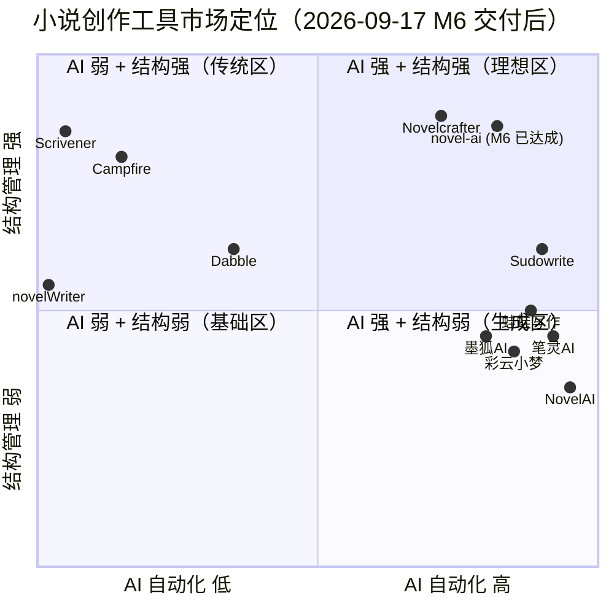

# Novel AI 竞品调研报告（刷新版）

| 项目 | 内容 |
|---|---|
| 调研日期 | 2026-09-17（刷新自 2026-09-02 版） |
| 调研方式 | 联网检索（WebSearch / WebFetch），逐条标注来源 URL |
| 调研对象 | 9 款同类 / 相邻产品 + 2 项补充对照 |
| 服务对象 | `/Users/simpleli/workspace/novel-ai`（小说 AI 创作工作台，**零运行时依赖 + 本地单文件 SQLite**） |
| 编写人 | 产品文档工程师 |
| 相较旧版变化 | ① 补齐三款国内工具 **彩云小梦 / 墨狐AI / 蛙蛙写作**；② 刷新 Sudowrite / NovelAI / Scrivener 的 2026 价格与能力；③ 本项目定位从「M4 基线」更新为 **M6/schema v7 已交付**，重新绘制横向矩阵与定位象限；④ 新增「我们采纳的设计原则」一节 |

> **可信度说明**：价格/功能来自 2026-09-17 检索结果。来源冲突时并列标注；无法查证显式标注「未核实」。**本报告不写入任何真实 API Key**。

---

## 一、执行摘要（5 条核心发现）

1. **市场已分化为「AI 优先」与「结构优先」两条路线，本项目已切入两者交叠的空位。**
   AI 派（Sudowrite / NovelAI / 彩云小梦 / 墨狐AI / 蛙蛙写作 / 笔灵AI）卖生成与网文工作流；结构派（Scrivener / novelWriter）卖组织能力、AI 薄弱或为零。**同时把「世界记忆层（自动提及 + 按需召回）」和「长篇结构管理（大纲树 / 场景卡 / Plot Grid / 伏笔生命周期）」做扎实的本地工具极少** —— 这正是本项目 M6 已交付的核心区。

2. **「Codex / Story Bible / Lorebook」是本赛道被验证的核心范式，且与本项目数据结构高度同构。**
   Novelcrafter 的 Codex 自动双向链接、NovelAI 的 Lorebook 关键词触发召回、Sudowrite 的 Story Bible，本质都是「设定条目 ↔ 正文双向绑定 + 按需注入 AI 上下文」。本项目经 M5（F080 自动提及反链 + F081 按需召回 + F088 FTS5）已补齐该层，不再是旧版所说的「有表有图但未自动链接」。

3. **BYOK + 本地模型是中型工具的标准答案，本项目已做满。**
   Novelcrafter 全系 BYOK 并支持本地 Ollama；本项目 `novel-ai-provider.js` 实现 OpenAI 兼容调用，且 **F062 UI 可配 Base URL/Model/加密 Key、F093 本地模型（Ollama/LM Studio/llama.cpp）免密钥接入**。旧版「半个 BYOK（仅 env）」的短板已消除。

4. **长篇一致性靠「伏笔/设定的生命周期管理」，而非更大上下文。**
   国内测评反复强调「过了 50 万字看谁帮你锁住人设/伏笔/世界观」。本项目 M6（F084 伏笔生命周期状态机 + 逾期提醒 + 与冲突校验联动；F083 Plot Grid 并行线索追踪）已把一致性从「单次 AI 调用」升级为「持续追踪」。

5. **「零运行时依赖 + 本地单文件 SQLite」是真实差异化，且已被本项目兑现。**
   商业竞品均为云订阅（$10–49/月，蛙蛙/墨狐按字数阶梯）；开源竞品（novelWriter）纯本地但无 AI。本项目同时具备两者，且 **M4–M6 已把差异化承诺兑现为体验**：防丢稿（G3）、真实 AI 闭环 + 流式（F082）、定时发布调度器（F085）、多格式导出（F092）、完整导入回灌（F078）。

---

## 二、竞品逐一分析

### 2.1 Sudowrite（美国 · 云 · 商业 · AI 优先）— 2026 刷新

| 维度 | 内容 |
|---|---|
| 定位 | 专为虚构写作打造的 AI 创作环境，强调「不夺走作者声音」 |
| 目标用户 | 长篇小说/系列/剧本作者；官方称 30 万+ 用户 |
| 技术形态 | 云端 SaaS；自研 **Muse 1.5** 模型 + 20+  prose 模型（Claude Opus 4.8 / GPT-5.4 / Gemini 3.1 Pro / Ballad 1.1 / 开源）；**2026-05 上线原生 iOS/Android App，三端云同步** |
| 核心能力 | **Story Bible**（设定中枢，AI 无条件引用）、**My Voice**（千字样本训练私有风格模型，开放 beta）、Write（~300 字续写多选项）、Describe（五感描写）、Expand/Rewrite、Feedback（五维改进）、Canvas（可视化规划）、Brainstorm、1,000+ 插件、章节 Beats |
| 定价（2026-08 核实） | 全档**同功能只差额度**：Hobby & Student **$10/月**（年付，225k credits）、Professional **$22/月**（1M credits + Feedback）、Max **$44/月**（2M credits，仅此档 12 个月结转）。月付 $19/$29/$59。无永久免费档，试用 credits 用完即止 |
| 来源 | <https://sudowrite.com/blog/best-ai-writing-platforms-for-fiction-in-2026-why-your-workflow-matters-more-than-features>；<https://top50aitools.com/pricing/sudowrite>（2026-08 核实）；<https://aiproductivity.ai/tools/sudowrite>（2026-06）；<https://aiquiks.com/ai-tools/sudowrite> |

**可借鉴**
1. Story Bible 强制注入 → 本项目 F081 分层 prompt 已实现「按需注入而非全量堆砌」。
2. Describe 选中片段定向增强 → 本项目 F087 已让 `selectedText` 取真实选区。
3. My Voice 私有风格模型 → 启发「按项目训练的轻量风格层」，但受零依赖红线约束，暂以 prompt 模板（F058）替代。

**短板**：无永久免费档；订阅 + credits 双计费；云端存储隐私顾虑；**无 BYOK/OpenRouter/API**（仅 Google Docs 同步）；文学体易「紫腔」过浓。

---

### 2.2 NovelAI（美国 Anlatan · 云 · 商业 · AI 沙盒）— 2026 刷新

| 维度 | 内容 |
|---|---|
| 定位 | 沉浸式虚构叙事 / 角色扮演沙盒，非传统写作辅助 |
| 目标用户 | 同人/TRPG/互动小说/隐私敏感创作者 |
| 技术形态 | 云端；**客户端加密存储**（员工无法读取）；自研 Kayra/Clio/Erato + **Xialong（GLM-4.6 微调，仅 Opus 档）**；无公开 API |
| 核心能力 | **Lorebook**（关键词触发持久化世界上下文，Opus 档 8,192 token 记忆）、**Memory**、Author's Note（隐藏指令）、Biases、分支剧情、自定义模块微调、图像生成（Anime Diffusion V4）、TTS、User Scripts |
| 定价（2026-08 核实） | Tablet **$10/月**（无限文本，1,024 token 记忆）、Scroll **$15/月**（2,048 token + TTS）、Opus **$25/月**（Xialong + 28,672 token 上下文 + 无限标准分辨率图像）。**无年付折扣、无永久免费档**，一次性试用 50 次文本生成 |
| 来源 | <https://buildfastwithai.com/ai-tools/novelai>；<https://recatools.com/ai-directory/novelai-image>（2026-09-03 核实）；<https://thetoolsverse.com/tools/novelai-gpt-story-writing-generator>（2026-08）；<https://aitexttools.net/tools/novelai>；<https://knowara.com/?p=1982/> |

**可借鉴**
1. Lorebook 关键词触发式召回 → 本项目 F081 四维加权 + F088 bigram 命中即注入，思路一致。
2. Memory 与 Lorebook 分离 → 本项目「草稿态 vs 版本态 + 项目设定层」职责已分离。
3. Author's Note 隐藏指令 → 本项目有 `prompt_templates`（F058），可演进为 per-project 全局备注层。

**短板**：无公开 API；上下文 28K（Opus）长篇仍需手工裁剪 Lorebook；定位偏沙盒；图像二次元风；**无 BYOK**。

---

### 2.3 Scrivener（英国 Literature & Latte · 桌面 · 买断 · 无 AI）— 2026 刷新

| 维度 | 内容 |
|---|---|
| 定位 | 长篇写作事实标准：「数字活页夹 + 软木板 + 打字机」 |
| 目标用户 | 小说家/编剧/学术/记者；15+ 年历史，用户基数极大 |
| 技术形态 | 纯本地桌面（macOS/Windows/iOS）；Dropbox 同步，**完全离线，无 AI**。**截至 2026-09 仍为 v3，Scrivener 4 尚未正式发布**（多方称「开发中/即将到来」，无确定日期） |
| 核心能力 | Binder 层级、Corkboard 索引卡、Outliner、Composition Mode（全屏专注）、**Snapshot 快照版本控制**、写作目标与历史统计、研究资料内嵌、Compile 多格式导出（Word/PDF/ePub/Final Draft/MultiMarkdown/LaTeX）、脚本模式、自动备份 |
| 定价（2026-08 核实） | **一次性买断**：单平台 $59.99（教育 $49.99），iOS $23.99，跨平台捆绑约 $80–$95.98；30 天**非连续**试用（仅实际使用日计数）。无订阅、无功能门控 Pro |
| 来源 | <https://scrivener.com.cn/>；<https://casrai.org/guides/scrivener-pricing>（2026-08）；<https://clickup.com/blog/writing-apps-for-mac>；<https://www.wps.com/blog/scrivener-4-everything-you-want-to-know-so-far> |

**可借鉴**
1. **Snapshot 显式里程碑快照** → 本项目 F097「★ 打快照」（`kind='milestone'`）已对标，且叠加自动版本/手动存稿三态区分。
2. **Compile 多格式导出** → 本项目 F092 已实现 MD/DOCX/EPUB + 附录（手写 OOXML/OPF/ZIP，零依赖）。
3. **Composition Mode 全屏专注 + 打字机滚动** → 本项目 F090 已实现（`body.focus-mode` 单类驱动 + rAF 死区回中）。

**短板**：学习曲线陡；界面陈旧；Windows 版落后于 Mac；无实时协作；**原生无 AI**（本项目正面进攻点）。

---

### 2.4 彩云小梦（中国 北京彩彻区明科技 / 彩云科技 · 云+移动 · 商业）— 新增

| 维度 | 内容 |
|---|---|
| 定位 | 「AI 编剧 + 角色设计师」，**故事向 AI 写作 + 角色扮演互动 + UGC 世界观社区** |
| 目标用户 | 网文作者、编剧、内容创作者、角色扮演爱好者、学生；偏中短篇/脑洞/互动叙事 |
| 技术形态 | 网页端 + iOS + Android，多端实时同步；自研 **「云锦天章」大模型**（V3.5 基于 DCFormer），兼容 DeepSeek R1 探索模式；**云端存储，需联网续写** |
| 核心能力 | **三选一 AI 续写**（输入开头→三条分支）、**平行世界回溯**（任意节点改剧情产生蝴蝶效应）、自定义世界设定 + 角色词条/关系图谱、虚拟角色文字/语音互动、社区「世界广场」、多风格续写模型（言情/玄幻/纯爱）、智能体创作 |
| 定价 | 免费基础（每日 15–20 次生成、续写字数有限）；会员 **月 28 元 / 季 36 元 / 年 188–190 元**（年费约全网无限创作、长文本、高级模型）；电量包 30–298 元（5 万–100 万字） |
| 来源 | <https://if.caiyunai.com>；<https://prompt.cn/sites/10452.html>（官方 FAQ）；<https://www.yjpoo.com/site/1016.html>；<https://www.airukou.cn/tool/caiyun-xiaomeng> |

**可借鉴**
1. **平行世界回溯 / 分支剧情**：灵感激发的强交互范式 → 启发「章节版本 + 里程碑快照」之外的非线性探索形态（远期）。
2. **角色深度互动 + 关系图谱**：UGC 化的设定沉淀方式。
3. **三选一续写降低卡文门槛**：可在「续写建议」返回多选项时借鉴。

**短板**：**长文档整体记忆有限，更适合中短篇**；长篇深度管理弱（缺大纲拆解/剧本转化等专业工作台）；云端存储无私有化；强依赖平台生态。

---

### 2.5 墨狐AI（中国 北京云泥科技 · 云 · 商业 · 网文）— 新增

| 维度 | 内容 |
|---|---|
| 定位 | 专为网文小说作者打造的智能创作工具，**网文脑洞 + 剧情树规划** |
| 目标用户 | 网文作者、剧本创作者、IP 改编者；偏多支线/爽文短篇与自媒体 |
| 技术形态 | 云端；核心 AI 需联网调用（本地客户端仅作编辑器）；曾内测期全功能免费 |
| 核心能力 | **生成大纲**（世界观/角色/章节目录）、**剧情树**（可视化分支 + 续写多走向）、**小说转剧本**（IP 改编）、素材库、世界观设定生成、文风/字数/视角可调、多版本迭代 |
| 定价（来源冲突，以官方为准） | 免费版每日 3 次（或 3000 字额度，来源不一）；专业版 **68 元/月**（万字生成 + 多版本剧情树 + 剧本转换，20 次/日）；基础版 29 元/月；团队版 199 元/月含协作；另有「单价低至 0.02 元/千字」阶梯计价说法（未核实）。**注：各来源档位/额度冲突，列为未核实** |
| 来源 | <https://aigc21.com/sites/3010.html>；<https://ainavpro.cn/inkfox-ai>；<https://www.cnblogs.com/xielunwen/articles/21554787>（2026 实测）；<https://toolradarai.com/sites/23128.html>；<https://www.ai-all.info/en/tool/1350> |

**可借鉴**
1. **剧情树可视化分支**（Plot Tree）：与本项目 F083d Plot Grid（情节线×场景矩阵）互补——前者偏「单线分支探索」，后者偏「多线并行追踪」，可互为参考。
2. **小说转剧本**：F015 分镜剧本的进阶形态，远期可对接真实格式。
3. **「角色不崩、伏笔不漏」口号**：直接印证伏笔生命周期（F084）的刚需。

**短板**：**长篇连贯性偏弱，更适合 3 万字内短篇**（多来源一致）；无本地化/私有化；定价口径混乱。

---

### 2.6 蛙蛙写作（中国 杭州引力智航 × 浙大 · 云+多端 · 商业 · 网文全链路）— 新增

| 维度 | 内容 |
|---|---|
| 定位 | 2026 年网文圈增速最快的本土工具，**「网文 – 剧本 – 漫剧视频」一站式闭环创作**，定位个人作者与中小型工作室全能助手 |
| 目标用户 | 网文作者、短剧/编剧团队、自媒体、学术职场用户；宣称 30 万+ 创作者 |
| 技术形态 | 网页端 + 移动端 + PC 客户端，三端实时同步，**云端自动存档**；自研 **Weaver 中文垂类大模型**（联合浙大实验室）；微信扫码即用 |
| 核心能力 | 总纲/章纲管理、人物标签管理、AI 润色/续写/补全、**12 大类网文爆款模板**（黄金三章/爽点逻辑）、**小说拆书**（拆解爆款公式生成模板）、**AI 工具广场 + 工作流可视化拖拽**、**小说一键转剧本 + 分镜漫剧生成**（打通短视频变现） |
| 定价 | 注册赠 600 蛙币；**基础生成永久免费**；月卡 **39 元**无限字数、年卡 **299 元**附剧本转换权益；周卡 9 元；企业版定制。另有来源称月 29–30 / 年 298（口径接近） |
| 来源 | <https://wawawriter.com/home>；<https://aizxs.com/tool/wa-wa-xie-zuo>；<https://www.yjpoo.com/site/2103.html>；<https://ima.qq.com/wiki/...>（2026 实测，第三方转述） |

**可借鉴**
1. **拆书 / 反向工程爆款**：上传同类爆款输出结构公式 → 与本项目「知识库 + 术语表 + Prompt 模板（F058/F056）」天然契合，可沉淀为模板货架。
2. **垂类生成器矩阵**：与本项目 26 种 AI 任务同方向，可借鉴「按题材/平台组织的模板货架」呈现。
3. **小说转剧本 + 分镜**：F015 的延伸，远期对接真实发布/改编链路。

**短板**：**长篇控制力衰减（约 20 章后战力崩坏/人设偏移）需人工干预**；模板感重、易撞梗；版权归属未完全明确；免费额度对日更作者不足；纯云端无私有化。

---

### 2.7 Novelcrafter（德国 · 云 · 商业 · 结构 + BYOK）— 保留（最相关结构参照）

| 维度 | 内容 |
|---|---|
| 定位 | 「你的小说写作工具箱」，Codex 驱动的规划/写作/评审一体化 |
| 技术形态 | 浏览器端；**全系 BYOK，支持 300+ 模型（OpenAI/Anthropic/Google/Meta/Mistral/OpenRouter）及本地 Ollama/LM Studio** |
| 核心能力 | **Codex**（自动检测并链接正文提及条目、别名/昵称识别、Progressions 追踪角色与设定时间演化）、Grid/Outline 双规划视图、Scene Beats、AI 摘要/角色抽取、Word/MD/HTML 导入导出、修订历史、系列级 Codex 共享 |
| 定价 | Scribe $4 / Hobbyist $8 / Artisan $14 / Specialist $20 每月（AI 用量另付）；21 天试用 |
| 来源 | <https://www.novelcrafter.com/features/codex>；<http://billing.novelcrafter.com/>；<https://knowara.com/ai-tools/writing/novelcrafter-review> |

**可借鉴**：Codex 自动提及（**本项目 F080 已实现**）、Progressions 演化追踪（启发伏笔/角色状态时间线）、Grid 条目×场景矩阵（**本项目 F083d Plot Grid 已实现**）、BYOK + 本地模型（**本项目 F093 已实现**）。**这是本项目结构侧最接近的对手，但它是云订阅，本项目是本地零依赖。**

---

### 2.8 笔灵 AI（中国 上海简办网络 · 云 · 商业 · 网文全流程）— 保留

| 维度 | 内容 |
|---|---|
| 定位 | 面向网文新人的「一键写全篇」全流程工具 |
| 核心能力 | 全篇编辑器（模板→大纲→章纲→正文）、**无限 AI 续写（锚定初始人设与主线）**、**拆书神器**、大纲生成器、扩写/改写/润色、角色与关系生成、200+ 垂类生成器 |
| 定价 | 主推**终身会员**（赠 50 万 AI 字数）；月费/年费档位未明确展示（未核实） |
| 来源 | <https://ibiling.cn/novel-editor>（官方站，2026-09-02 实取） |

**可借鉴**：续写强制锚定人设主线（对标「写跑偏」）、垂类生成器矩阵（同 F011–F033 方向）、拆书公式沉淀为模板。**短板**：长篇深度管理弱、云端无私有化、强依赖平台生态。

---

### 2.9 novelWriter（FOSS · 桌面 · 纯文本 · 无 AI）— 保留（最相关本地参照）

| 维度 | 内容 |
|---|---|
| 定位 | 面向长篇的 Markdown 类纯文本编辑器 |
| 技术形态 | 跨平台 FOSS；**项目以纯文本文件存于本地，可直接纳入 git**；完全离线 |
| 核心能力 | Project Tree、类 Markdown 语法、注释/摘要/交叉引用元数据、角色与地点标注、Novel View 总览、Focus Mode、会话计时、写作统计 |
| 定价 | 免费开源（2026.1.1 版，2026-06 发布） |
| 来源 | <https://novelwriter.io/>；<https://justpublishingadvice.com/choose-your-free-book-writing-software-for-your-new-book> |

**可借鉴**：纯文本 + git 可版本化（数据主权终极形态，启发本项目 F078 完整导出/回灌）、交叉引用元数据（与 F080 自动提及殊途同归且零依赖可实现）、会话计时 + 统计（**本项目 F098/F099 已实现**）。**这是本项目数据主权侧最接近的对手，但无 AI。**

---

### 补充对照（简述）
- **Campfire**（模块化世界构建）：Encyclopedia 内链 Wiki + Maps 打点 + Relationships 模块 → 启发本项目「面板按需展开/折叠」与关系可视化。
- **Dabble**（云端写作 + Plot Grid）：**Plot Grid 情节线×场景矩阵是本项目 F083d 的直接灵感来源**；目标 + 连续打卡 Streaks 启发 F099 热力图。

---

## 三、横向对比矩阵（14 维度，2026-09-17 刷新）

图例：`●` 完整支持　`◐` 部分支持 / 有重大限制　`○` 不支持 / 无　`—` 未核实

| 维度 | **本项目 novel-ai（M6）** | Sudowrite | NovelAI | Scrivener | 彩云小梦 | 墨狐AI | 蛙蛙写作 | Novelcrafter | 笔灵AI | novelWriter |
|---|---|---|---|---|---|---|---|---|---|---|
| 定位 | 本地 AI 创作工作台 | AI 虚构写作 | AI 叙事沙盒 | 长篇写作标准 | AI 编剧+角色 | 网文剧情树 | 网文全链路 | 结构+BYOK | 网文全流程 | 纯文本长篇 |
| 部署形态 | **本地（零依赖）** | 云 | 云 | 本地桌面 | 云+移动 | 云 | 云+多端 | 云 | 云 | 本地桌面 |
| 是否开源 | 是（本地仓库） | ○ | ○ | ○ | ○ | ○ | ○ | ○ | ○ | **● FOSS** |
| AI 能力 | **●（26 任务+流式）** | ● | ● | ○ | ● | ● | ● | ● BYOK | ● | ○ |
| BYOK / 多模型 | **●（env+UI+本地模型）** | ○ | ○ | ○ | ○ | ○ | ○ | **● 300+** | ○ | ○ |
| 本地模型（Ollama 等） | **●（F093）** | ○ | ○ | ○ | ○ | ○ | ○ | ● | ○ | ○ |
| 世界设定中枢 | **●（FTS5+提及+召回）** | ● Story Bible | ● Lorebook | ◐ 研究夹 | ◐ | ◐ | ◐ | **● Codex** | ◐ | ◐ 元数据 |
| 长篇结构视图 | **●（树/卡/Grid）** | ◐ Canvas | ○ | ● 软木板/大纲 | ○ | ◐ 剧情树 | ◐ 章纲 | ● Grid/Outline | ◐ 章纲 | ● Project Tree |
| 伏笔/线索生命周期 | **●（F084 状态机）** | ◐ | ◐ | ○ | ○ | ◐ | ◐ | ◐ | ◐ | ○ |
| 版本/快照 | **●（草稿分离+里程碑）** | ◐ | ◐ | **● Snapshot** | ◐ 回溯 | ◐ | ◐ 云存稿 | ● 修订历史 | ◐ | **● git** |
| 定时/计划发布 | **●（F085 懒扫描）** | ○ | ○ | ○ | ○ | ○ | ◐ 平台同步 | ○ | ◐ | ○ |
| 导出格式 | **●（JSON/TXT/MD/DOCX/EPUB）** | ◐ | ◐ | **● 多格式** | ◐ TXT/WORD | ◐ | ◐ Word/TXT | ● Word/MD/HTML | ◐ | ● Pandoc |
| 导入/回灌 | **●（F078 new/replace+备份）** | ◐ | ◐ | ● | ○ | ◐ | ◐ | ● | ● 上传草稿 | ● |
| 协作 | ○ | ○ | ●（高档） | ○ | ◐ 社区 | ◐ 团队版 | ◐ 企业版 | ◐ | ○ | ○ |
| 价格 | **免费自用（零依赖）** | $10–44/月 | $10–25/月 | **$59.99 买断** | 28–190 元/年 | 29–199 元/月 | 39–299 元/月 | $4–20/月+用量 | 终身会员 | **免费** |
| 数据主权 | **● 本地单文件** | ○ | ◐ 客户端加密 | ● | ○ | ○ | ○ | ○ | ○ | **●** |

> 与 2026-09-02 旧版相比，本项目列从大量 `○/◐` 翻转为 `●`：本地模型、世界设定中枢、长篇结构视图、伏笔生命周期、版本快照、定时发布、导出格式、导入回灌均已交付。

---

## 四、市场定位象限图

横轴 = AI 自动化程度（低 → 高）；纵轴 = 长篇结构管理能力（弱 → 强）。

**读图说明**

- **象限 1（AI 强 + 结构强）**：原仅 Novelcrafter 稳定区内。**本项目 M6 已抵达 [0.82, 0.86]**，凭「本地零依赖 + 自动提及/按需召回 + 大纲/Plot Grid/伏笔生命周期 + 定时发布 + 多格式导出」进入理想区，且是区内唯一本地优先工具。
- **象限 2（AI 弱 + 结构强）**：Scrivener、Campfire、novelWriter，靠买断/免费/离线取胜，但均无 AI。
- **象限 4（AI 强 + 结构弱）**：Sudowrite、笔灵 AI、蛙蛙写作、彩云小梦、墨狐 AI、NovelAI——生成力强但长篇一致性靠「记忆层」外挂兜底，且多为云端。
- **移动路径已闭合**：旧版规划的「横向 AI 0.30→0.75、纵向结构 0.58→0.85」已由 M5/M6（F080/F081/F082/F083/F084/F085/F078/F092/F093）全部兑现。
- **象限评分口径**：横轴 = 真实模型调用 + 自动化注入上下文 + 后台自动化任务；纵轴 = 多层级结构视图 + 设定实体结构化并与正文联动 + 版本/导出/导入完整度。分数为 0–1 主观标定，用于相对定位。

---

## 五、竞品优点 → 本项目映射汇总（刷新）

| 竞品 | 优点 | 本项目现状（M6） | 引入难度 |
|---|---|---|---|
| Sudowrite | Story Bible 强制注入 | **● 已实现** F081 分层按需注入 | 已交付 |
| Sudowrite | Describe 选中片段定向改写 | **● 已实现** F087 真实选区 | 已交付 |
| Sudowrite | Feedback 结构化评审 | ◐ 冲突校验 F032 单次调用 | 中（可加多维度） |
| Novelcrafter | Codex 自动提及 + 别名 | **● 已实现** F080 | 已交付 |
| Novelcrafter | Progressions 状态演化 | ◐ 伏笔生命周期 F084 部分覆盖 | 低（扩展） |
| Novelcrafter | Grid 条目 × 场景矩阵 | **● 已实现** F083d Plot Grid | 已交付 |
| Novelcrafter | BYOK + 本地模型 | **● 已实现** F062 + F093 | 已交付 |
| Scrivener | Snapshot 里程碑快照 | **● 已实现** F097 | 已交付 |
| Scrivener | Compile 多格式导出 | **● 已实现** F092 MD/DOCX/EPUB | 已交付 |
| Scrivener | 全屏专注模式 | **● 已实现** F090 | 已交付 |
| NovelAI | Lorebook 关键词触发召回 | **● 已实现** F081 + F088 | 已交付 |
| NovelAI | Memory / Lorebook 分离 | **● 已实现**（草稿/版本/项目设定三层） | 已交付 |
| NovelAI | Author's Note 隐藏指令 | ◐ 有 prompt 模板，无全局备注层 | 低 |
| Campfire | 模块制 / 面板折叠 | **● 已实现**（面板按需展开/关闭，F068/F069/F070–F072） | 已交付 |
| Dabble | Plot Grid 情节线 × 场景 | **● 已实现** F083d | 已交付 |
| Dabble | 目标 + 连续打卡 | **● 已实现** F099 热力图 | 已交付 |
| 笔灵 AI / 蛙蛙写作 | 拆书 / 反向工程爆款 | ◐ 知识库 + Prompt 模板可承载，未做拆书流程 | 中 |
| 笔灵 AI / 墨狐 AI | 带约束续写（锚定人设主线） | ◐ 续写为单次调用，未强制锚定 | 中 |
| 彩云小梦 | 平行世界 / 分支剧情 | ○ 版本+里程碑，无分支探索 | 高（远期） |
| novelWriter | 纯文本导出 + 可回灌 | **● 已实现** F078 完整导出/回灌 | 已交付 |
| novelWriter | 会话计时与写作统计 | **● 已实现** F098/F099 | 已交付 |

> 结论：**旧版「我们该补的 20 条」中，约 15 条已在 M5/M6 交付，剩余多为「增强项」（多维度评审、全局备注层、拆书流程、分支探索），列入远期想法池。**

---

## 六、我们从中采纳的设计原则

竞品界面与交互的共性规律，归纳为本项目三条设计原则并已在代码中落地：

### 6.1 渐进式披露（Progressive Disclosure）
- **规律**：所有成熟竞品都把「写作区作为唯一焦点」，管理/设定退居侧栏或次级视图，**绝不把几十个功能平铺在一屏**。Sudowrite 的 Story Bible/Canvas 折叠、Scrivener 的 Binder/Inspector、Campfire 的模块制、Novelcrafter 的 Codex 面板，本质都是「需要时展开、不需要时收起」。
- **本项目落地**：`F068` 知识库面板、`F069` 发布计划面板、`F070–F072` 图谱类型/标签切换/关闭面板、`F090` 专注模式（隐藏一切非编辑元素）—— 编辑器始终是页面主舞台，26 个 AI 按钮收在工具栏、知识/结构/运营收在侧栏，切专注即全收起。

### 6.2 聚焦编辑器（Editor as the Single Focus）
- **规律**：写作工具的第一原则是不打断心流。Scrivener 的 Composition Mode、novelWriter 的 Focus Mode、Sudowrite 的 Write 工具，都把光标与段落置于视觉中心。
- **本项目落地**：`F090` 专注/打字机模式（`body.focus-mode` 单类驱动，Esc 优先关弹窗再退专注）；打字机滚动用 rAF 节流、仅在死区（光标离视口 40%–60%）小幅回中，**不逐键强制滚动**；当前段落高亮用 textarea 镜像层 `<mark>` 透出。字号（`F090a`）/行宽（`F090b`）以 CSS 变量下发，普通模式同样生效。

### 6.3 节点可视化（Node Visualization）
- **规律**：长篇的「人设/伏笔/世界观」关系天然是图。Novelcrafter 的 Codex 关系图、Campfire 的 Relationships、彩云小梦的角色关系图谱，都用可视化降低认知负荷。
- **本项目落地**：`F091` 零依赖力导向节点图（Fruchterman-Reingold 简化版，`js/graph-layout.js` 纯数学 + `js/graph-view.js` 视图层，DOM 节点 + SVG 边）—— 支持拖拽固定（📌 虚线描边）、双击解除、光标锚缩放（0.35x–2.6x）、平移；收敛后 alpha 阈值自停、大图（>100 节点）逐帧优化；保留 `data-node-id` 点击契约与类型过滤。与 `F080` 自动提及反链、`F084` 伏笔生命周期共用同一图谱底座。

---

## 七、结论与建议

1. **不与 Sudowrite / 笔灵 AI / 蛙蛙写作在「生成质量」正面竞争** —— 它们是自研/微调模型 + 海量语料或垂类大模型（Weaver），本项目是 BYOK 壳层，拼生成必败；差异化在「本地 + 结构 + 可控」。
2. **主攻「本地 + 结构 + 可控」三角**：数据在本地、上下文可控（作者清楚 AI 看到了什么，F081 引用来源回传）、结构可审计（伏笔/设定/时间线有明确状态，F084/F083）。这是所有云竞品的结构性弱点，也是本项目已兑现的区隔。
3. **已补完的「世界记忆层」自动化是最高 ROI 的一块**：F080 自动提及 + F081 按需召回 + F088 FTS5，与现有数据结构高度契合，且全部零依赖实现，是本项目从「生成区」跃迁到「理想区」的主因。
4. **严守零依赖红线**：本调研中绝大多数优点（自动链接、按需召回、力导向布局、SSE 流式、ZIP 打包、本地 Ollama 调用）均可用 Node 内置模块实现。**唯一需警惕的是向量嵌入（RAG）** —— 零依赖下无法本地生成高质量 embedding，继续采用「关键词 + 四维加权召回」降级方案。
5. **下一步方向（非本期）**：多维度 Feedback 评审、per-project 全局备注层、拆书流程（复用知识库+Prompt 模板）、分支探索（彩云小梦式平行世界）、AI provider 插件化路由、端到端加密云备份。**PWA（F094）/ 只读分享（F095）维持未排期**，因其与「仅本机 + Origin 白名单」鉴权模型（F074）存在根本张力。

---

## 附：信息来源清单（2026-09-17 检索）

| # | 产品 | 来源 URL | 可信度 |
|---|---|---|---|
| 1 | Sudowrite | https://sudowrite.com/blog/best-ai-writing-platforms-for-fiction-in-2026-why-your-workflow-matters-more-than-features | 厂商自述（营销倾向） |
| 2 | Sudowrite | https://top50aitools.com/pricing/sudowrite | 第三方，称 2026-08 核对官方 |
| 3 | Sudowrite | https://aiproductivity.ai/tools/sudowrite | 第三方评测（2026-06） |
| 4 | Sudowrite | https://aiquiks.com/ai-tools/sudowrite | 第三方评测 |
| 5 | NovelAI | https://buildfastwithai.com/ai-tools/novelai | 第三方评测 |
| 6 | NovelAI | https://recatools.com/ai-directory/novelai-image | 第三方（2026-09-03 核实） |
| 7 | NovelAI | https://thetoolsverse.com/tools/novelai-gpt-story-writing-generator | 第三方（2026-08） |
| 8 | NovelAI | https://aitexttools.net/tools/novelai | 第三方目录 |
| 9 | NovelAI | https://knowara.com/?p=1982/ | 第三方评测（含实测） |
| 10 | Scrivener | https://scrivener.com.cn/ | 官方中文站 |
| 11 | Scrivener | https://casrai.org/guides/scrivener-pricing | 第三方（2026-08） |
| 12 | Scrivener | https://clickup.com/blog/writing-apps-for-mac | 第三方导购 |
| 13 | Scrivener | https://www.wps.com/blog/scrivener-4-everything-you-want-to-know-so-far | 第三方（v4 前瞻） |
| 14 | 彩云小梦 | https://if.caiyunai.com | 官方站 |
| 15 | 彩云小梦 | https://prompt.cn/sites/10452.html | 第三方（含官方 FAQ） |
| 16 | 彩云小梦 | https://www.yjpoo.com/site/1016.html | 第三方 |
| 17 | 彩云小梦 | https://www.airukou.cn/tool/caiyun-xiaomeng | 第三方目录 |
| 18 | 墨狐AI | https://aigc21.com/sites/3010.html | 第三方百科 |
| 19 | 墨狐AI | https://ainavpro.cn/inkfox-ai | 第三方导航 |
| 20 | 墨狐AI | https://www.cnblogs.com/xielunwen/articles/21554787 | 第三方实测（2026） |
| 21 | 墨狐AI | https://toolradarai.com/sites/23128.html | 第三方 |
| 22 | 蛙蛙写作 | https://wawawriter.com/home | 官方站 |
| 23 | 蛙蛙写作 | https://aizxs.com/tool/wa-wa-xie-zuo | 第三方 |
| 24 | 蛙蛙写作 | https://www.yjpoo.com/site/2103.html | 第三方 |
| 25 | Novelcrafter | https://www.novelcrafter.com/features/codex | 官方产品页 |
| 26 | Novelcrafter | http://billing.novelcrafter.com/ | 官方定价页 |
| 27 | 笔灵 AI | https://ibiling.cn/novel-editor | 官方站（2026-09-02 实取） |
| 28 | novelWriter | https://novelwriter.io/ | 官方站 |
| 29 | novelWriter | https://justpublishingadvice.com/choose-your-free-book-writing-software-for-your-new-book | 第三方评测 |

**未核实/冲突项**：墨狐 AI 各档位与额度（来源冲突，以官方为准）；笔灵 AI 月费/年费具体档位（官网仅展示终身会员）；蛙蛙写作个别渠道月费口径（$29 vs $39）；NovelAI 是否年付折扣（多来源称无，recatools 称约 1/3 折扣，存疑）。以上均不影响横向定位结论。
