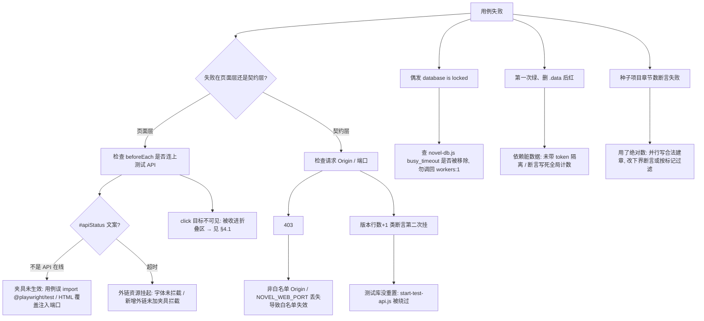

# Novel AI 自动化测试体系

| 项目 | 内容 |
|---|---|
| 文档日期 | 2026-09-17（M6 重写，替换 M4/2026-09-05 版本） |
| 里程碑 | **M6**（F083 三视图 / F084 伏笔 / F085 调度器 / F090 专注 / F091 图谱 / F092 导出） |
| 测试基线 | Playwright **75 passed**：契约层 33（api-contract 33）+ 页面层 42（basic 6 / m6-ui 9 / api-m6 20 / knowledge 4 / publishing 3） |
| 工程化 | 后续叠加 `tsc --noEmit`(checkJs) / ESLint / Prettier / CI，见 `doc/development-docs/development.md` 第七章 |
| 手工测试计划 | `doc/archive/2026-09-05-superseded/test-plan.md`（历史 B/F/T 清单；按钮编号已更新，手工回归请以 `button-reference.md` 为准） |

## 一、测试分层

```mermaid
graph TD
  A[页面冒烟层 · 42 条] -->|真实浏览器 + 真实 API + 真实测试库| B[novel-ai.html]
  C[API 契约层 · 33 条] -->|request fixture 直打 HTTP| D[novel-api.js]
  A --> D
  B --> D
  D --> E[(.data/novel-test.sqlite)]
  F[单元层 · 刻意没有] -.全部 SQL 收敛在 novel-db.js 且只经 HTTP 暴露.-> C
```

| 层 | 文件 | 条数 | 依赖 | 作用 |
|---|---|---|---|---|
| 页面冒烟层 | `basic.spec.js` `knowledge.spec.js` `publishing.spec.js` `m6-ui.spec.js` | 6+4+3+9 = **22** | 真实浏览器 + 真实 API + 真实测试库 | 防「页面根本没接上 API / 后端通了前端没接」 |
| M6 页面层 | `m6-ui.spec.js` | **9** | 同上 | F083/F084/F085/F090/F091/F092 端到端 |
| API 契约层 | `api-contract.spec.js` `api-m6.spec.js` | 33+20 = **53** | `request` fixture 直打 HTTP | 重构回归防线，只依赖 URL+状态码+响应头+库状态 |
| 单元层 | 刻意没有 | 0 | — | 全部 SQL 收敛在 `novel-db.js` 且只经 HTTP 暴露，契约层已覆盖语义 |

**为什么契约层是主体**：前端（`js/` 36 模块）在持续改造，页面级用例会跟着 UI 抖；契约只依赖 URL + 状态码 + 响应头 + 库状态，服务端行为不变则用例稳定。

**为什么不直接读 SQLite 断言**：测试进程另开连接会绕过「多进程共享同一文件」的真实语义，把 `SQLITE_BUSY` 藏起来。版本行数、正文一律经 API 间接校验（bootstrap / versions）。唯一例外是 `user_version`——服务端没有暴露它的端点，用只读探针 `tests/helpers/db-probe.mjs`（readOnly 打开，不参与写锁竞争）。

## 二、运行方式

```bash
npm test              # 全量：自动拉起 8788(API) + 5176(Web) 两个测试服务，结束自动回收
npm run test:ui       # Playwright UI 模式（调试单个用例）
npm run test:report   # 打开上次 HTML 报告（test-results/playwright-report）
```

- **无需手工先起服务**：`playwright.config.js` 的 `webServer` 数组自动拉起两个进程，且 `reuseExistingServer: false`——绝不复用可能存在的开发进程（复用 = 测试写进开发库）。
- 并发：当前真实配置 `fullyParallel: true`，`workers: process.env.CI ? 2 : 4`；`retries: process.env.CI ? 1 : 0`（本地要看见真实失败，避免偶发问题被重试掩盖成「通过」）。`timeout: 30000`，`expect.timeout: 7000`。

### 2.1 环境隔离（关键设计）

常量唯一真源：`tests/test-env.js`（端口、库路径、Origin 全部从这里取，禁止手写）。

| 维度 | 开发环境 | 测试环境 |
|---|---|---|
| Web 端口 | 5175 | **5176** |
| API 端口 | 8787 | **8788**（契约用 `http://127.0.0.1:8788`，避免 localhost 解析成 IPv6 ::1 连不上） |
| 数据库 | `.data/novel-ai.sqlite` | **`.data/novel-test.sqlite`**（每次运行前整体重置） |
| 合法 Origin | `http://localhost:5175` 等 | `http://localhost:5176` |

隔离的三个机制：

1. **测试库重置在打开连接之前**：`tests/start-test-api.js`（webServer 命令）先删库（含 `-wal`/`-shm` 两个 WAL 伴生文件），再 `import` API 服务。清理不能放 `globalSetup`——它的执行顺序晚于 webServer，那时进程已持有被 unlink 的旧 inode，等于没清。
2. **护栏**：`start-test-api.js` 校验测试库与开发库路径不同，相同直接拒绝启动（防止一次误配删掉真实稿件）；并设 `NOVEL_NO_DOTENV=1` 避免把真实 AI 密钥带入测试环境。
3. **页面夹具注入端口**：`tests/fixtures.js` 用 `context.addInitScript` 在页面脚本求值前注入 `window.NOVEL_API_PORT = 8788`。前端写死 `|| 8787`，不注入就会连去开发进程/开发库。**页面用例必须从 `./fixtures.js` 导入 test**，直接用 `@playwright/test` 会静默打到开发库。

### 2.2 workers 与 busy_timeout（X3 实测结论，破除历史误判）

> **「`workers: 1` 是因为 SQLite BUSY」是历史误判，已被实测推翻。**

原配置 `workers: 1` 的理由「多 worker 并发写 SQLite 会 `SQLITE_BUSY`」是**错误归因**：根因是缺 `busy_timeout`。实测对比（见 `playwright.config.js` 头注释）：

| 配置 | 4 进程 × 400 次写 | 失败率 |
|---|---|---|
| 无 `busy_timeout` | 1411 / 1600 | **88%** |
| `PRAGMA busy_timeout = 5000` 后 | 0 / 1600 | **0%** |

`server/novel-db.js` 已设置该参数，因此当前 `fullyParallel: true, workers: 4`（CI 2）安全。**若将来出现偶发 `database is locked`，先查 `busy_timeout` 是否被改掉，而不是调回 `workers: 1`。**

并发用例的数据隔离模式：每个写用例用 `token(label)`（pid + 时间 + 随机）生成全局唯一标记，建章/写正文都带标记，断言只统计自己的数据——worker 之间互不干扰。

## 三、用例清单（75 条）

> 计数：basic 6 + m6-ui 9 + api-m6 20 + knowledge 4 + publishing 3 + api-contract 33 = **75**。api-m6 编号从 34 起（延续 api-contract 的 01–33），其中 40 缺号（写作时预留、未实现即不占位）。

### 3.1 basic.spec.js（6 条 · 页面基础冒烟）

| # | 用例 | 验证点 |
|---|---|---|
| 1 | 页面打开并显示 UI 结构 | `.app-shell` `.brand` `[data-open-panel="knowledge"]` `[data-open-panel="publish"]` 加载即可见 |
| 2 | 知识库面板可打开 | click → `#knowledgeDrawer` 可见 |
| 3 | 发布计划面板可打开 | click → `#publishDrawer` 可见 |
| 4 | 系统日志面板可打开 | click `[data-action="open-log"]` → `#logDrawer` 可见 |
| 5 | 项目切换器 | 新建项目后自动切换并可切回（按 id 切回，避免重名） |
| 6 | 同步辅助走流式通道 | click `run-sync-ai` → `#assistFeed` 结构卡 + 「本地演示」徽章 |

### 3.2 m6-ui.spec.js（9 条 · M6 端到端）

| # | 用例 | 验证点 |
|---|---|---|
| 01 | 三视图切换 | list→corkboard→grid；`.outline-branch`/`.chapter-card`/`.plotgrid-wrap` 各自渲染；按钮 `.active` 高亮 |
| 02 | 情节网格 | 新建情节线 → 矩阵 `#outlineBody table.plotgrid` 渲染；单元格三态循环（progress/planned/清除）并落库 |
| 03 | 伏笔抽屉 | `[data-open-panel="foreshadow"]` 打开 → 登记/标记回收，状态流转不可逆，落库 |
| 04 | 调度器状态块 | 发布面板含 `#schedulerStatus`；文案与 `/scheduler` 的 `disabled` 一致（测试库显示「调度器已禁用」「下次扫描：--」）；任务卡标「模拟适配器」 |
| 05 | 专注模式 | `[data-action="focus-toggle"]` 开 → `body.focus-mode`、顶栏隐藏、编辑器可见；Esc 退出 |
| 06 | 字号/行宽档位 | `font-inc`/`font-dec` 改 `--editor-font-size`；`width-cycle` 改 `--editor-max-width`；偏好写入 localStorage |
| 07 | 图谱节点 > 16 | 补 10 条知识把节点顶过旧 16 上限；`refresh-graph` → `window.__graphPerf.done`，DOM 节点数与数据一致、收敛 < 3s |
| 08 | 拖拽节点 pin | 真实指针拖拽 → 节点 `.pinned` 且 transform 改变（力导向+固定生效） |
| 09 | 导出弹窗 | `export-multi` → 3 种格式（markdown/docx/epub，默认 markdown）+ 4 个附录默认全选；取消不下载 |

### 3.3 api-m6.spec.js（20 条 · 编号 34–54，缺 40）

| # | 用例 | 验证点 |
|---|---|---|
| 34 | 大纲数据包 | 章节按 `sort_order` 返回、带 1 起连续 `ordinal`；含 `scenes/foreshadows/plotLines/beats`；不回传正文、带 `char_count` |
| 35 | 章节拖拽重排 | `/chapters/reorder` 持久化，重排后再次拉取顺序保持，bootstrap 同序 |
| 36 | 重排非法载荷 | 缺章/多章/重复 id/空数组 → 400 且库中顺序分毫未动 |
| 37 | 场景归属 | 新建→归入章节→移回未分配；跨项目章节归属 400 |
| 38 | 情节线 CRUD/节拍 | 空标题 400；同（线×章）覆盖非新增；非法 mark 归一化；mark=null 清除；跨项目 404；删除情节线级联删节拍；不存在 404 |
| 39 | 导入回灌顺序不漂移 | 自定义顺序导出→导入→顺序/内容逐项一致、ID 重映射、plotLines/beats 随回灌（v7 排序契约回归） |
| 41 | 登记伏笔 | 成功落库；空标题/非法章号 400；不存在/跨项目章节 404；列表回带 `chapter_ordinal`/`overdue` |
| 42 | 状态机单向 | planted→resolved/abandoned；终态再流转 400；跨态流转 400 |
| 43 | 逾期判定 | `expected_chapter ≤ 章节数` 即逾期；仪表盘 `foreshadowOverdue` 与列表一致；回收后回落 |
| 44 | 跨项目隔离 | 列表互不可见；跨项目流转 404；原状态不被改 |
| 45 | conflict 注入 | `conflict` 任务 prompt 含【未回收伏笔清单】；非 conflict 不含；回收后不含 |
| 46 | 线索提示 | 伏笔名在别的章被提及 → mention 提示（只提示不建库） |
| 47 | 测试库调度器禁用 | `/scheduler` 的 `disabled/running/lastScanAt/lastTriggered` 全为禁用态；造到期任务也不被推走；无扫描审计 |
| 48 | 手动状态机 | simulate 推成功/失败（平台含「失败」→失败）；retry 回置 waiting 可再推；全部任务标 `simulated` |
| 49 | 抢占式执行 | 同一到期任务重复扫描只真正执行一次（审计 `publish.execute` 仅 1 条） |
| 50 | 发布创建校验 | 缺 platform 显式报错（≥400），不留下脏任务 |
| 51 | Markdown 导出 | `attachment` + RFC 5987 中文文件名；目录 + 多章；单章不含目录 |
| 52 | DOCX 导出 | ZIP 签名 `PK\x03\x04`；含 `[Content_Types].xml` / `word/document.xml`；EOCD 签名 |
| 53 | EPUB 导出 | 首条目必须是 STORED 的 `mimetype`（method=0），内容 `application/epub+zip`；含 `META-INF/container.xml` |
| 54 | 导出负面 | 非白名单 Origin 403；不存在章节 404；未支持格式（pdf）404 |

### 3.4 knowledge.spec.js（4 条）

| # | 用例 | 验证点 |
|---|---|---|
| 1 | 知识库面板可打开 | `[data-open-panel="knowledge"]` → `#knowledgeDrawer` |
| 2 | 图谱渲染节点 | `#nodeMap` `.node` 至少 1 个；`#graphStats` 同源 |
| 3 | 知识库搜索 | fill「黑潮」+ click `search-knowledge` → `#assistFeed`「知识库搜索」卡 + `#projectKnowledge` 命中 |
| 4 | 节点可交互 | click `.node` → `#graphDetail` 展示该节点 label |

### 3.5 publishing.spec.js（3 条）

| # | 用例 | 验证点 |
|---|---|---|
| 1 | 发布面板可打开 | `[data-open-panel="publish"]` → `#publishDrawer` |
| 2 | 发布队列 | `#publishBoard` `.publish-card` = 2（种子数据模拟平台 A/B） |
| 3 | 状态指示器 | `#apiStatus` 文案 =「API 在线」、不带 `offline` 类 |

### 3.6 api-contract.spec.js（33 条 · 编号 01–33）

| 组 | # | 用例 | 验证点 |
|---|---|---|---|
| CORS/鉴权 | 01 | 无 Origin bootstrap | 200 且**不带任何 CORS 头** |
| | 02 | 白名单 Origin | 精确回显 + `Vary: Origin` |
| | 03 | 恶意 Origin 读 | 403，错误含 `origin not allowed`，无 CORS 头 |
| | 04 | 恶意 Origin 写 | 403 且**库确实没多出章节** |
| | 05 | OPTIONS 白名单 | 204 + 回显 |
| | 06 | OPTIONS 恶意 | 403 |
| 错误码 | 07 | 超 2MB 请求体 | 413（或连接中断）且库未变更、服务仍活 |
| | 08 | 不存在端点 | 404 |
| | 09 | 不存在章节 | 404 |
| 版本语义 | 10 | 草稿语义 | 连打 10 次 `/draft` 版本行数不变、正文已更新 |
| | 11 | 版本语义 | `/save` 一次新增恰好 1 个 `manual` 版本 |
| | 12 | 初始化版本 | 建章初始化 1 个 `auto` 版本 |
| 迁移 | 13 | 迁移幂等 | 重复启动后 `user_version` 稳定（从 `MIGRATIONS` 推导，当前 v7） |
| 导出导入 | 14 | 导出集合 | 19 字段齐全 + formatVersion/schemaVersion；**不含密钥材料** |
| | 15 | 导入校验 | 数组/缺 project/未来格式版本 → 400，服务仍健康 |
| | 16 | 导入新项目 | ID 全量重映射、可再导出、内容逐项一致、global 不重复 |
| | 17 | 覆盖模式 | 目标项目整体替换且 id 不变，其他项目毫发无损 |
| 多项目 | 18 | bootstrap 列表 | 默认（无 projectId）= id 最小项目 |
| | 19 | `?projectId=` | 写入落到指定项目；其他项目不串 |
| | 20 | `X-Project-Id` 头 | 与查询参数等效 |
| | 21 | 非法/不存在 projectId | 非法回落默认；不存在显式 404（读与写同拦） |
| 检索 | 22 | 中文 2 字词 | 「黑潮」命中知识 + 章节；无假网络文献 |
| | 23 | 字面后过滤 | 散落 token 候选被剔；全名召回不误杀 |
| | 24 | 章节检索隔离 | 正文/标题命中；不回传正文；跨项目不串 |
| 提及反链 | 25 | 提及识别 | 分组计数 + 标题解析；草稿保存同步重扫 |
| | 26 | 负例遮蔽 | 登记「黑潮生」→ 重扫 → 内部「黑潮」不再误报；幂等 |
| | 27 | 反链隔离 | 反链含本章；其他项目视角为空 |
| 按需召回 | 28 | 引用清单 | 提及实体按分入榜；prompt 分层、不再整包灌 |
| | 29 | 三段截断 | 3600 字→1800、`truncated` 回传、prompt 短于原文 |
| | 30 | 噪声底限 | 无关实体不进引用清单（全新项目隔离） |
| 流式 | 31 | SSE 流程 | meta→delta→done、首帧 < 500ms、拼接一致、落库 |
| | 32 | 客户端中断 | 服务健康；中断的流不写历史 |
| | 33 | JSON 双通道 | `/ai` 行为不变（provider=mock） |

## 四、加载可见性矩阵

页面用例用 `toBeVisible()` **直断**元素加载即可见。把下列「必须可见」的元素塞进折叠的 `<details>`/下拉，会直接导致对应用例硬失败（basic.spec 不打开任何面板就断言按钮可见；m6-ui 不展开就 click 入口）。

### 4.1 必须加载即可见（收起即破）

| 元素 | 出现在 | 违规后果 |
|---|---|---|
| `[data-open-panel="knowledge"]` | basic #1 | basic 首条断言失败 |
| `[data-open-panel="publish"]` | basic #1 | basic 首条断言失败 |
| `[data-action="open-log"]` | basic #4 | 系统日志按钮不可见 → basic #4 失败（用户口中的「收进下拉会 SIGTERM」即指此处：一旦把日志入口藏进折叠下拉，basic.spec 的可见性断言直接 error） |
| `#apiStatus` | m6-ui 前置 / publishing #3 | 文案必须「API 在线」，否则 m6-ui 前置 `openApp` 即失败 |
| `[data-action="refresh-graph"]` | m6-ui #07 | 图谱用例 click 不到 |
| `[data-outline-view="list|corkboard|grid"]` | m6-ui #01 | 三视图切换失败 |
| `[data-open-panel="foreshadow"]` | m6-ui #03 | 伏笔抽屉打不开 |
| `[data-action="export-multi"]` | m6-ui #09 | 导出弹窗打不开 |
| `[data-action="focus-toggle"]` | m6-ui #05 | 专注模式开不了 |
| `#nodeMap` / `.node` / `#graphStats` / `#knowledgeSearch` | knowledge | 图谱/搜索用例失败 |
| `#publishBoard` / `#schedulerStatus` | publishing #2 / m6-ui #04 | 发布看板/调度器状态块不可见 |

> 原则：顶栏入口按钮、状态指示器、各面板 opener、图谱/大纲/导出/专注的触发键，一律保持在主可见 UI，不要默认折叠。

### 4.2 可安全默认折叠（forms-collapsed）

近期 UI 简化引入 `body.forms-collapsed`：带 `form-grid` 的**管理区**默认收起（`.ops-layout .form-grid` / `.config-textarea` / `.goal-box` 等 `display:none`）。这些区被 5 个管理表单覆盖，**没有任何用例 fill 它们的输入框**，因此默认折叠不影响 75 条用例：

| 可折叠管理区 | 标记 |
|---|---|
| 关系/人物管理 | `.ops-layout .form-grid` |
| 写作目标 `goal-box` | `.goal-box` |
| 待办 `form-grid` | `.form-grid` |
| 术语表 `form-grid` | `.form-grid` |
| 敏感规则 `config-textarea` | `.config-textarea` |

> 新增管理面板默认也收起即可；只要不把 §4.1 的触发键塞进折叠区，测试零影响。

## 五、新增用例规范

**API 行为** → `tests/api-contract.spec.js`（或 `api-m6.spec.js`，按需求批次）：

```js
import { test, expect } from '@playwright/test';
import { API_BASE } from './test-env.js';

test('14 xxx', async ({ request }) => {
  const tk = token('t14');                        // 并发隔离标记（同文件内 token 函数）
  const res = await request.post(`${API_BASE}/api/novel/chapters`, {
    data: { title: `T14-${tk}`, content: '…' },   // 带标记建数据
  });
  expect(res.status()).toBe(201);
  // 读库状态经 API 间接校验（bootstrap/versions/outline），不直连 SQLite
});
```

**页面交互** → 新建 `tests/xxx.spec.js`：

```js
import { test, expect } from './fixtures.js';     // 不是 '@playwright/test'：夹具注入测试端口
test.beforeEach(async ({ page }) => {
  await page.goto('/novel-ai.html');
  await page.waitForResponse((res) => res.url().includes('/api/novel/bootstrap')).catch(() => {});
  await page.waitForLoadState('networkidle');
});
```

硬性规范：
1. 端口/库路径/Origin **只从 `tests/test-env.js` 取**，不手写。
2. 页面用例从 `./fixtures.js` 导入 `test`；API 用例从 `@playwright/test` 导入。
3. 写用例用 `token(label)` 隔离；断言只统计带自己标记的数据。
4. **直断**：元素不存在就直接失败，禁止 `if`/`try-catch` 包裹 `expect`、禁止只操作不断言、禁止断言文案与被断言对象不符。
5. 断言种子数据数量时记住测试库每次从零重建（固定 3 章 3 角色 3 关系 2 发布任务）；并行写会让种子项目章数变化，章节数只能下界断言或按标记过滤。
6. M6 全量覆盖式端点（reorder/assignScenes）各自建**专属项目**（`?projectId=` 限定），避免被 api-contract 并行用例的建章污染全量载荷断言。

## 六、历史教训（三条，均付出过代价）

**教训一：同文件并行 Edit 竞态丢改动 → 改为一次性原子替换**
多人/多 agent 同时编辑同一文档文件时，基于「读取旧内容 + 局部替换」的两次写会互相覆盖：后写者用过期快照，把前写者的改动抹掉，且无任何报错。
**规则**：对同一文件的多次修改，合并为**一次原子写入**（先汇总全部目标内容，再一次性 `Write`/`Edit` 全量），不要在已变更的文件上叠加多次独立 Edit。本文档重写即采用一次性全量写入。

**教训二：系统日志入口收进下拉 → 测试硬失败（SIGTERM）**
basic.spec 在 `beforeEach` 之外直接 `expect([data-action="open-log"]).toBeVisible()`，且 click 打开 `#logDrawer`。曾把日志入口塞进折叠下拉（默认收起），按钮 `display:none` → 可见性断言失败 → 该 spec 直接 error（用户俗称「SIGTERM」）。
**规则**：§4.1 列出的触发键必须保持加载可见，绝不放进默认折叠容器。折叠只限于 §4.2 的管理表单区。

**教训三：Google Fonts 被墙 → networkidle 挂死 → 拦截字体 + domcontentloaded**
`novel-ai.html` 的 `<head>` 引了 `fonts.googleapis.com` / `fonts.gstatic.com`。在字体请求被网络黑洞的环境，请求永远挂起，`waitForLoadState('networkidle')` 等不到 → 11 条页面用例全部超时。
**规则**：`tests/fixtures.js` 已 `context.route` 拦截这两个域名并 `route.abort()`（与离线语义一致、结果确定）。**新增任何外链资源，必须同步加入夹具拦截清单**，否则同样挂死。

> 附：早期两条（仍有效，来自旧版测试文档）
> - **空过断言（F077 立项原因）**：`if (graph.count() > 0)` 包裹断言 / `fill` 后零断言 / 选错选择器（`.publish-queue` 实为 `#publishBoard`）——覆盖率看着有、实际为零。已全部改为直断。
> - **HTML 内联脚本覆盖注入端口（2026-09-05 修复）**：`novel-ai.html` 曾写死 `window.NOVEL_API_PORT = 8787` 无条件赋值，覆盖夹具注入值。修复为 `window.NOVEL_API_PORT = window.NOVEL_API_PORT || 8787`（任何「环境注入 + 页面默认值」组合都必须用 `||` 守卫）。

## 七、失败排查流程



| 症状 | 最可能原因 | 处置 |
|---|---|---|
| 页面用例「API 在线」失败 | 夹具没生效（直接 import `@playwright/test`）或 HTML 覆盖注入端口 | 页面用例改从 `./fixtures.js` 导入；确认 HTML 用 `||` 守卫 |
| `goto`/`networkidle`/`waitForResponse` 超时 | 外链资源（Google Fonts）被黑洞挂起 | 夹具已 abort 字体域名；新增外链须同步加拦截 |
| 契约用例 403 | 带非白名单 Origin；或 `NOVEL_WEB_PORT` 丢失使白名单失效 | 检查 `tests/test-env.js` 与 playwright `webServer.env` |
| 相对断言第二次跑就挂 | 测试库没重置 | 检查 `start-test-api.js` 是否被绕过（手工起服务跑测试） |
| 偶发 `database is locked` | `busy_timeout` 被移除 | 恢复 PRAGMA，不要调回 `workers: 1` |
| 删 `.data` 后变红 | 依赖脏数据 | 用例带 `token` 隔离，断言改下界/按标记 |
| 种子项目章节数失败 | 用了绝对数 | 并行写会合法建章，改下界断言或按标记过滤 |

## 八、当前未覆盖（诚实清单）

| 缺口 | 原因 | 计划 |
|---|---|---|
| AI 真实 provider 调用 | 依赖外部密钥，测试只覆盖 mock 降级与密钥错误分支 | 保持 mock 路径自动化；真实调用属手工验收（`.env` 配置后手测） |
| 单项目硬编码 | 部分路径未做多项目隔离 | 随架构改造补契约用例 |
| 性能/负载 | 未立项 | design 文档已有 150 万字检索实测数据，可按需转基准用例 |
| 手工验收项 | 99 按钮 × 全交互组合 | 以 `doc/function-docs/button-reference.md`（B001–B099）为清单人工回归 |
